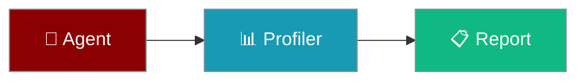

Give each agent its own profiler so concurrent runs do not mix timing data.

```python
from praisonaiagents import Agent
from praisonai.profiler import Profiler

Profiler.enable()
agent = Agent(name="DataAgent", instructions="Process data efficiently")
agent.start("Analyse quarterly sales")
Profiler.report()
```



## Quick Start

<Steps>
<Step title="Simple Usage">

Profile a single agent turn:

```python
from praisonaiagents import Agent
from praisonai.profiler import Profiler

Profiler.enable()
agent = Agent(name="DataAgent", instructions="Process data efficiently")
agent.start("Analyse quarterly sales")

Profiler.report()
```

</Step>

<Step title="With Configuration">

Profile concurrent agents with isolated reports:

```python
import asyncio
from praisonaiagents import Agent
from praisonai.profiler import Profiler

async def run_agent(name, task):
    Profiler.enable()
    agent = Agent(name=name, instructions=f"Handle {name} tasks")
    result = await agent.run_async(task)
    summary = Profiler.get_summary()
    return result, summary

async def main():
    results = await asyncio.gather(
        run_agent("SalesAgent", "Process Q4 sales data"),
        run_agent("MarketAgent", "Analyse market trends"),
    )
    for _, summary in results:
        print(f"Total: {summary['total_time_ms']:.2f}ms")

asyncio.run(main())
```

</Step>
</Steps>

---

## How It Works

Profilers live in a `ContextVar` — each async task or thread sees its own instance when you call `set_profiler()`.

| API | Purpose |
|-----|---------|
| `Profiler.enable()` | Start recording timing data |
| `Profiler.block("name")` | Time a code block with a context manager |
| `Profiler.get_summary()` | Return timing totals, slowest operations, import times |
| `Profiler.report()` | Print a formatted summary to console |
| `Profiler.clear()` | Reset all recorded data |

---

## Configuration Options

| Parameter | Type | Default | Description |
|-----------|------|---------|-------------|
| `PRAISONAI_PROFILE_MAX` | env | `10000` | Global default buffer cap per instance |

---

## Best Practices

<AccordionGroup>
<Accordion title="Call enable() before start()">
`Profiler.enable()` activates recording — without it, timings are silently skipped.
</Accordion>
<Accordion title="Use block() for custom segments">
`Profiler.block("llm_call")` and `Profiler.block("tool_execution")` add named timings to the report.
</Accordion>
<Accordion title="Call clear() between runs">
`Profiler.clear()` resets accumulated data so back-to-back runs don't mix results.
</Accordion>
<Accordion title="Read get_summary() not get_statistics()">
The public API returns data via `get_summary()`, which includes `total_time_ms`, `slowest_operations`, and category breakdowns.
</Accordion>
</AccordionGroup>

---

## Related

<CardGroup cols={2}>
<Card title="Observability Overview" icon="chart-line" href="/docs/observability/overview">
  Traces, metrics, and logging
</Card>
<Card title="Profiling" icon="gauge" href="/docs/features/profiling">
  Broader performance profiling options
</Card>
</CardGroup>
