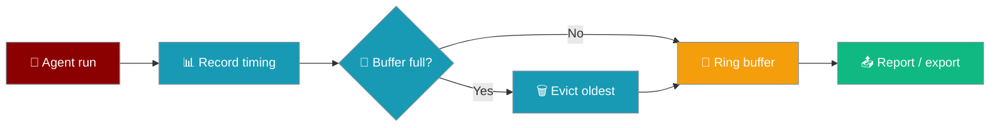
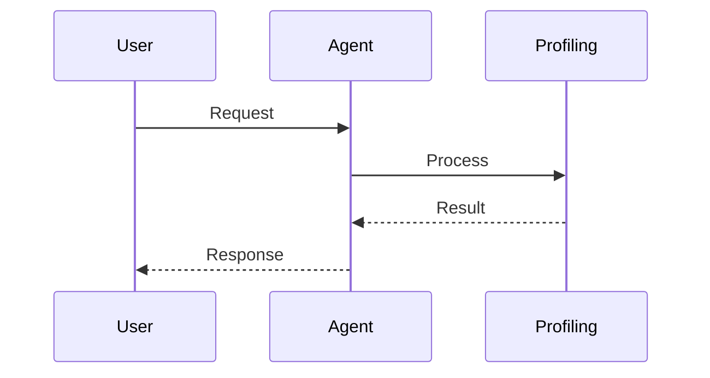
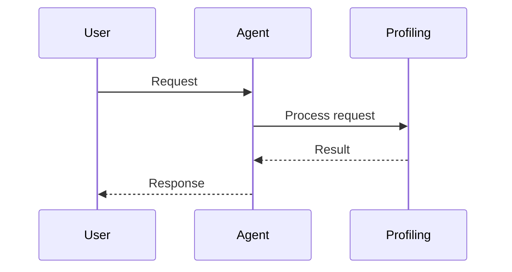

Profile agent runs with bounded buffers that stay safe in long-lived production workloads.

```python
from praisonaiagents import Agent
from praisonai.profiler import Profiler, profile

Profiler.enable()

@profile(category="agent")
def run_task(prompt: str):
    agent = Agent(name="assistant", instructions="Be helpful")
    return agent.start(prompt)

result = run_task("Summarise quarterly sales")
print(Profiler.get_statistics())
```

The user runs a profiled task; timing and memory stats accumulate in a bounded buffer.




## How It Works




## Quick Start

<Steps>
<Step title="Simple Usage">

Enable profiling and wrap an agent turn:

```python
from praisonaiagents import Agent
from praisonai.profiler import Profiler, profile

Profiler.enable()

@profile(category="agent")
def run_task(prompt: str):
    agent = Agent(name="assistant", instructions="Be helpful")
    return agent.start(prompt)

run_task("Summarise quarterly sales")
Profiler.report()
```

</Step>

<Step title="With Configuration">

Time blocks and export a report:

```python
from praisonaiagents import Agent
from praisonai.profiler import Profiler

Profiler.enable()

with Profiler.block("agent_execution"):
    agent = Agent(name="assistant", instructions="Be helpful")
    agent.start("Analyse market trends")

Profiler.export_to_file("profile_report.json", format="json")
stats = Profiler.get_statistics()
print(f"P95: {stats['p95']:.2f}ms")
```

</Step>
</Steps>

---

## How It Works




Profiling is off by default — decorators and context managers are no-ops until you call `Profiler.enable()` or set `PRAISONAI_PROFILE=1`.

| Surface | Purpose |
|---------|---------|
| `@profile` / `@profile_async` | Time a function |
| `Profiler.block("name")` | Time a code block |
| `Profiler.api_call(...)` | Track HTTP/API latency |
| `Profiler.streaming(...)` | Measure TTFT and chunk timing |
| `Profiler.memory("name")` | Track memory with tracemalloc |
| `Profiler.report()` | Console summary with p50/p95/p99 |

Each buffer uses a bounded `deque` — when full, oldest records drop. See [Performance Profiling](/docs/features/profiler) for per-agent isolation via `set_profiler()`.

---

## Configuration Options

| Option | Type | Default | Description |
|--------|------|---------|-------------|
| `PRAISONAI_PROFILE` | env `int` | `0` | Set to `1` to enable globally |
| `PRAISONAI_PROFILE_MAX` | env `int` | `10000` | Max records per buffer before rotation |

---

## Best Practices

<AccordionGroup>
<Accordion title="Disable in production by default">
Enable only when debugging — overhead is near zero when off, but reports and tracemalloc add cost when on.
</Accordion>
<Accordion title="Size buffers for your RAM budget">
Default 10k records ≈ 1–2 MB per buffer. Lower `PRAISONAI_PROFILE_MAX` in containers.
</Accordion>
<Accordion title="Export periodically on long runs">
Ring buffers keep recent data only — export JSON/HTML before buffers rotate.
</Accordion>
<Accordion title="Use descriptive block names">
`Profiler.block("llm_call")` and `Profiler.block("tool_execution")` make reports readable.
</Accordion>
</AccordionGroup>

---

## Related

<CardGroup cols={2}>
<Card title="Performance Profiling" icon="gauge" href="/docs/features/profiler">
  Per-agent profiler isolation for multi-agent runs
</Card>
<Card title="Observability Overview" icon="chart-line" href="/docs/observability/overview">
  Traces, metrics, and logging
</Card>
</CardGroup>
