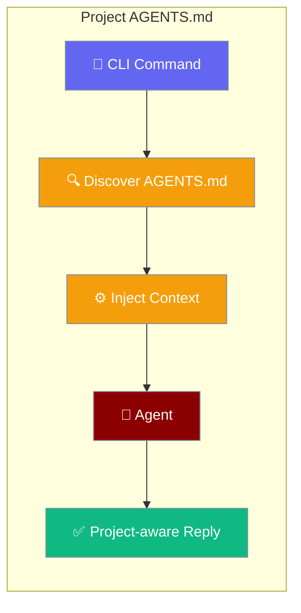
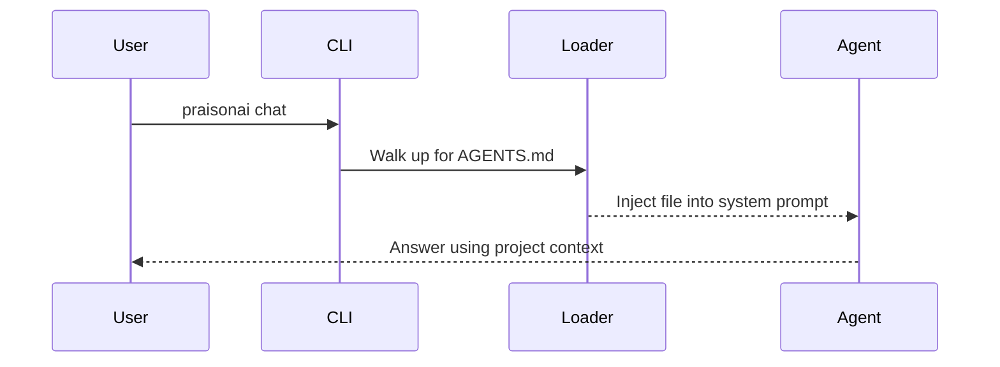
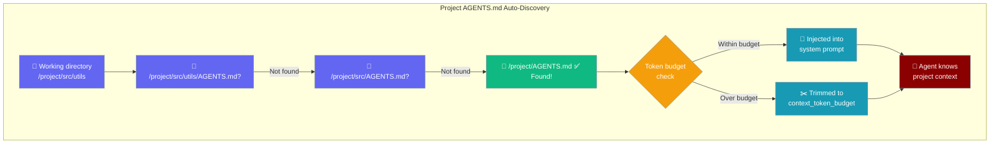
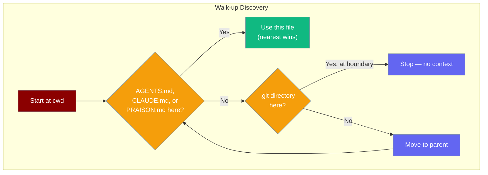

Place an `AGENTS.md` file at your project root and every `praisonai chat`, `run`, `code`, and `tui` command automatically injects it into the agent's system prompt — no flags needed.

```python
from praisonaiagents import Agent

agent = Agent(
    name="Dev",
    instructions="Help with coding tasks",
)

agent.start("How should I structure new modules in this project?")
```

The user asks a coding question; AGENTS.md from the project root is injected automatically.



## How It Works



### Auto-Discovery



## Quick Start

<Steps>
<Step title="Create an AGENTS.md at the repo root">

```markdown
# Project Context

## Tech Stack
- Python 3.12, FastAPI, SQLAlchemy
- Tests with pytest; coverage >= 90%

## Style
- PEP 8; type hints everywhere; docstrings for public APIs

## Do
- Use dependency injection for database sessions
- Write one test per behaviour, not per function

## Don't
- Import from circular modules
- Use `global` variables
```

Now any `praisonai` command run inside the repo picks this up automatically:

```bash
praisonai code "Add a new user endpoint"
```

The agent already knows your stack, style rules, and conventions.
</Step>

<Step title="Disable for a single run">

```bash
praisonai code --no-context "Explain what Python is"
```

The `--no-context` flag skips AGENTS.md injection for that run only.
</Step>

<Step title="Disable globally with an env var">

```bash
PRAISON_NO_CONTEXT=true praisonai run task.yaml
```

Useful in CI jobs where project context would waste tokens and slow things down.
</Step>

<Step title="Tune the token budget">

Large AGENTS.md files are trimmed to fit. Set the budget in `.praison.json`:

```json
{
  "context_token_budget": 4000
}
```

Default is `8000` characters.
</Step>
</Steps>

---

## Discovery Rules



**File names searched (in order):** `AGENTS.md`, `CLAUDE.md`, `PRAISON.md`, `GEMINI.md`

**Stop condition:** A `.git` directory — the walk-up never crosses a git repository boundary.

**Nearest wins:** The first matching file found (starting from cwd and walking up) is used. Deeper files override ancestor files.

---

## Precedence

| Setting | Overrides |
|---------|-----------|
| `--no-context` flag | Everything — disables for this run |
| `PRAISON_NO_CONTEXT=true` env var | Config-level default |
| `context_token_budget` in `.praison.json` | Sets trim budget |
| Default ON | Base behaviour when nothing overrides |

---

## What to Put in AGENTS.md

Keep it concise — the budget is finite. Useful content includes:

- **Tech stack** — language versions, key frameworks, database
- **Code conventions** — naming, formatting, patterns to follow
- **Do/Don't rules** — specific things the agent should or should not do
- **Key file locations** — where models, routes, tests live
- **Project-specific vocabulary** — domain terms, component names

Avoid:
- Long prose the agent doesn't need for most tasks
- Secrets or credentials (they will end up in logs)
- Entire source files or large schemas — use `--file` flags instead

---

## Best Practices

<AccordionGroup>
<Accordion title="Commit AGENTS.md to your repository">

Everyone on the team benefits when the agent knows the project conventions. Treat AGENTS.md like `.editorconfig` — check it in, keep it updated as the project evolves.
</Accordion>

<Accordion title="Keep it under the budget">

The default `context_token_budget` is 8000 characters (~2000 tokens). Long AGENTS.md files are trimmed from the bottom up — keep the most important rules at the top.
</Accordion>

<Accordion title="Use per-subfolder AGENTS.md for specialised areas">

If your monorepo has a `backend/` with Python conventions and a `frontend/` with TypeScript conventions, add separate AGENTS.md files in each subdirectory. The walk-up stops at the nearest one.
</Accordion>

<Accordion title="Disable in CI to save tokens">

If your CI doesn't need project context (e.g., a simple test-and-lint pipeline), disable it:

```yaml
env:
  PRAISON_NO_CONTEXT: "true"
```
</Accordion>
</AccordionGroup>

---

## Related

<CardGroup cols={2}>
<Card title="Context Files" icon="folder-open" href="/docs/features/context-files">
  Other ways to inject context into agent sessions
</Card>
<Card title="Hierarchical Config" icon="layer-group" href="/docs/features/hierarchical-config">
  Walk-up discovery for .praison.json project config
</Card>
</CardGroup>
