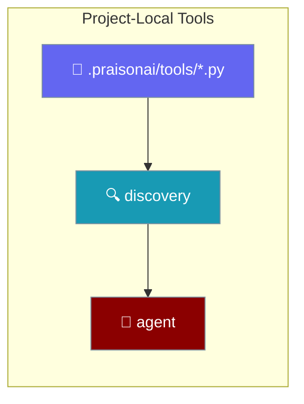
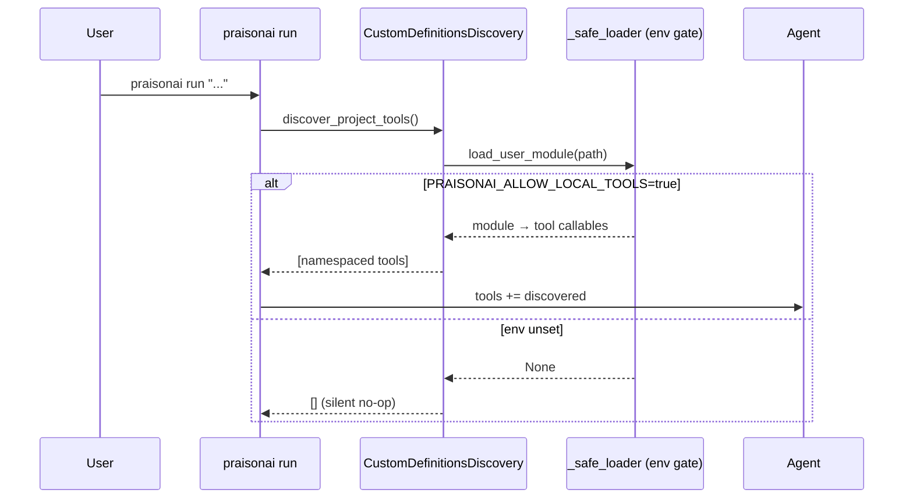

Drop a Python file in `.praisonai/tools/` and `praisonai run` auto-loads every public function as a tool — no `--tools` flag.

```python
from praisonaiagents import Agent

agent = Agent(
    name="Greeter",
    instructions="Greet users by name.",
    tools=["greet.greet"],
)
agent.start("Greet Ada")
```

The tool name uses the namespaced form — `<module>.<function>` — so `greet.py::greet` becomes `greet.greet`.



## Quick Start

<Steps>
<Step title="Scaffold the convention">

`praisonai init` writes a commented `@tool` stub at `.praisonai/tools/example.py`:

```python
# .praisonai/tools/example.py
"""Project-local tools for this .praisonai/ project.

Every public callable in this directory is auto-discovered and made available
to the agent on `praisonai run` — no --tools flag required.
"""

# from praisonaiagents import tool
#
#
# @tool
# def greet(name: str) -> str:
#     """Return a friendly greeting for the given name."""
#     return f"Hello, {name}!"
```

</Step>

<Step title="Drop a plain function and run">

Add a plain function at `.praisonai/tools/greet.py`:

```python
# .praisonai/tools/greet.py
def greet(name: str) -> str:
    """Return a friendly greeting for the given name."""
    return f"Hello, {name}!"
```

Run — no `--tools` flag needed, just the opt-in env var:

```bash
PRAISONAI_ALLOW_LOCAL_TOOLS=true praisonai run "use the greet tool to greet Ada"
```

</Step>

<Step title="Promote to @tool for a rich schema">

Decorate a function with `@tool` when you want a typed schema for the LLM:

```python
# .praisonai/tools/math.py
from praisonaiagents import tool

@tool
def add(a: int, b: int) -> int:
    """Add two numbers."""
    return a + b
```

</Step>
</Steps>

---

## How It Works

`praisonai run` walks `.praisonai/tools/`, loads each module behind the security gate, and hands the callables to the agent.



---

## Discovery Rules

The rules below come straight from the SDK's `CustomDefinitionsDiscovery` and `_load_tools`.

| Rule | Behaviour |
|------|-----------|
| Location | `.praisonai/tools/*.py` (user-global `~/.praisonai/tools/` + project walk-up to git root) |
| Precedence | Later wins on collision (user-global < project; nested closer to CWD < nested further) |
| Naming | `<module-filename>.<function-name>` (e.g. `greet.py::greet` → `greet.greet`) |
| Public only | Callables whose name doesn't start with `_` |
| Module filter | Files starting with `_` (e.g. `_helpers.py`) are skipped |
| Mixed file rule | If any function in the file is `@tool`-decorated, only decorated functions are exported |
| Security gate | `PRAISONAI_ALLOW_LOCAL_TOOLS=true` required — gate unset → empty discovery, no warning |
| Interaction with `--tools` | Additive; explicit `--tools` items take precedence (dedup by callable identity) |
| Opt-out | `--no-tools` on `praisonai run` skips discovery entirely |

---

## `@tool`-decorated vs Plain Callable

Both a plain function and a `@tool`-decorated function become tools — but if a file has any `@tool`, only the decorated functions win.

<Tabs>
<Tab title="Plain function">

```python
# .praisonai/tools/greet.py
def greet(name: str) -> str:
    """Return a friendly greeting for the given name."""
    return f"Hello, {name}!"
```

Exposed as `greet.greet`.

</Tab>
<Tab title="@tool-decorated">

```python
# .praisonai/tools/math.py
from praisonaiagents import tool

@tool
def add(a: int, b: int) -> int:
    """Add two numbers."""
    return a + b

def _round(x: float) -> int:
    """Private helper — never exported."""
    return round(x)
```

Exposed as `math.add`. The plain `_round` helper is skipped (leading underscore), and if any non-underscore plain helper existed it would be dropped too because `add` is `@tool`-decorated.

</Tab>
</Tabs>

---

## User-Global vs Project-Local

Two locations feed discovery, and they differ on the working-directory boundary.

<Note>
User-global tools live at `~/.praisonai/tools/` and load even though they sit outside your project directory — the CWD boundary is deliberately opted out for that explicitly user-owned location (a regression fix that mirrors how an explicit `--tools` absolute path is trusted). Project-local tools walk up from your current directory and keep the strict CWD check, so an untrusted checkout cannot escape it.
</Note>

---

## Best Practices

<AccordionGroup>
<Accordion title="Keep private helpers underscore-prefixed">
Prefix helper functions with `_` so they stay internal. Underscore names are never exported, and modules whose filename starts with `_` are skipped entirely.
</Accordion>
<Accordion title="Use @tool when you want a rich schema">
Decorate with `@tool` from `praisonaiagents` to give the LLM a typed schema. In a mixed file, only the `@tool` functions are exported — plain helpers are dropped.
</Accordion>
<Accordion title="Only set PRAISONAI_ALLOW_LOCAL_TOOLS=true in trusted shells">
Loading a tool module executes its code. Keep the opt-in on only in shells where you trust the `.praisonai/tools/` contents.
</Accordion>
<Accordion title="Use --no-tools for one-off deterministic runs">
Pass `--no-tools` to `praisonai run` to skip auto-discovery entirely when you want a run with no local tools loaded.
</Accordion>
</AccordionGroup>

---

## Related

<CardGroup cols={2}>
<Card title="Local Tools Loading" icon="wrench" href="/docs/features/local-tools-loading">
Load your own tools.py or --tools file safely with the PRAISONAI_ALLOW_LOCAL_TOOLS opt-in.
</Card>
<Card title="Tool Discovery Order" icon="list-tree" href="/docs/features/tool-discovery-order">
The tier order that resolves a tool name — local files, built-ins, package, or plugin.
</Card>
<Card title="Add Tools" icon="plus" href="/docs/cli/tools-add">
Copy tool files into ~/.praisonai/tools/ from local files or GitHub.
</Card>
<Card title="Tools CLI" icon="terminal" href="/docs/cli/tools">
List and manage the tools available to praisonai run.
</Card>
</CardGroup>
