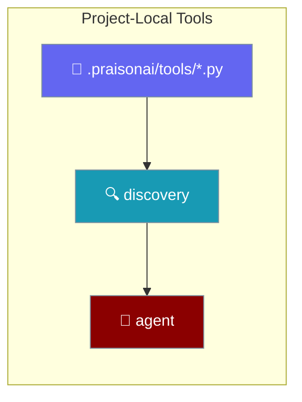
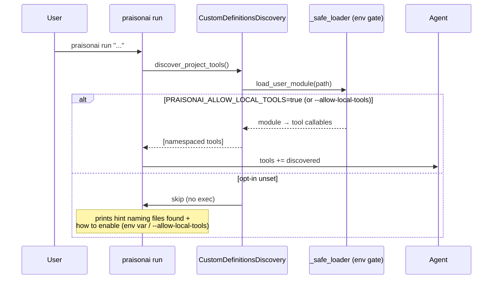
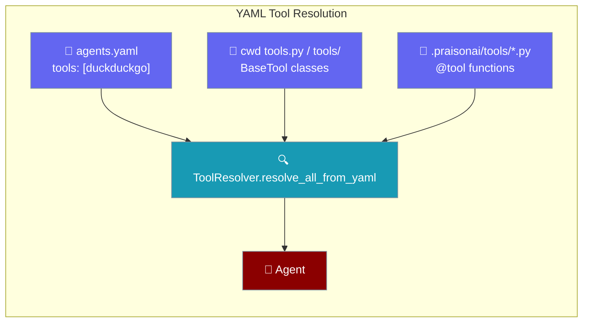

Drop a Python file in `.praisonai/tools/` and `praisonai run` auto-loads every public function as a tool — no `--tools` flag.

```python
from praisonaiagents import Agent

agent = Agent(
    name="Greeter",
    instructions="Greet users by name.",
    tools=["greet.greet"],
)
agent.start("Greet Ada")
```

The tool name uses the namespaced form — `<module>.<function>` — so `greet.py::greet` becomes `greet.greet`.



## Quick Start

<Steps>
<Step title="Scaffold the convention">

`praisonai init` writes a commented `@tool` stub at `.praisonai/tools/example.py`:

```python
# .praisonai/tools/example.py
"""Project-local tools for this .praisonai/ project.

Every public callable in this directory is auto-discovered and made available
to the agent on `praisonai run` — no --tools flag required.
"""

# from praisonaiagents import tool
#
#
# @tool
# def greet(name: str) -> str:
#     """Return a friendly greeting for the given name."""
#     return f"Hello, {name}!"
```

</Step>

<Step title="Drop a plain function and run">

Add a plain function at `.praisonai/tools/greet.py`:

```python
# .praisonai/tools/greet.py
def greet(name: str) -> str:
    """Return a friendly greeting for the given name."""
    return f"Hello, {name}!"
```

Run — no `--tools` flag needed, just the opt-in:

```bash
# Either — per-invocation flag (recommended)
praisonai run --allow-local-tools "use the greet tool to greet Ada"
# Or — shell-scoped env var
PRAISONAI_ALLOW_LOCAL_TOOLS=true praisonai run "use the greet tool to greet Ada"
```

</Step>

<Step title="Promote to @tool for a rich schema">

Decorate a function with `@tool` when you want a typed schema for the LLM:

```python
# .praisonai/tools/math.py
from praisonaiagents import tool

@tool
def add(a: int, b: int) -> int:
    """Add two numbers."""
    return a + b
```

Run it with the opt-in as a first-class flag:

```bash
# Either
praisonai run --allow-local-tools "use the add tool: 2+3"
# Or
PRAISONAI_ALLOW_LOCAL_TOOLS=true praisonai run "use the add tool: 2+3"
```

</Step>
</Steps>

---

## How It Works

`praisonai run` walks `.praisonai/tools/`, loads each module behind the security gate, and hands the callables to the agent.



---

## Discovery Rules

The rules below come straight from the SDK's `CustomDefinitionsDiscovery` and `_load_tools`.

| Rule | Behaviour |
|------|-----------|
| Location | `.praisonai/tools/*.py` (user-global `~/.praisonai/tools/` + project walk-up to git root) |
| Precedence | Later wins on collision (user-global < project; nested closer to CWD < nested further) |
| Naming (via `praisonai run` auto-discovery) | `<module-filename>.<function-name>` (e.g. `greet.py::greet` → `greet.greet`) |
| Naming (via YAML `agents.yaml`) | Flat tool name — `@tool(name=...)` if given, else the function `__name__` (matches how YAML `tools:` entries are written) |
| Public only | Callables whose name doesn't start with `_` |
| Module filter | Files starting with `_` (e.g. `_helpers.py`) are skipped |
| Mixed file rule | If any function in the file is `@tool`-decorated, only decorated functions are exported |
| Security gate | `PRAISONAI_ALLOW_LOCAL_TOOLS=true` (or `--allow-local-tools`) required — gate unset → empty discovery + a one-line hint naming the tool files found and how to enable them |
| Interaction with `--tools` / `--toolset` | Additive; explicit `--tools`/`--toolset` items and auto-discovered tools merge, dedup'd by callable identity |
| Interaction with `--agent` | Same behaviour as default `run` — frontmatter `tools:` list is unioned with `--tools`/`--toolset` and auto-discovered `.praisonai/tools/*.py`, dedup'd by callable identity. Fixed in [#3047](https://github.com/MervinPraison/PraisonAI/issues/3047). |
| Opt-out | `--no-tools` on `praisonai run` skips discovery entirely |

---

## YAML Agents (`agents.yaml`)

YAML-defined agents pick up `@tool` functions dropped into `.praisonai/tools/*.py` by their flat tool name — no `tools:` entry required.

Start with an agent that names no tools in YAML:

```yaml
# agents.yaml
framework: praisonai
topic: Weather
roles:
  reporter:
    role: Weather reporter
    goal: Report the weather for a city
    backstory: A helpful assistant.
    tasks:
      report:
        description: Report the weather for London.
        expected_output: A one-line weather summary.
```

Drop a `@tool` function beside it:

```python
# .praisonai/tools/weather.py
from praisonaiagents import tool

@tool
def weather(city: str) -> str:
    """Return the current weather for a city."""
    return f"sunny in {city}"
```

Run with the opt-in — the agent sees the tool as `weather`:

```bash
praisonai run --allow-local-tools agents.yaml
```

### Naming the tool explicitly

Pass `name=` to `@tool` to control the flat name the agent resolves:

```python
# .praisonai/tools/weather.py
from praisonaiagents import tool

@tool(name="weather_lookup")
def weather(city: str) -> str:
    """Return the current weather for a city."""
    return f"sunny in {city}"
```

The agent now sees the tool as `weather_lookup`. If your `agents.yaml` lists tools explicitly, reference it by that flat name.

### Additive with YAML-named tools

A YAML-named built-in and a `.praisonai/tools/` `@tool` function resolve together on the same agent:

```yaml
# agents.yaml
framework: praisonai
topic: Weather
roles:
  reporter:
    role: Weather reporter
    goal: Report the weather for a city
    backstory: A helpful assistant.
    tools: [duckduckgo]
    tasks:
      report:
        description: Report the weather for London.
        expected_output: A one-line weather summary.
```

```python
# .praisonai/tools/weather.py
from praisonaiagents import tool

@tool(name="weather_lookup")
def weather(city: str) -> str:
    """Return the current weather for a city."""
    return f"sunny in {city}"
```

`duckduckgo` still resolves from the built-in tools, and `weather_lookup` is added on top from the discovered file.

### How tools merge on the YAML path

`ToolResolver.resolve_all_from_yaml` resolves YAML-named built-ins, layers cwd `tools.py` / `tools/` classes, then additively merges the discovered `.praisonai/tools/*.py` `@tool` functions — all gated by the same opt-in.



<Note>
The same gate applies — set `PRAISONAI_ALLOW_LOCAL_TOOLS=true` or pass `--allow-local-tools`. See [Enabling on run](#enabling-on-run) below. The gate is checked first, so no directory walk-up runs when local tools are disabled.
</Note>

<Info>
The cwd `tools.py` / `tools/` `BaseTool`-class extraction is unchanged and still runs first. Explicit Python-passed tools take precedence, and only the `.praisonai/tools/` layer is additive.
</Info>

---

## Enabling on `run`

Two equivalent ways to opt in for a `praisonai run` invocation.

<Tabs>
<Tab title="--allow-local-tools (per-invocation)">

Discoverable via `praisonai run --help`. Scoped strictly to the single invocation.

```bash
praisonai run --allow-local-tools "use the greet tool to greet Ada"
```

</Tab>
<Tab title="PRAISONAI_ALLOW_LOCAL_TOOLS=true (shell scope)">

Persists for the shell session. Use when several back-to-back runs need it.

```bash
export PRAISONAI_ALLOW_LOCAL_TOOLS=true
praisonai run "use the greet tool to greet Ada"
```

Accepts only `true` (case-insensitive). Values like `1`, `yes`, `on`, `false`, `0` are **not** truthy for this variable.

</Tab>
</Tabs>

<Note>
`--allow-local-tools` is a **per-invocation** grant — it sets `PRAISONAI_ALLOW_LOCAL_TOOLS=true` for this run only and restores the prior value in a `finally`. A later in-process `run_main()` call (embedded/notebook/test reuse) without the flag will not inherit the authorization.
</Note>

### Discovery hint when the opt-in is unset

When `.praisonai/tools/*.py` (or `~/.praisonai/tools/*.py`) files are present but the opt-in is unset, `praisonai run` prints a one-line hint on the default path (not just `--verbose`):

```
Found 3 local tool files in .praisonai/tools/ and ~/.praisonai/tools/ but local tools are disabled. Enable with PRAISONAI_ALLOW_LOCAL_TOOLS=true or --allow-local-tools.
```

The location(s) named in the hint reflect where files were actually found — `.praisonai/tools/`, `~/.praisonai/tools/`, or both. The hint is silent when there are no local tool files.

### Enabling on `run --agent`

`run --agent <name>` auto-discovers `.praisonai/tools/*.py` too — the frontmatter `tools:` list, `--tools`/`--toolset`, and discovered tools all merge, dedup'd by callable identity.

```bash
# Frontmatter tools + --tools flag + .praisonai/tools/ all merged
praisonai run --agent researcher --tools github --allow-local-tools "..."
```

The same `PRAISONAI_ALLOW_LOCAL_TOOLS=true` / `--allow-local-tools` opt-in applies — the security gate is identical to default `run`. Fixed in [#3047](https://github.com/MervinPraison/PraisonAI/issues/3047).

---

## `@tool`-decorated vs Plain Callable

Both a plain function and a `@tool`-decorated function become tools — but if a file has any `@tool`, only the decorated functions win.

<Tabs>
<Tab title="Plain function">

```python
# .praisonai/tools/greet.py
def greet(name: str) -> str:
    """Return a friendly greeting for the given name."""
    return f"Hello, {name}!"
```

Exposed as `greet.greet`.

</Tab>
<Tab title="@tool-decorated">

```python
# .praisonai/tools/math.py
from praisonaiagents import tool

@tool
def add(a: int, b: int) -> int:
    """Add two numbers."""
    return a + b

def _round(x: float) -> int:
    """Private helper — never exported."""
    return round(x)
```

Exposed as `math.add`. The plain `_round` helper is skipped (leading underscore), and if any non-underscore plain helper existed it would be dropped too because `add` is `@tool`-decorated.

</Tab>
</Tabs>

<Warning>
On the YAML path, plain undecorated functions are **not** exported — only `@tool`-decorated callables land in the resolved tool dict. This differs from the `praisonai run` auto-discovery path, which exports plain public functions too.
</Warning>

---

## User-Global vs Project-Local

Two locations feed discovery, and they differ on the working-directory boundary.

<Note>
User-global tools live at `~/.praisonai/tools/` and load even though they sit outside your project directory — the CWD boundary is deliberately opted out for that explicitly user-owned location (a regression fix that mirrors how an explicit `--tools` absolute path is trusted). Project-local tools walk up from your current directory and keep the strict CWD check, so an untrusted checkout cannot escape it.
</Note>

---

## Best Practices

<AccordionGroup>
<Accordion title="Keep private helpers underscore-prefixed">
Prefix helper functions with `_` so they stay internal. Underscore names are never exported, and modules whose filename starts with `_` are skipped entirely.
</Accordion>
<Accordion title="Use @tool when you want a rich schema">
Decorate with `@tool` from `praisonaiagents` to give the LLM a typed schema. In a mixed file, only the `@tool` functions are exported — plain helpers are dropped.
</Accordion>
<Accordion title="Prefer --allow-local-tools over exporting the env var">
Loading a tool module executes its code. Prefer `--allow-local-tools` on the individual `praisonai run` invocation over exporting `PRAISONAI_ALLOW_LOCAL_TOOLS=true` in your shell — the CLI flag is scoped to the single run and cannot leak to a later in-process invocation. Export the env var only when many back-to-back runs need the opt-in in a trusted shell.
</Accordion>
<Accordion title="Use --no-tools for one-off deterministic runs">
Pass `--no-tools` to `praisonai run` to skip auto-discovery entirely when you want a run with no local tools loaded.
</Accordion>
</AccordionGroup>

---

## Related

<CardGroup cols={2}>
<Card title="Local Tools Loading" icon="wrench" href="/docs/features/local-tools-loading">
Load your own tools.py or --tools file safely with the PRAISONAI_ALLOW_LOCAL_TOOLS opt-in.
</Card>
<Card title="Tool Discovery Order" icon="list-tree" href="/docs/features/tool-discovery-order">
The tier order that resolves a tool name — local files, built-ins, package, or plugin.
</Card>
<Card title="Add Tools" icon="plus" href="/docs/cli/tools-add">
Copy tool files into ~/.praisonai/tools/ from local files or GitHub.
</Card>
<Card title="Tools CLI" icon="terminal" href="/docs/cli/tools">
List and manage the tools available to praisonai run.
</Card>
<Card title="Run CLI" icon="play" href="/docs/cli/run">
How --agent composes frontmatter tools with --tools/--toolset and local tools.
</Card>
<Card title="Custom Agents, Commands & Tools" icon="file-code" href="/docs/features/custom-agents-commands">
Tool composition order for praisonai run --agent.
</Card>
<Card title="Tool Resolver" icon="wrench" href="/docs/features/tool-resolver">
The resolution chain used by YAML-defined agents.
</Card>
</CardGroup>
