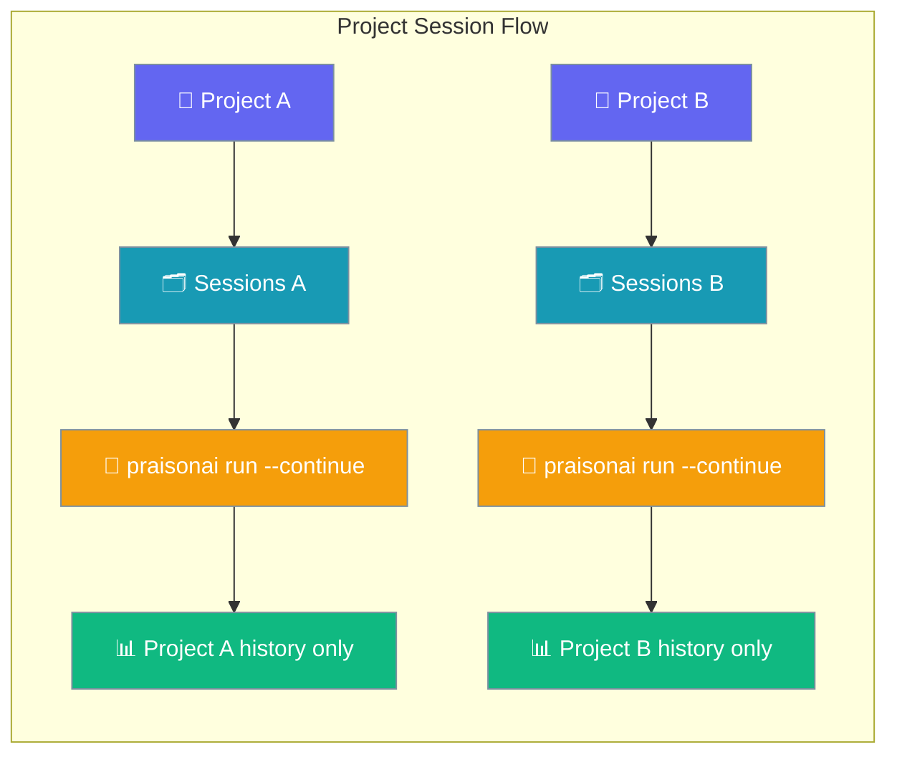

Every project gets its own conversation history, automatically.



## Quick Start

<Steps>
<Step title="From your project root">
Start working in any project directory:

```bash
cd ~/code/my-app && praisonai run "Build a TODO app"
```

Project context is automatically detected from the git root or current directory.
</Step>

<Step title="Continue tomorrow, from the same folder">
Return to the same project to pick up where you left off:

```bash
praisonai run --continue "Add a delete endpoint"
```

Session continuity works seamlessly across days and terminal sessions.
</Step>

<Step title="List this project's sessions">
See all sessions for the current project:

```bash
praisonai session list
```

Only sessions from this project are shown by default.
</Step>
</Steps>

## How project detection works

| Where you are | Project ID derived from |
|---|---|
| Inside a git repo | `git rev-parse --show-toplevel` (the repo root) |
| Outside a git repo | The current working directory |
| The hash itself | First 8 chars of `sha256(absolute_path)` |

The project ID ensures consistent session scoping regardless of your current subdirectory within the project.

## How `--continue` finds your session

```mermaid
sequenceDiagram
    participant User
    participant CLI
    participant Detector as Project detector
    participant Store as Project session store
    participant Agent
    
    User->>CLI: praisonai run --continue "..."
    CLI->>Detector: resolve git root / cwd
    Detector-->>CLI: /path/to/project
    CLI->>Store: find_last_session(project_id)
    Store-->>CLI: most-recent session ID (or none)
    CLI->>Agent: resume with that session, run new prompt
    Agent-->>User: response with context from previous runs
    
    classDef user fill:#6366F1,stroke:#7C90A0,color:#fff
    classDef cli fill:#8B0000,stroke:#7C90A0,color:#fff
    classDef system fill:#189AB4,stroke:#7C90A0,color:#fff
    classDef result fill:#10B981,stroke:#7C90A0,color:#fff
    
    class User user
    class CLI cli
    class Detector,Store system
    class Agent result
```

If no previous session exists, a warning is shown and a new session starts automatically.

<Info>
`--continue` does two things: it picks the right session ID for this project **and** replays every prior user and assistant message into the new agent before your prompt runs. You don't need to summarise what happened last time — the agent already has it.
</Info>

## Common Patterns

### Resume after lunch
Pick up exactly where you left off:

```bash
praisonai run --continue "Now let's add error handling"
```

### Branch a session to try something risky
Experiment without affecting the original conversation:

```bash
praisonai run --fork --session abc123 "What if we used GraphQL instead?"
```

Both the original and forked sessions evolve independently.

### One-off question I don't want remembered
Ask quick questions without cluttering project history:

```bash
praisonai run --no-save "What's the capital of France?"
```

## Best Practices

<AccordionGroup>
<Accordion title="Run from the project root">
Always start `praisonai run` from your project's root directory so the git root is detected correctly. This ensures consistent project identification regardless of your current subdirectory.

```bash
# Good: from project root
cd ~/code/my-app
praisonai run --continue "Add tests"

# Still works: from subdirectory (same project detected)
cd ~/code/my-app/src
praisonai run --continue "Add tests"
```
</Accordion>

<Accordion title="Use `--fork` instead of mid-conversation branching">
When exploring alternatives, fork the session rather than continuing in the main conversation thread:

```bash
# Fork to try different approach
praisonai run --fork --session abc123 "try Redis instead of PostgreSQL"

# Original session remains intact
praisonai run --session abc123 "continue with PostgreSQL implementation"
```
</Accordion>

<Accordion title="Use `--no-save` for throwaway/PII-sensitive prompts">
For quick questions or sensitive information that shouldn't be stored:

```bash
praisonai run --no-save "How do I hash this password: secretPassword123"
```
</Accordion>

<Accordion title="Use `praisonai session list --all` to clean up across projects">
Periodically review and delete old sessions from all projects:

```bash
praisonai session list --all
praisonai session delete old-session-id
```
</Accordion>
</AccordionGroup>

## Related

<CardGroup cols={2}>
  <Card title="Run Command" icon="play" href="/docs/cli/run">
    Complete `praisonai run` documentation with session flags
  </Card>
  <Card title="Session Management" icon="clock-rotate-left" href="/docs/cli/session">
    Session commands and storage backends
  </Card>
</CardGroup>