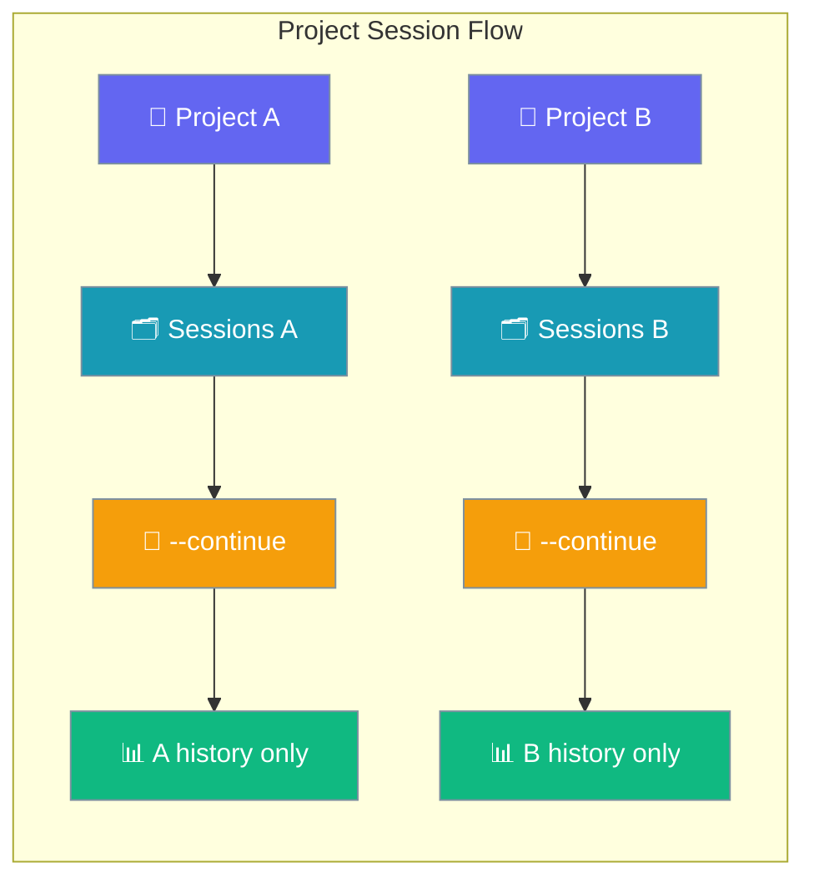
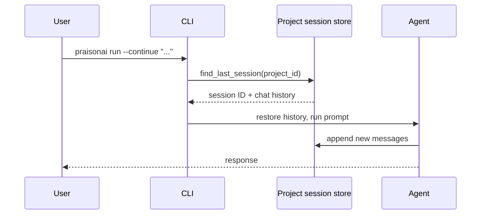

Each project keeps its own conversation history — resume in the same folder and prior turns load automatically.

```bash
cd ~/code/my-app && praisonai run "Build a TODO app"
praisonai run --continue "Add a delete endpoint"
```



## Quick Start

<Steps>
<Step title="Start in your project root">

```bash
cd ~/code/my-app && praisonai run "Build a TODO app"
```

Project context comes from the git root (or current directory if not in a repo).
</Step>

<Step title="Continue later">

```bash
praisonai run --continue "Add a delete endpoint"
```

Prior user and assistant messages replay before your new prompt — no need to summarise what happened last time.
</Step>

<Step title="List this project's sessions">

```bash
praisonai session list
```

Only sessions for the current project appear by default.
</Step>
</Steps>

---

## How It Works



| Where you are | Project ID from |
|---|---|
| Inside a git repo | `git rev-parse --show-toplevel` |
| Outside a git repo | Current working directory |
| Stored hash | First 8 chars of `sha256(absolute_path)` |

History restore and save wiring landed in [PR #1963](https://github.com/MervinPraison/PraisonAI/pull/1963). If no prior session exists, a warning appears and a new session starts.

---

## Configuration Options

| Flag | Description |
|------|-------------|
| `--continue` | Resume the most recent session for this project |
| `--session <id>` | Resume a specific session |
| `--fork --session <id>` | Branch a session to try alternatives |
| `--no-save` | One-off prompt — nothing persisted |
| `session list --all` | List sessions across all projects |

---

## Best Practices

<AccordionGroup>
<Accordion title="Run from the project root">
Start `praisonai run` from the repo root so git detection stays consistent — subdirectories still resolve to the same project.
</Accordion>
<Accordion title="Use --fork for risky experiments">
Try alternatives without altering the main thread: `praisonai run --fork --session abc123 "try Redis instead"`.
</Accordion>
<Accordion title="Use --no-save for throwaway prompts">
Quick questions or PII-sensitive input: `praisonai run --no-save "How do I hash passwords?"`.
</Accordion>
<Accordion title="Clean up with session list --all">
Review and delete stale sessions across projects periodically.
</Accordion>
</AccordionGroup>

---

## Related

<CardGroup cols={2}>
<Card title="Run Command" icon="play" href="/docs/cli/run">
  Complete `praisonai run` with session flags
</Card>
<Card title="Session Management" icon="clock-rotate-left" href="/docs/cli/session">
  Session commands and storage backends
</Card>
</CardGroup>
