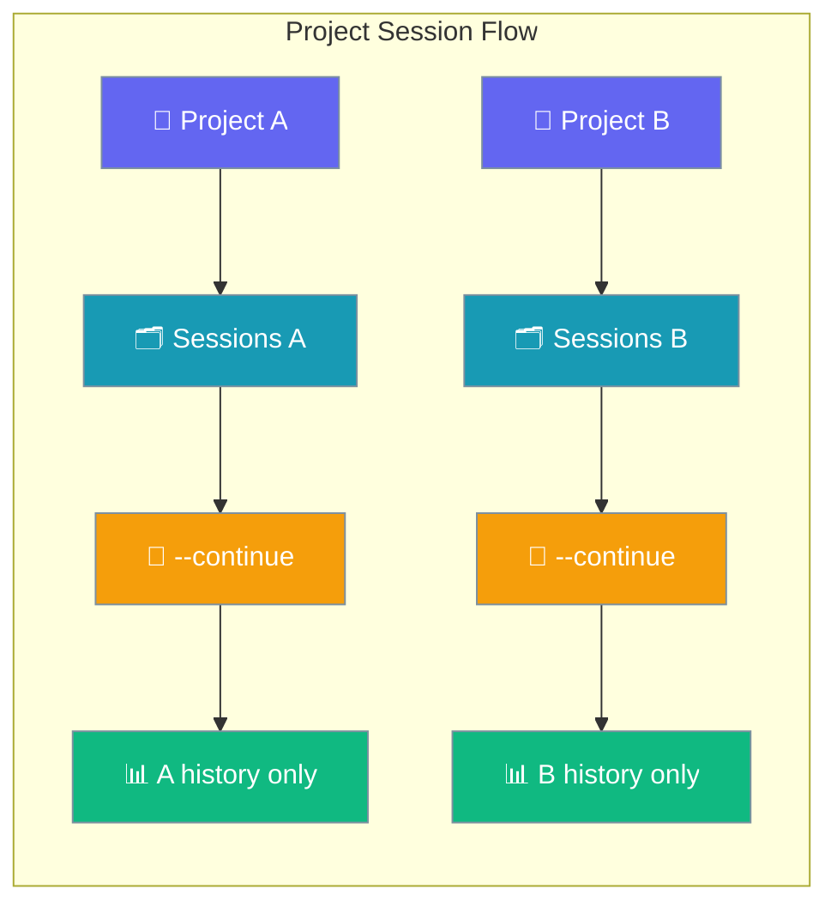
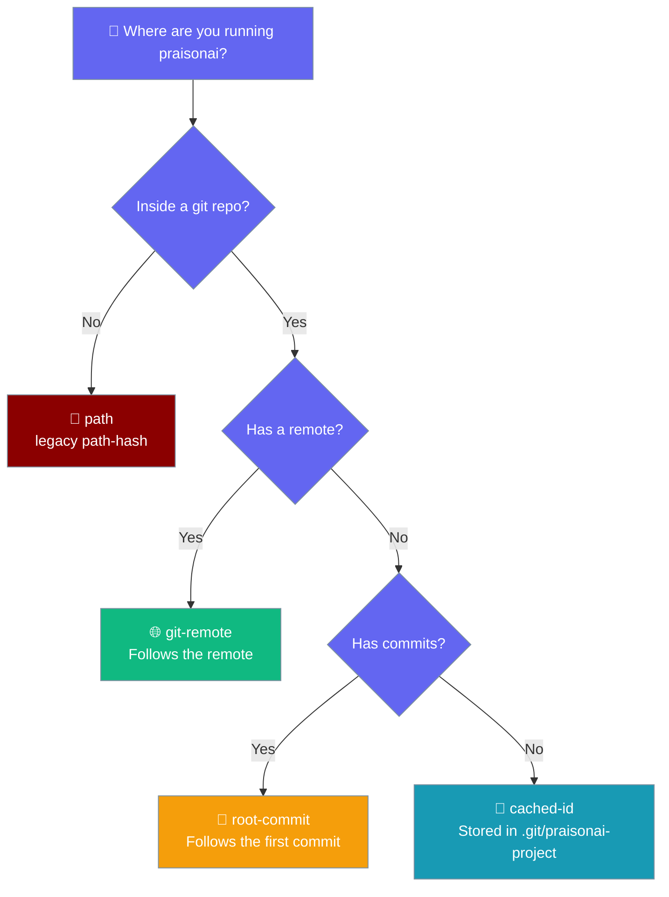

```python
from praisonaiagents import Agent

agent = Agent(name="project-agent", instructions="Manage project-scoped agent sessions.")
agent.start("Load my marketing-campaign project session and continue where we left off.")
```


The user resumes work in the same project folder; prior turns and cumulative usage load automatically.

```bash
cd ~/code/my-app && praisonai run "Build a TODO app"
praisonai run --continue "Add a delete endpoint"
```



## Quick Start

<Steps>
<Step title="Start in your project root">

```bash
cd ~/code/my-app && praisonai run "Build a TODO app"
```

Project context comes from the git repository — its remote or root commit — falling back to a path hash only outside a repo.
</Step>

<Step title="Continue later">

```bash
praisonai run --continue "Add a delete endpoint"
```

Prior user and assistant messages replay before your new prompt — no need to summarise what happened last time.
</Step>

<Step title="List this project's sessions">

```bash
$ praisonai session list
Project: my-app (ID: a1b2c3d4, identity: git-remote)
...
```

The `identity:` label tells you which resolver won — useful when explaining why two clones share sessions or why a fresh repo has none.

Shows every session `--continue` could resume for this project — the project's own sessions **plus** any globally-stored sessions (from `chat`, gateway, TUI, API, or a bare `Agent(session_id=...)`). Duplicates are collapsed; the freshest record wins.
</Step>
</Steps>

---

## How It Works

```mermaid
sequenceDiagram
    participant User
    participant CLI
    participant PS as Project session store
    participant GS as Global default store
    participant Agent

    User->>CLI: praisonai run --continue "..."
    CLI->>PS: list_sessions(limit)
    CLI->>GS: list_sessions(limit)
    Note over CLI: merge + dedup by session_id, freshest wins, prefer root sessions
    CLI-->>CLI: last root session id
    CLI->>Agent: restore history, run prompt
    Agent->>PS: append new messages
    Agent-->>User: response

    classDef cli fill:#8B0000,stroke:#7C90A0,color:#fff
    classDef store fill:#189AB4,stroke:#7C90A0,color:#fff
    classDef result fill:#10B981,stroke:#7C90A0,color:#fff

    class User,CLI cli
    class PS,GS store
    class Agent result
```

`find_last_session()` merges the **project-scoped store** and the **global default store** so `--continue` resolves the most-recent session regardless of how it was created (`run`, `chat`, gateway, TUI, API, or a bare `Agent(session_id=...)`). Sub-agent / forked children are skipped — the last **root** session wins. It falls back to a child only if the project has none. Each store is scanned with a `limit` window (default `50`).

The CLI now follows the repository, not the folder — cloning, moving, or `git worktree`-ing a repo keeps the same session history.

| Priority | Where the id comes from | Identity source | When it applies |
|---|---|---|---|
| 1 | Normalised **git remote URL** (`origin` first, then any configured remote) | `git-remote` | Any repo with a remote |
| 2 | Repository **root commit SHA** (across all refs, deterministic) | `root-commit` | Repo has commits but no remote |
| 3 | Cached id persisted at **`.git/praisonai-project`** | `cached-id` | Git repo with neither remote nor commits |
| 4 | Absolute-path SHA-256 hash (legacy behaviour) | `path` | Non-git directories only |

All four sources collapse to the same 8-char `sha256` short hash, so the on-disk session layout is unchanged.



### What survives

Session history follows the repository, not the folder.

| Scenario | Session history follows you? | Why |
|---|---|---|
| `mv myrepo mynewrepo` (rename directory) | ✅ Yes | Identity comes from remote / root commit, not the path |
| Clone the same repo to `~/work/a` and `~/work/b` | ✅ Yes (shared history) | Both resolve to the same normalised remote |
| `git worktree add ../feature-x` | ✅ Yes | Worktrees share `--git-common-dir`, so the same identity resolves |
| `pip install` a project into `/venvs/foo/src/myrepo` | ✅ Yes | Same remote resolves the same id |
| Delete `.git` and `git init` again with no remote | ⚠️ New identity (root commit changes) | Legacy sessions are auto-migrated on first `--continue` |
| Non-git directory renamed | ❌ Old behaviour: new id | Path hash changes |

<Note>
When a repo gains a remote or its first commit, existing sessions from the previous `path`-based id are copied into the new identity directory on the next run — no manual action needed.
</Note>

**Upgrading from an earlier CLI?** Your existing project sessions are stored under a directory named after a hash of the repo's absolute path. On the first `--continue` / `praisonai run` after upgrading, sessions are **copied** (not moved) into the new identity-based directory automatically. No configuration, no data loss — just re-run in the same repo and prior history is there.

History restore and save wiring landed in [PR #1963](https://github.com/MervinPraison/PraisonAI/pull/1963). If no prior session exists, a warning appears and a new session starts.

**Reading the identity source programmatically:**

```python
from praisonai_code.cli.utils.project import (
    get_project_id,
    get_project_identity_source,
    resolve_project_identity,
)

pid = get_project_id()                     # 8-char hash — unchanged public API
source = get_project_identity_source()     # "git-remote" / "root-commit" / "cached-id" / "path"
pid, source = resolve_project_identity()   # both in one call
```

---

## Persisted usage shape

Every session stores a `usage` blob in `~/.praisonai/sessions/projects/<project_id>/<session_id>.json`. Config-driven consumers and scripts can read this directly.

| Key | Type | Notes |
|---|---|---|
| `input_tokens` | `int` | Cumulative prompt tokens |
| `output_tokens` | `int` | Cumulative completion tokens |
| `cached_tokens` | `int` | Cumulative cached / prefix-hit tokens (when provider reports them) |
| `total_tokens` | `int` | `input + output` (cached not double-counted); mirrored to flat `total_tokens` on session metadata for back-compat with `list_sessions` |
| `cost` | `float` | USD, priced via `get_pricing(model)`; mirrored to flat `cost` |
| `requests` | `int` | Count of `agent.start()` runs that produced usage |

The flat `total_tokens` and `cost` fields at the session root are mirrors kept for backwards compatibility with any code reading the old schema.

**SDK helpers (praisonaiagents 1.6.85+):**

```python
from praisonai.cli.state.project_sessions import (
    read_session_usage,
    format_usage_footer,
    accumulate_session_usage,
)

usage = read_session_usage(session_id="abc12345")
print(usage)
# {"input_tokens": 10000, "output_tokens": 2345, "cached_tokens": 0,
#  "total_tokens": 12345, "cost": 0.014, "requests": 3}

footer = format_usage_footer(usage)
print(footer)
# "10,000 in / 2,345 out · $0.0140"

updated = accumulate_session_usage(session_id="abc12345", model="gpt-4o-mini")
```

---

## Configuration Options

| Flag | Description |
|------|-------------|
| `--continue` | Resume the most recent **root** session for this project — searches both the project store **and** the global default store |
| `--session <id>` | Resume a specific session |
| `--fork --session <id>` | Branch a session to try alternatives |
| `--no-save` | One-off prompt — nothing persisted |
| `session list --all` | List sessions across all projects |

---

## Best Practices

<AccordionGroup>
<Accordion title="Run from the project root">
Start `praisonai run` from the repo root so git detection stays consistent — subdirectories still resolve to the same project.
</Accordion>
<Accordion title="Use --fork for risky experiments">
Try alternatives without altering the main thread: `praisonai run --fork --session abc123 "try Redis instead"`.
</Accordion>
<Accordion title="Use --no-save for throwaway prompts">
Quick questions or PII-sensitive input: `praisonai run --no-save "How do I hash passwords?"`.
</Accordion>
<Accordion title="Clean up with session list --all">
Review and delete stale sessions across projects periodically.
</Accordion>
<Accordion title="Clones and moves keep their history">
Two clones of the same repo — for example, one on your laptop and one on a build box — automatically share session history because the id comes from the git remote. Renaming or moving a checkout does not change the id either.
</Accordion>
</AccordionGroup>

---

## Related

<CardGroup cols={2}>
<Card title="Run Command" icon="play" href="/docs/cli/run">
  Complete `praisonai run` with session flags and usage footer
</Card>
<Card title="Session Management" icon="clock-rotate-left" href="/docs/cli/session">
  Session commands, new table columns, and resume panel
</Card>
<Card title="Cost Tracking" icon="dollar-sign" href="/docs/cli/cost-tracking">
  Per-session persistence, `/cost` command, and pricing table
</Card>
</CardGroup>
