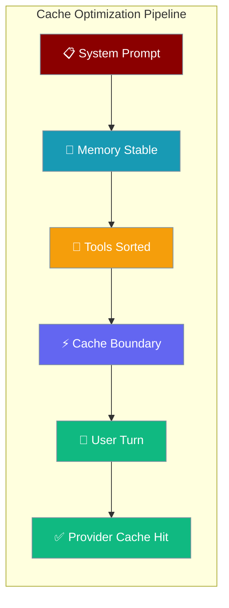
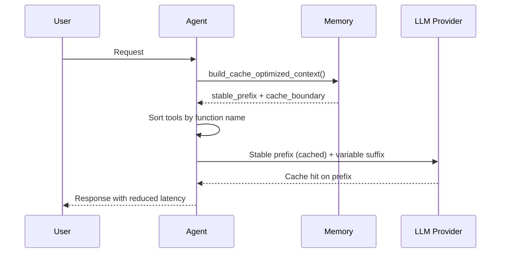

Praison automatically arranges your agent's system prompt, memory, and tools so providers like Anthropic, OpenAI, Bedrock, and Deepseek can cache the stable parts — no code change needed.



## Quick Start

<Steps>
<Step title="Automatic Activation">
Cache optimization is enabled automatically for supported models:

```python
from praisonaiagents import Agent

agent = Agent(
    instructions="You are a helpful assistant",
    llm="anthropic/claude-sonnet-4-20250514",  # supports prompt caching
    memory=True,
)

agent.start("Summarize the latest report")
# Memory + tools laid out cache-friendly automatically
```
</Step>

<Step title="Explicit Configuration">
Make cache optimization visible in your configuration:

```python
from praisonaiagents import Agent, CachingConfig

agent = Agent(
    instructions="You are a helpful assistant", 
    llm="openai/gpt-4o",
    memory=True,
    caching=CachingConfig(prompt_caching=True)
)

agent.start("Analyze the data trends")
```
</Step>
</Steps>

---

## How It Works



### Three Cache-Friendly Behaviors

| Behavior | What It Does | Impact |
|----------|-------------|---------|
| **Deterministic tool order** | Tools sorted by function name | Adding/reordering tools doesn't break cache |
| **Stable memory prefix** | Memory sections in fixed order | Same context = identical prefix = cache hit |
| **Cache boundary marker** | Semantic split between stable/variable | Providers optimize caching automatically |

---

## Supported Models

Cache optimization works automatically with these providers:

| Provider | Models | Cache Type | Activation |
|----------|--------|------------|------------|
| **OpenAI** | gpt-4o, gpt-4-turbo, gpt-3.5-turbo | Automatic (≥1024 tokens) | Automatic |
| **Anthropic** | claude-sonnet-4, claude-opus-4, claude-3-5-* | Manual with cache_control | Manual + `--prompt-caching` |
| **Bedrock** | All models supporting caching | Manual | Manual |
| **Deepseek** | deepseek-chat, deepseek-coder | Automatic | Automatic |

Check if your model supports caching:
```python
from praisonaiagents.llm.model_capabilities import supports_prompt_caching

supports_prompt_caching("anthropic/claude-sonnet-4")  # True
supports_prompt_caching("openai/gpt-4o")             # True
supports_prompt_caching("ollama/llama3")            # False
```

---

## Pipeline Integration

Cache optimization applies across all agent surfaces:

| Surface | Method | Cache-Optimized |
|---------|--------|----------------|
| **Single agent** | `Agent._build_system_prompt` | ✅ When model supports caching |
| **Session** | `Session.get_context` | ✅ Memory context optimized |
| **API session** | `APISession.get_context` | ✅ Memory context optimized |
| **Multi-agent task** | `Agents._prepare_task_prompt` | ✅ Task context optimized |
| **Task chains** | `Task.execute_callback` | ✅ Next-task context optimized |

---

## User Interaction Flow

Here's a realistic customer support scenario showing cache optimization in action:


**What happens:**
1. **First question**: Memory context is empty, tools are sorted deterministically
2. **Second question**: Memory grows but maintains stable order → cache hit on system prompt + memory prefix
3. **Third question**: More memory added, but provider caches the stable portions → **up to 90% cost reduction**

**Approximate savings:**
- **Turn 1**: Full cost (no cache)
- **Turn 2**: 60-70% cost reduction  
- **Turn 3+**: 80-90% cost reduction

See detailed cost analysis in [Prompt Caching CLI](/cli/prompt-caching).

---

## Best Practices

<AccordionGroup>
<Accordion title="Use supported models">
Cache optimization only works with models that support prompt caching. Use OpenAI (automatic), Anthropic (manual), Bedrock, or Deepseek.

```python
# ✅ Good - supported model
agent = Agent(llm="openai/gpt-4o", memory=True)

# ❌ Won't cache - unsupported model  
agent = Agent(llm="ollama/llama3", memory=True)
```
</Accordion>

<Accordion title="Keep instructions stable">
Variable instructions break the cached prefix. Keep your system prompt consistent across turns.

```python
# ✅ Good - stable instructions
agent = Agent(instructions="You are a helpful customer support agent")

# ❌ Bad - variable instructions
agent.instructions = f"You are helping {customer_name} at {timestamp}"
```
</Accordion>

<Accordion title="Enable memory for optimization">
Memory activates the cache-optimized context path. Without memory, only tool sorting applies.

```python
# ✅ Good - memory enables full optimization
agent = Agent(memory=True, llm="openai/gpt-4o")

# ❌ Limited - only tool sorting optimized
agent = Agent(memory=False, llm="openai/gpt-4o")
```
</Accordion>

<Accordion title="Let the SDK sort tools">
Don't manually sort tool lists. The SDK sorts them deterministically by function name.

```python
# ✅ Good - let SDK sort
tools = [search_tool, email_tool, calendar_tool]
agent = Agent(tools=tools)

# ❌ Bad - manual sorting breaks cache consistency
tools.sort(key=lambda t: t.__name__)
```
</Accordion>
</AccordionGroup>

---

## Related

<CardGroup cols={2}>
<Card title="Agent Caching" icon="database" href="/concepts/caching">
  Core caching concepts and configuration options
</Card>
<Card title="Prompt Caching CLI" icon="terminal" href="/cli/prompt-caching">
  Enable caching via command line with cost analysis
</Card>
</CardGroup>