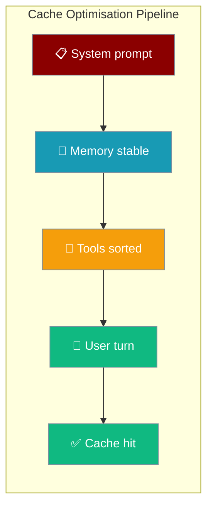
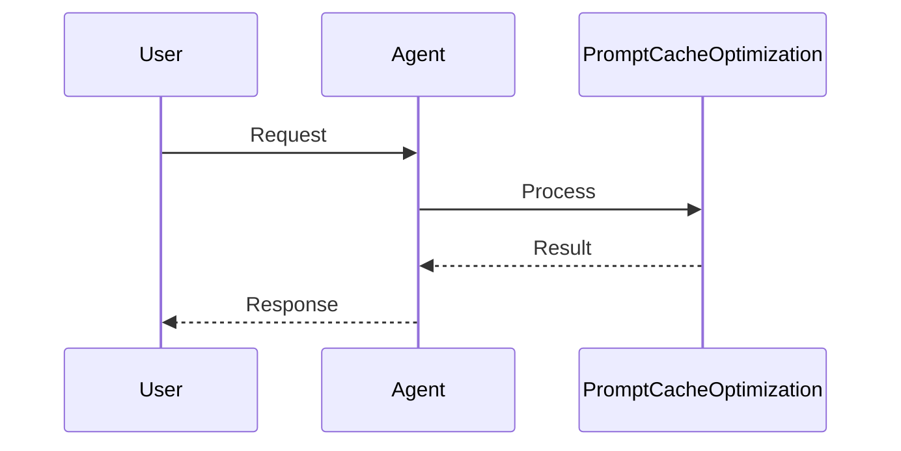
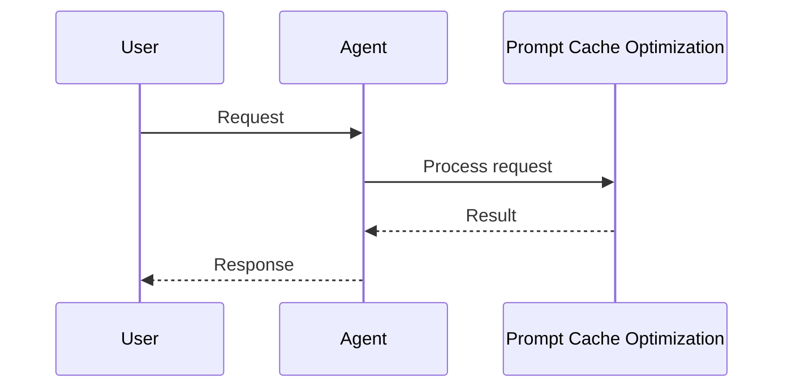

Turn on memory on a supported model — the SDK sorts tools and lays out context so providers can cache the stable prefix.

```python
from praisonaiagents import Agent

agent = Agent(
    instructions="You are a helpful assistant",
    llm="openai/gpt-4o",
    memory=True,
)

agent.start("Summarise the latest report")
# Turn 2+ reuses cached system prompt + memory prefix
agent.start("What changed since yesterday?")
```

The user chats across turns; stable prefixes stay cached for lower cost.




## How It Works




## Quick Start

<Steps>
<Step title="Simple Usage">

Automatic on supported models when memory is enabled:

```python
from praisonaiagents import Agent

agent = Agent(
    instructions="You are a helpful assistant",
    llm="openai/gpt-4o",
    memory=True,
)

agent.start("Summarise the latest report")
```

</Step>

<Step title="With Configuration">

Make prompt caching explicit:

```python
from praisonaiagents import Agent, CachingConfig

agent = Agent(
    instructions="You are a helpful assistant",
    llm="anthropic/claude-sonnet-4-20250514",
    memory=True,
    caching=CachingConfig(prompt_caching=True),
)

agent.start("Analyse the data trends")
```

</Step>
</Steps>

---

## How It Works




| Behaviour | What it does |
|-----------|-------------|
| Deterministic tool order | Tools sorted by function name — reordering tools does not break cache |
| Stable memory prefix | Memory sections in fixed order via `build_cache_optimized_context()` |
| Reserved boundary constant | `CACHE_BOUNDARY` is defined for future structured-cache metadata — not injected into current prompts |

<Note>
`CACHE_BOUNDARY` is a reserved marker constant (`"--- CACHE_BOUNDARY ---"`) on `praisonaiagents.memory.memory` for future structured-cache metadata. No current provider consumes it, so it is intentionally not appended to the outgoing system prompt. Providers hit the cache because the prefix is deterministic — not because of any marker.
</Note>

On OpenAI and Gemini the SDK emits no explicit cache markers. Those providers apply prefix caching automatically as long as the request prefix is **byte-identical** across turns. The optimisations on this page — deterministic tool order, stable memory layout, no wall-clock in the system prompt — are what make automatic caching work.

<Tip>
Anthropic works differently: it gets explicit `cache_control` breakpoints on the system block and the stable history prefix. See [Prompt Caching](/docs/features/prompt-caching) for the Anthropic breakpoint behaviour and the provider-behaviour table.
</Tip>

Check model support:

```python
from praisonaiagents.llm.model_capabilities import supports_prompt_caching

supports_prompt_caching("openai/gpt-4o")  # True
supports_prompt_caching("ollama/llama3")  # False
```

---

## Configuration Options

| Option | Type | Default | Description |
|--------|------|---------|-------------|
| `enabled` | `bool` | `True` | Response caching |
| `prompt_caching` | `Optional[bool]` | `None` | Provider prompt-cache hints (Anthropic manual, OpenAI automatic when eligible) |

Set via `Agent(caching=True)` or `Agent(caching=CachingConfig(...))`.

The `include_cache_boundary` flag on `build_cache_optimized_context()` controls whether the returned dict contains the marker; it does not affect what is sent on the wire.

---

## Best Practices

<AccordionGroup>
<Accordion title="Use supported models">
OpenAI, Anthropic, Bedrock, and Deepseek support caching — local models like Ollama do not.
</Accordion>
<Accordion title="Keep instructions stable">
Changing system prompts between turns breaks the cached prefix.
</Accordion>
<Accordion title="Enable memory for full optimisation">
Without memory, only tool sorting applies — `memory=True` activates the cache-optimised context path.
</Accordion>
<Accordion title="Let the SDK sort tools">
Do not manually reorder tool lists — the SDK sorts deterministically by name.
</Accordion>
</AccordionGroup>

---

## Related

<CardGroup cols={2}>
<Card title="Prompt Caching" icon="database" href="/docs/features/prompt-caching">
  Deterministic memory ordering for cache hits
</Card>
<Card title="Prompt Caching CLI" icon="terminal" href="/docs/cli/prompt-caching">
  Enable caching from the command line
</Card>
</CardGroup>
