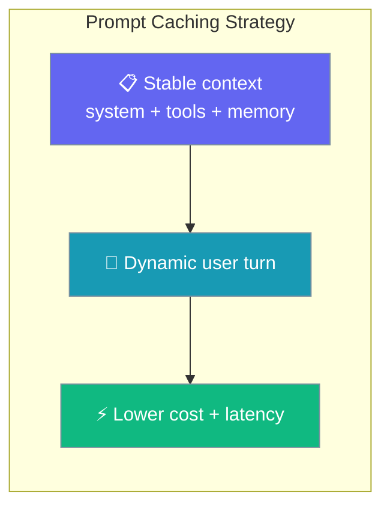
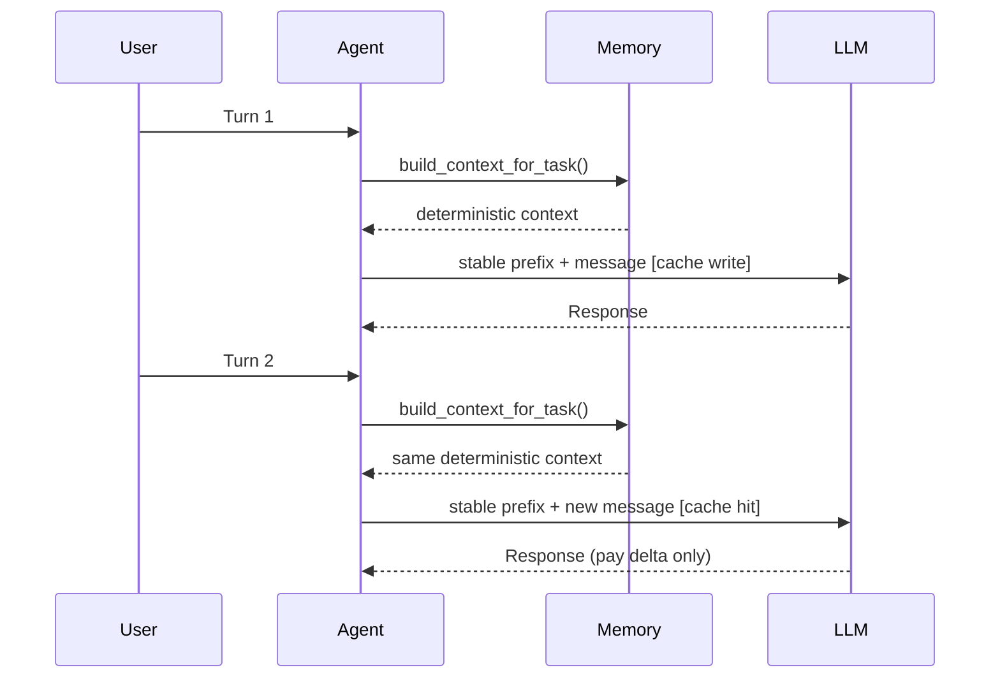

Reuse stable context across turns — pay full token cost once for instructions, tools, and unchanged memory.

```python
from praisonaiagents import Agent, CachingConfig

agent = Agent(
    name="Researcher",
    instructions="Answer research questions using memory.",
    llm="anthropic/claude-sonnet-4-20250514",
    memory=True,
    caching=CachingConfig(prompt_caching=True),
)

agent.start("What did we learn last week about prompt caching?")
agent.start("What are the cost savings?")  # cache hit on stable prefix
```



## Quick Start

<Steps>
<Step title="Simple Usage">

Deterministic ordering is automatic with memory:

```python
from praisonaiagents import Agent

agent = Agent(
    name="Researcher",
    instructions="Answer research questions using memory.",
    memory=True,
)

agent.start("What did we learn last week about prompt caching?")
```

</Step>

<Step title="With Configuration">

Enable provider prompt caching explicitly:

```python
from praisonaiagents import Agent, CachingConfig

agent = Agent(
    name="Researcher",
    instructions="Answer research questions using memory.",
    llm="anthropic/claude-sonnet-4-20250514",
    memory=True,
    caching=CachingConfig(prompt_caching=True),
)
```

</Step>
</Steps>

---

## How It Works



| Component | Caching behaviour |
|-----------|-------------------|
| Memory search results | Deterministic order by content hash and timestamps |
| Tool schemas | Consistent ordering across invocations |
| Context structure | Stable system + memory before dynamic user input |

---

## Configuration Options

| Option | Type | Default | Description |
|--------|------|---------|-------------|
| `enabled` | `bool` | `True` | Response caching via `CachingConfig` |
| `prompt_caching` | `Optional[bool]` | `None` | Provider prompt-cache control |
| `max_items` | `int` | `3` | Max items per memory category in `build_context_for_task()` |
| `include_in_output` | `Optional[bool]` | `None` | Include memory in assembled prompt (manual assembly) |

---

## Best Practices

<AccordionGroup>
<Accordion title="Keep memory writes between turns minimal">
Frequent memory updates change the prefix and reduce cache hits — batch updates at conversation boundaries.
</Accordion>
<Accordion title="Place stable content first">
Instructions, tools, and static memory before user messages and fresh data.
</Accordion>
<Accordion title="Use consistent parameters">
Varying `max_items` between turns changes context and breaks cache effectiveness.
</Accordion>
<Accordion title="Pair with cache optimisation">
See [Prompt Cache Optimisation](/docs/features/prompt-cache-optimization) for tool sorting and cache boundaries.
</Accordion>
</AccordionGroup>

---

## Related

<CardGroup cols={2}>
<Card title="Prompt Cache Optimisation" icon="database" href="/docs/features/prompt-cache-optimization">
  Stable prefixes, tool sorting, and cache boundaries
</Card>
<Card title="Advanced Memory" icon="brain" href="/docs/features/advanced-memory">
  Memory configuration and search strategies
</Card>
</CardGroup>
