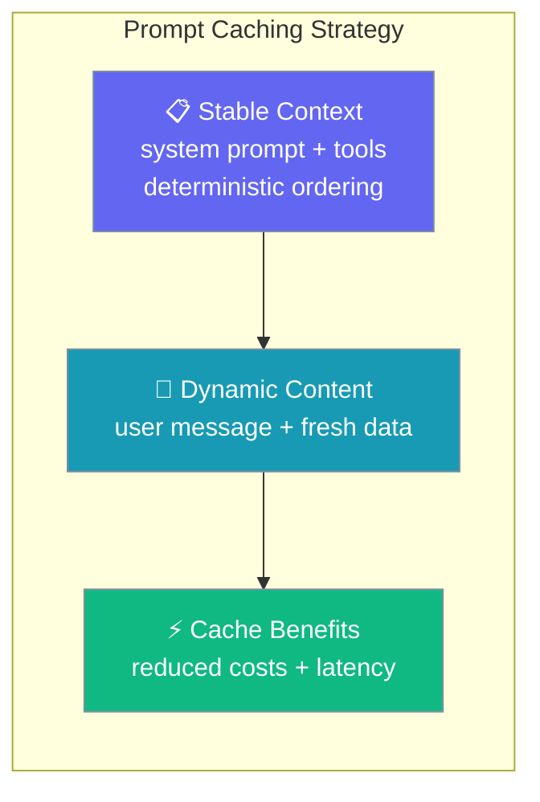
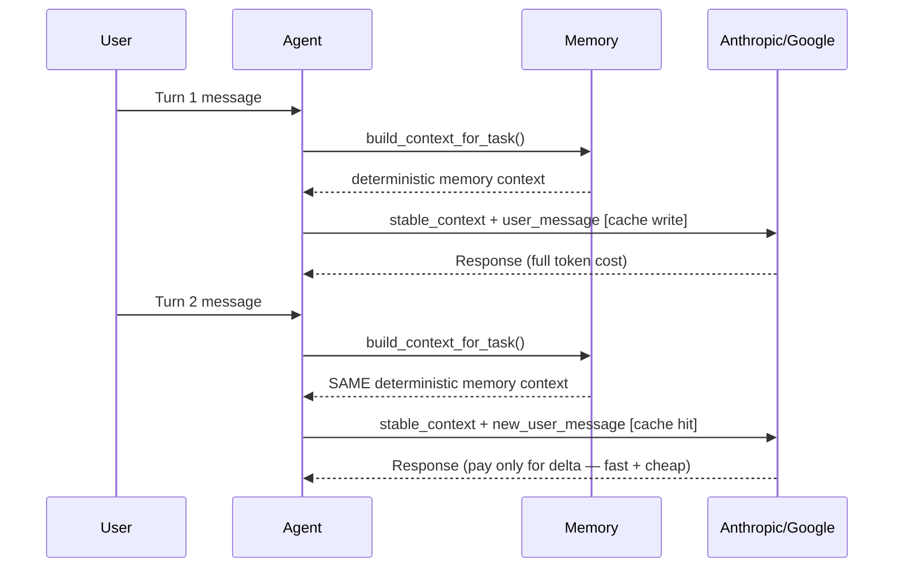

Prompt caching optimizes LLM token costs by reusing stable context across conversation turns, paying full cost only once for unchanging prompt prefixes.



## Quick Start

<Steps>
<Step title="Use deterministic memory ordering">

```python
from praisonaiagents import Agent

agent = Agent(
    name="Researcher",
    instructions="Answer research questions using memory and tools.",
    memory=True,
)

# Memory results are sorted deterministically for cache consistency
agent.start("What did we learn last week about prompt caching?")
```

Memory search results maintain consistent ordering to improve cache hit rates on Anthropic/Google models.

</Step>

<Step title="Manual prompt assembly for caching">

```python
from praisonaiagents import Agent, Memory

memory = Memory(config={"provider": "rag"})

# Get consistent memory context
context = memory.build_context_for_task(
    task_descr="Summarise our research notes",
    user_id="user_123",
    max_items=3,
    include_in_output=True  # Force include for prompt assembly
)

# Construct cache-friendly prompt structure
system_prompt = f"System instructions and tools\n\n{context}\n\nUser message: {{user_input}}"
```

</Step>
</Steps>

---

## How It Works



| Component | Caching Behavior |
|-----------|------------------|
| Memory search results | Returned in deterministic order based on content hashing and timestamps |
| Tool schemas | Consistent ordering for reproducible prompts |
| Context structure | Stable system prompt + memory + dynamic user input |
| Cache effectiveness | High hit rates when underlying data is unchanged |

---

## Configuration Options

The `build_context_for_task()` method provides these parameters for cache-optimized context:

| Parameter | Type | Default | Description |
|-----------|------|---------|-------------|
| `task_descr` | `str` | — | Task description for memory search |
| `user_id` | `Optional[str]` | `None` | Optional user ID for personalised memory |
| `additional` | `str` | `""` | Additional context to include in search |
| `max_items` | `int` | `3` | Maximum items per memory category |
| `include_in_output` | `Optional[bool]` | `None` | Whether to include memory content in output (set to `True` for manual prompt assembly) |

**Returns:** `str` — deterministically ordered context string combining relevant memories

---

## Common Patterns

### Multi-turn chat with memory

Just using `memory=True` is enough; deterministic ordering is automatic.

```python
from praisonaiagents import Agent

agent = Agent(
    name="Assistant",
    instructions="Help with research tasks using memory.",
    memory=True,
)

# Each turn automatically gets cache-friendly prefixes
agent.start("Research prompt caching benefits")
agent.start("What are the cost savings?")  # Cache hit on Anthropic/Google
```

### Manual prompt assembly for custom LLM calls

Use `build_context_for_task()` with explicit output control for manual prompt construction.

```python
from praisonaiagents import Memory

memory = Memory(config={"provider": "rag"})

context = memory.build_context_for_task(
    task_descr="Analyse user feedback",
    max_items=5,
    include_in_output=True  # Force memory content inclusion
)

# Construct cache-friendly prompt structure
system_prompt = f"""System: You are an AI assistant.

{context}

User: {user_input}"""
```

### Tool schema consistency

Tools are ordered consistently to maintain prompt cache effectiveness across invocations.

---

## Best Practices

<AccordionGroup>

<Accordion title="Keep memory writes batched between turns">
Minimize memory updates during conversation turns to maintain cache consistency. Update memories at conversation boundaries.
</Accordion>

<Accordion title="Structure prompts for caching">
Place stable system content (instructions, tools, static memory) before dynamic content (user messages, fresh data).
</Accordion>

<Accordion title="Use consistent parameters">
Varying `max_items` or other context parameters between turns changes the context and reduces cache effectiveness.
</Accordion>

<Accordion title="Maintain deterministic ordering">
The framework automatically ensures consistent ordering for memory search results and tool schemas to optimize cache hits.
</Accordion>

</AccordionGroup>

---

## Related

<CardGroup cols={2}>
<Card title="Advanced Memory" icon="brain" href="/docs/features/advanced-memory">
Memory configuration and search strategies
</Card>
<Card title="Stateful Agents" icon="user" href="/docs/features/stateful-agents">
Building agents that maintain conversation state
</Card>
</CardGroup>