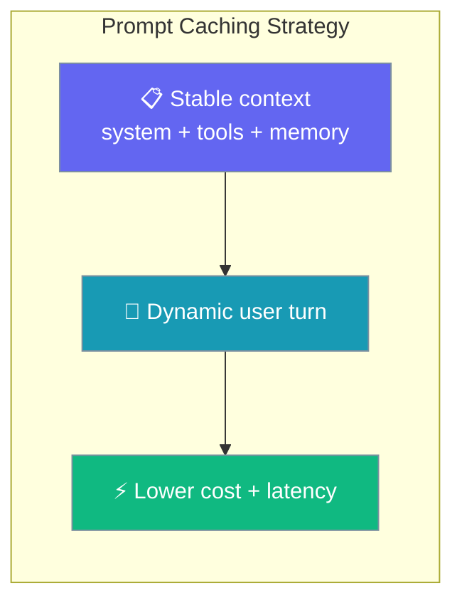
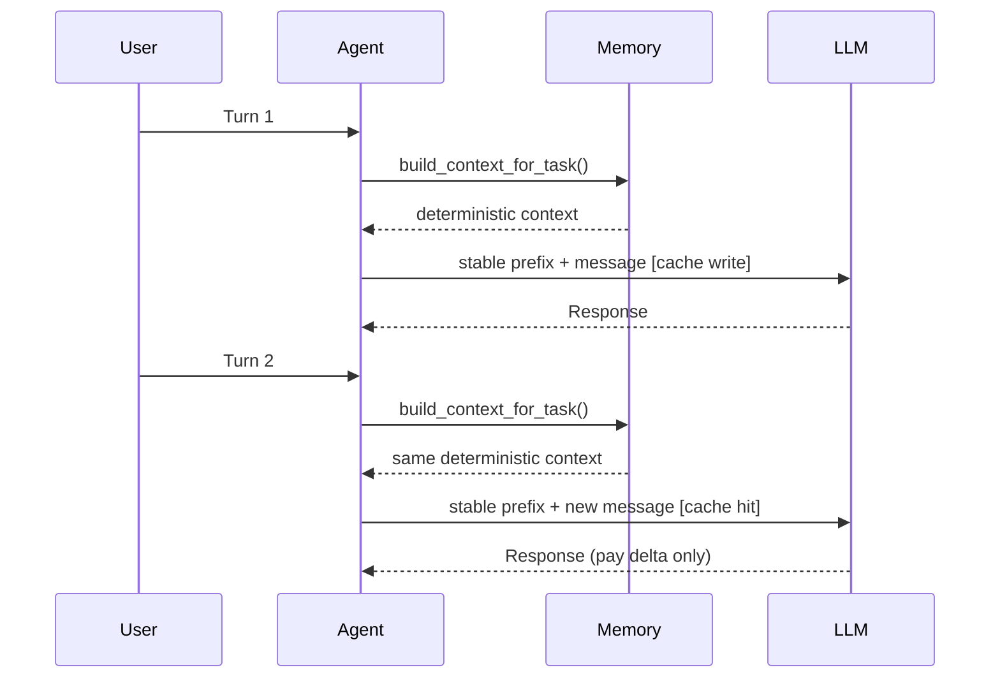

Reuse stable context across turns — pay full token cost once for instructions, tools, and unchanged memory.

```python
from praisonaiagents import Agent, CachingConfig

agent = Agent(
    name="Researcher",
    instructions="Answer research questions using memory.",
    llm="anthropic/claude-sonnet-4-20250514",
    memory=True,
    caching=CachingConfig(prompt_caching=True),
)

agent.start("What did we learn last week about prompt caching?")
agent.start("What are the cost savings?")  # cache hit on stable prefix
```

The user continues the conversation; cached instructions and memory skip repeat token charges.




## Quick Start

<Steps>
<Step title="Simple Usage">

Deterministic ordering is automatic with memory:

```python
from praisonaiagents import Agent

agent = Agent(
    name="Researcher",
    instructions="Answer research questions using memory.",
    memory=True,
)

agent.start("What did we learn last week about prompt caching?")
```

</Step>

<Step title="With Configuration">

Enable provider prompt caching explicitly — later turns hit the cached system block and history prefix:

```python
from praisonaiagents import Agent, CachingConfig

agent = Agent(
    name="Researcher",
    instructions="Answer research questions using memory.",
    llm="anthropic/claude-sonnet-4-20250514",
    memory=True,
    caching=CachingConfig(prompt_caching=True),
)

agent.start("What did we learn last week?")
agent.start("Summarise the top three findings.")  # cache hit on system + history prefix
agent.start("Turn those into action items.")      # still hitting the same prefix
```

</Step>

<Step title="OpenAI — no explicit markers">

OpenAI applies prefix caching automatically; the SDK keeps the prefix byte-stable so no markers are emitted:

```python
from praisonaiagents import Agent

agent = Agent(
    instructions="You are a helpful analyst.",
    llm="openai/gpt-4o",
    memory=True,
)

agent.start("Summarise the report")
agent.start("What changed since yesterday?")  # automatic prefix cache hit
```

</Step>
</Steps>

---

## How It Works

<Note>
Chat history you pass into `agent.start(...)` is not mutated. The SDK deep-copies the boundary message before adding a marker, so the same history dict can be reused across OpenAI, Gemini, and Anthropic in mixed pipelines.
</Note>



| Component | Caching behaviour |
|-----------|-------------------|
| Memory search results | Deterministic order by content hash and timestamps |
| Tool schemas | Consistent ordering across invocations |
| Context structure | Stable system + memory before dynamic user input |

---

## Cache breakpoints

On Anthropic models the SDK marks **two** stable regions with a `cache_control` breakpoint: the system prompt (instructions, tools, memory prelude) and the stable conversation-history prefix. The two most recent messages stay uncached — they change every turn, and marking them would move the cache boundary and invalidate the prefix.


The history-prefix breakpoint lands on the last stable message. Each turn the prefix grows by one exchange, so older prefixes stay cache-hittable while the volatile tail (the two most recent messages) is re-sent uncached.

```mermaid
sequenceDiagram
    participant User
    participant Agent
    participant LLM

    User->>Agent: First question
    Agent->>LLM: [system 🔒] [history prefix (empty) 🔒] [user "First question"]
    LLM-->>Agent: Answer

    User->>Agent: Second question
    Agent->>LLM: [system 🔒] [history prefix (Q1, A1) 🔒] [user "Second question"]
    Note over Agent,LLM: prefix cached from turn 1

    User->>Agent: Third question
    Agent->>LLM: [system 🔒] [history prefix (Q1, A1, Q2, A2) 🔒] [user "Third question"]
    Note over Agent,LLM: grows one turn at a time; each older prefix stays cache-hittable
```

Anthropic allows up to **4** breakpoints per request. The SDK counts markers already present — the system block plus any markers left on caller-supplied history — and returns early before adding a new one if that count reaches 4, so the provider cap is never exceeded.

---

## Provider behaviour

| Provider | Explicit `cache_control` markers | How caching happens |
|----------|----------------------------------|---------------------|
| Anthropic (`anthropic/*`, Bedrock Anthropic, Vertex Anthropic) | ✅ Yes — system block + history-prefix marker | Manual breakpoints, up to 4 per request (Anthropic cap) |
| OpenAI (`openai/*`, Azure OpenAI) | ❌ No | Automatic prefix caching — SDK just keeps the prefix byte-stable |
| Google (`gemini/*`, Vertex Gemini) | ❌ No | Automatic prefix caching — SDK just keeps the prefix byte-stable |
| Others (Ollama, local models) | ❌ No | No provider-side caching |

Verified against `_explicit_cache_breakpoints()` in `llm.py` — Anthropic gets explicit markers; OpenAI and Gemini rely on automatic prefix caching so no markers are emitted.

---

## Configuration Options

| Option | Type | Default | Description |
|--------|------|---------|-------------|
| `enabled` | `bool` | `True` | Response caching via `CachingConfig` |
| `prompt_caching` | `Optional[bool]` | `None` | Provider prompt-cache control |
| `max_items` | `int` | `3` | Max items per memory category in `build_context_for_task()` |
| `include_in_output` | `Optional[bool]` | `None` | Include memory in assembled prompt (manual assembly) |

---

## Best Practices

<AccordionGroup>
<Accordion title="Keep memory writes between turns minimal">
Frequent memory updates change the prefix and reduce cache hits — batch updates at conversation boundaries.
</Accordion>
<Accordion title="Place stable content first">
Instructions, tools, and static memory before user messages and fresh data.
</Accordion>
<Accordion title="Use consistent parameters">
Varying `max_items` between turns changes context and breaks cache effectiveness.
</Accordion>
<Accordion title="Pair with cache optimisation">
See [Prompt Cache Optimisation](/docs/features/prompt-cache-optimization) for tool sorting and the deterministic memory prefix.
</Accordion>
</AccordionGroup>

---

## Related

<CardGroup cols={2}>
<Card title="Prompt Cache Optimisation" icon="database" href="/docs/features/prompt-cache-optimization">
  Stable prefixes, tool sorting, and deterministic memory ordering
</Card>
<Card title="Advanced Memory" icon="brain" href="/docs/features/advanced-memory">
  Memory configuration and search strategies
</Card>
</CardGroup>
