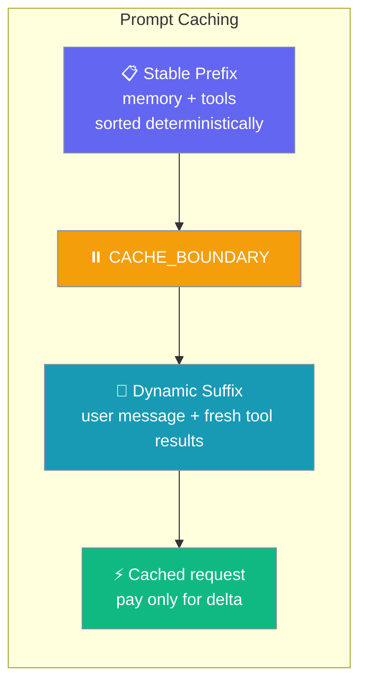
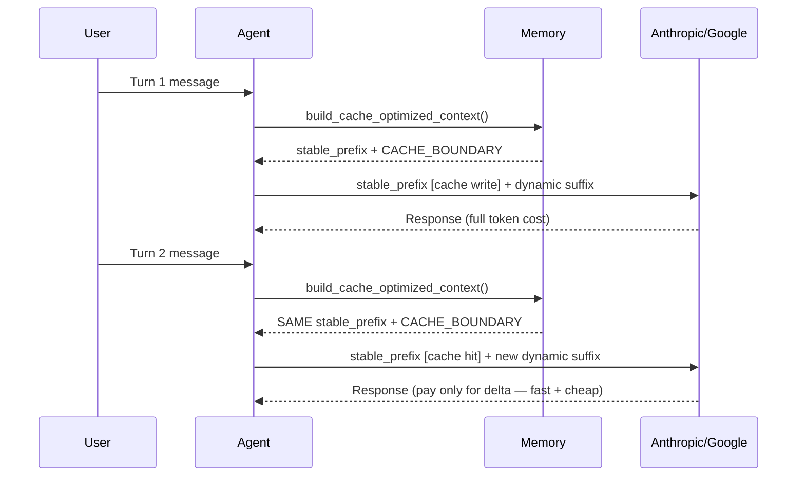

Prompt caching reuses the stable part of your system prompt across turns, so you pay full token cost only once instead of every message.



## Quick Start

<Steps>
<Step title="Simple usage (default deterministic behaviour, no opt-in)">

```python
from praisonaiagents import Agent

agent = Agent(
    name="Researcher",
    instructions="Answer research questions using memory and tools.",
    memory=True,
)

agent.start("What did we learn last week about prompt caching?")
```

As of PR #1909 the memory layer now sorts results deterministically by default — multi-turn conversations automatically get cache-friendly prefixes on Anthropic/Google.

</Step>

<Step title="Explicit cache-optimised context (advanced)">

```python
from praisonaiagents import Agent
from praisonaiagents.memory import Memory

memory = Memory(config={"provider": "rag"})

ctx = memory.build_cache_optimized_context(
    task_descr="Summarise our research notes",
    user_id="user_123",
    max_items=3,
)

system_prompt = ctx["stable_prefix"] + ctx["cache_boundary"] + "Latest user message goes here"
```

</Step>
</Steps>

---

## How It Works



| Component | Before PR #1909 | After PR #1909 |
|-----------|-----------------|----------------|
| Memory search results | Returned in DB / similarity order — varies turn-to-turn | Sorted by `(timestamp_desc, sha256(content))` — byte-stable |
| Tool schemas | Insertion / dict order — process-dependent | Sorted alphabetically by `function.name` |
| Cache boundary | None | `CACHE_BOUNDARY = "\n\n\n\n"` marker available |
| Cache hit on Anthropic/Google | Almost never | Every turn where the underlying data hasn't changed |

---

## Configuration Options

The `build_cache_optimized_context()` method provides these parameters:

| Parameter | Type | Default | Description |
|-----------|------|---------|-------------|
| `task_descr` | `str` | — | Task description for memory search |
| `user_id` | `Optional[str]` | `None` | Optional user ID for personalised memory |
| `additional` | `str` | `""` | Additional context to include in search |
| `max_items` | `int` | `3` | Maximum items per memory category |
| `include_cache_boundary` | `bool` | `True` | Include the cache boundary marker in the returned dict |
| `include_in_output` | `Optional[bool]` | `None` (treated as `True` here) | Whether to include memory content in output |

**Returns:** `Dict[str, str]` with keys:
- `stable_prefix` — deterministically ordered context string (safe to send as a long-TTL cached prefix)
- `cache_boundary` — the `CACHE_BOUNDARY` marker string (empty string if `include_cache_boundary=False`)

---

## Common Patterns

### Multi-turn chat with memory

Just using `memory=True` is enough; deterministic ordering is automatic.

```python
from praisonaiagents import Agent

agent = Agent(
    name="Assistant",
    instructions="Help with research tasks using memory.",
    memory=True,
)

# Each turn automatically gets cache-friendly prefixes
agent.start("Research prompt caching benefits")
agent.start("What are the cost savings?")  # Cache hit on Anthropic/Google
```

### Manual prompt assembly for custom LLM calls

Use `build_cache_optimized_context()` directly with the returned `stable_prefix` + `cache_boundary` + dynamic suffix pattern.

```python
from praisonaiagents.memory import Memory

memory = Memory(config={"provider": "rag"})

ctx = memory.build_cache_optimized_context(
    task_descr="Analyse user feedback",
    max_items=5,
)

# Construct prompt with clear boundary
system_prompt = (
    ctx["stable_prefix"] + 
    ctx["cache_boundary"] + 
    f"Current user message: {user_input}"
)
```

### Sorted tool schemas for custom provider calls

Use `get_sorted_tool_schemas()` for users who hand-roll tool lists.

```python
from praisonaiagents.tools.base import get_sorted_tool_schemas

schemas = get_sorted_tool_schemas([my_tool_a, my_tool_z, my_tool_m])
# schemas are now alphabetically sorted by function name
```

---

## Best Practices

<AccordionGroup>

<Accordion title="Keep memory writes in batches between turns">
Every write invalidates the cached prefix. Batch memory updates at end-of-turn rather than mid-turn.
</Accordion>

<Accordion title="Put per-turn content AFTER the cache boundary">
The boundary marker signals to your LLM call code where the long-TTL cache write ends.
</Accordion>

<Accordion title="Use `max_items` consistently">
Varying `max_items` between turns changes the prefix and misses the cache.
</Accordion>

<Accordion title="Sort custom tool lists">
If you bypass the default tool pipeline, run `get_sorted_tool_schemas()` so your schema list is stable.
</Accordion>

</AccordionGroup>

---

## Related

<CardGroup cols={2}>
<Card title="Advanced Memory" icon="brain" href="/features/advanced-memory">
Memory configuration and search strategies
</Card>
<Card title="Stateful Agents" icon="user" href="/features/stateful-agents">
Building agents that maintain conversation state
</Card>
</CardGroup>