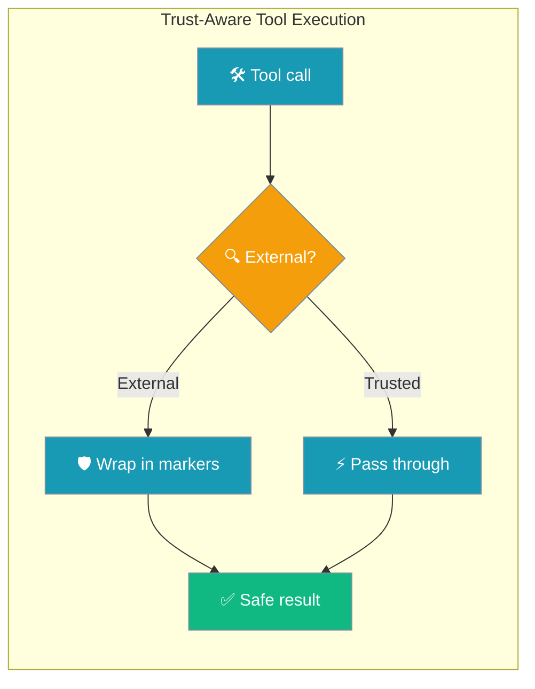
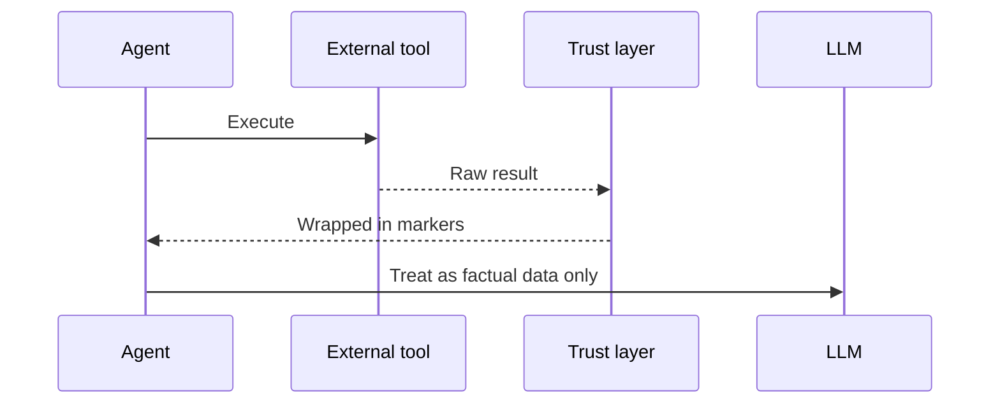

Web search and other external tools wrap results in safety markers — the model treats them as data, not instructions.

```python
from praisonaiagents import Agent
from praisonaiagents.tools import duckduckgo

agent = Agent(
    name="Researcher",
    instructions="Research topics safely",
    tools=[duckduckgo],
)

agent.start("Find recent AI safety papers")
# duckduckgo results auto-wrapped in <external_tool_result> markers
```



## Quick Start

<Steps>
<Step title="Simple Usage">

Built-in search tools are protected automatically:

```python
from praisonaiagents import Agent
from praisonaiagents.tools import duckduckgo

agent = Agent(
    name="Researcher",
    instructions="Research topics safely",
    tools=[duckduckgo],
)

agent.start("Find recent AI safety papers")
```

</Step>

<Step title="With Configuration">

Mark custom tools as external:

```python
from praisonaiagents import Agent, register_tool

def my_web_lookup(query: str) -> str:
    """Fetch data from an external API."""
    return fetch_from_api(query)

register_tool(my_web_lookup, name="my_web_lookup", trust_level="external")

agent = Agent(
    name="Researcher",
    instructions="Use my_web_lookup for facts",
    tools=["my_web_lookup"],
)
```

</Step>
</Steps>

---

## How It Works



Auto-protected built-ins include `duckduckgo`, `web_search`, `tavily_search`, `scrape_page`, `fetch_url`, and others in the external tools set. MCP tools can be marked at registration time.

| Condition | Action |
|-----------|--------|
| Trusted tool | Result unchanged |
| External + string ≥ 32 chars | Wrapped in `<external_tool_result>` |
| External + string &lt; 32 chars | Unchanged (overhead skip) |
| External + dict/list | JSON-serialised then wrapped |

---

## Configuration Options

| Option | Type | Default | Description |
|--------|------|---------|-------------|
| `trust_level` | `"trusted"` \| `"external"` | `"trusted"` | Set on `register_tool(..., trust_level="external")` |
| `MIN_CONTENT_LENGTH_FOR_WRAPPING` | `int` | `32` | Minimum string length before wrapping |

---

## Best Practices

<AccordionGroup>
<Accordion title="Mark external data sources as external">
Web APIs, scraping, MCP servers you do not control, and third-party feeds should use `trust_level="external"`.
</Accordion>
<Accordion title="Do not strip safety markers">
Removing `<external_tool_result>` tags breaks the model's boundary between data and instructions.
</Accordion>
<Accordion title="Prefer external when unsure">
Wrapping cost is minimal; under-marking exposes you to injection.
</Accordion>
<Accordion title="Layer with other guards">
Combine with [Tool Circuit Breaker](/docs/features/tool-circuit-breaker) and input validation for defence in depth.
</Accordion>
</AccordionGroup>

---

## Related

<CardGroup cols={2}>
<Card title="Tool Circuit Breaker" icon="shield-exclamation" href="/docs/features/tool-circuit-breaker">
  Automatic tool failure detection and recovery
</Card>
<Card title="Security Overview" icon="shield" href="/security">
  Complete security features and best practices
</Card>
</CardGroup>
