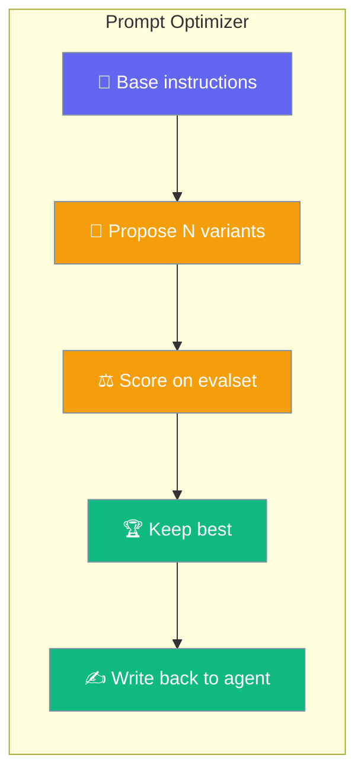
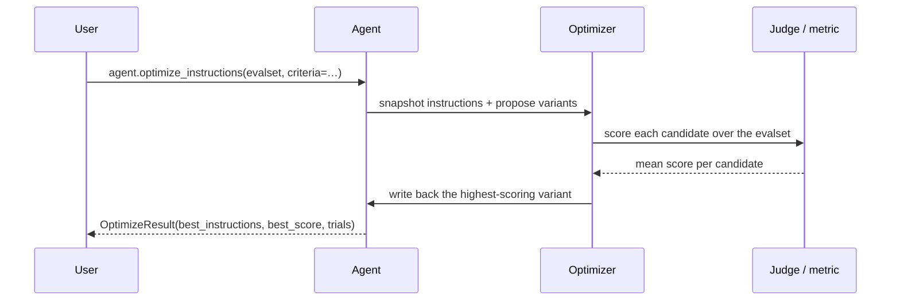

Prompt Optimizer rewrites your agent's instructions and keeps the version that scores highest on your eval.

```python
from praisonaiagents import Agent

agent = Agent(name="Summariser", instructions="Summarise the input.")

result = agent.optimize_instructions(
    evalset=[("Summarise: PraisonAI is an agent framework.", "PraisonAI is a framework for agents.")],
    criteria="concise, faithful, no hallucinations",
)

print(result.best_score, result.improved)
print(agent.instructions)   # winning instructions are written back
```



## Quick Start

<Steps>
<Step title="Optimise with the LLM Judge">
Score each candidate with the built-in Judge using plain-English criteria.

```python
from praisonaiagents import Agent

agent = Agent(name="Summariser", instructions="Summarise the input.")

result = agent.optimize_instructions(
    evalset=[
        ("Summarise: PraisonAI is an agent framework.", "PraisonAI is a framework for agents."),
        ("Summarise: Skills are grounded reusable tasks.", "Skills are reusable grounded tasks."),
    ],
    criteria="concise, faithful, no hallucinations",
    n_candidates=6,
)

print(result.best_score, result.improved)
```
</Step>

<Step title="Score with a numeric metric">
Supply a `metric(output, expected) -> float` to replace the Judge with your own gold-data score.

```python
from praisonaiagents import Agent

def word_overlap(output: str, expected: str) -> float:
    a, b = set(output.lower().split()), set(expected.lower().split())
    return len(a & b) / max(len(b), 1)

agent = Agent(name="Summariser", instructions="Summarise the input.")

result = agent.optimize_instructions(
    evalset=[
        ("Summarise: PraisonAI is an agent framework.", "PraisonAI is a framework for agents."),
        ("Summarise: Skills are grounded reusable tasks.", "Skills are reusable grounded tasks."),
    ],
    metric=word_overlap,
    n_candidates=4,
)

print(result.best_score)
```
</Step>

<Step title="Preview without applying">
Set `apply=False` to keep the original instructions and inspect the winner first.

```python
from praisonaiagents import Agent

agent = Agent(name="Summariser", instructions="Summarise the input.")

result = agent.optimize_instructions(
    evalset=[("Summarise X", "gold X"), ("Summarise Y", "gold Y")],
    criteria="concise, faithful",
    apply=False,
)

print(result.best_instructions)   # inspect before applying
agent.instructions = result.best_instructions   # apply manually when ready
```
</Step>
</Steps>

---

## How It Works



The optimiser runs in five steps:

| Step | What happens |
|---|---|
| **Snapshot** | Captures the agent's `instructions`, `goal`, and `backstory`. |
| **Propose** | Asks an auxiliary LLM for `n_candidates` rewrites, seeded with the lowest-scoring examples. |
| **Score** | Runs the agent with each candidate over the eval set and averages the scores. |
| **Keep best** | Selects the highest-scoring candidate; if `apply=True`, writes it back and clears the system-prompt cache. |
| **Restore** | Restores the original state when `apply=False` or on error. |

---

## Configuration Options

`agent.optimize_instructions(...)` accepts these parameters:

| Option | Type | Default | Description |
|--------|------|---------|-------------|
| `evalset` | `list[tuple[str, Any]]` | — | List of `(prompt, expected)` cases to score candidates on. |
| `metric` | `Callable[[output, expected], float]` | `None` | Numeric metric; when set, replaces the LLM Judge. |
| `scorer` | `Judge` | `None` | Custom Judge instance (ignored when `metric` is set). |
| `criteria` | `str` | `""` | Criteria for the default Judge. |
| `n_candidates` | `int` | `6` | Number of instruction variants to try. |
| `apply` | `bool` | `True` | Write the winning instructions back to `self.instructions`. |

<Note>
`aoptimize_instructions(...)` is the async twin — it offloads the synchronous run to a worker thread so async callers never block the event loop.
</Note>

### OptimizeResult

`optimize_instructions(...)` returns an `OptimizeResult`:

| Field | Type | Description |
|-------|------|-------------|
| `best_instructions` | `str` | Highest-scoring instructions found. |
| `best_score` | `float` | Aggregate score of the winning instructions. |
| `base_score` | `float` | Aggregate score of the original instructions. |
| `trials` | `list[tuple[str, float]]` | Every candidate tried (base + variants) with its score. |
| `applied` | `bool` | Whether the winner was written back to the agent. |
| `improved` | `bool` (property) | `True` when `best_score > base_score`. |

---

## Common Patterns

### Judge-based scoring for open-ended tasks

Use `criteria` when there is no single gold answer.

```python
from praisonaiagents import Agent

agent = Agent(name="Writer", instructions="Write a product blurb.")

result = agent.optimize_instructions(
    evalset=[("Blurb for an AI assistant", None), ("Blurb for a note app", None)],
    criteria="engaging, concise, benefit-led",
    n_candidates=6,
)
```

### Numeric-metric scoring with gold data

Plug in any empirical score — rouge_l, accuracy, latency, or a custom function.

```python
from praisonaiagents import Agent

def accuracy(output: str, expected: str) -> float:
    return 1.0 if expected.lower() in output.lower() else 0.0

agent = Agent(name="Classifier", instructions="Answer yes or no.")

result = agent.optimize_instructions(
    evalset=[("Is 7 prime?", "yes"), ("Is 8 prime?", "no")],
    metric=accuracy,
)
```

### Async usage

```python
from praisonaiagents import Agent

agent = Agent(name="Summariser", instructions="Summarise the input.")

result = await agent.aoptimize_instructions(
    evalset=[("Summarise X", "gold X")],
    criteria="concise, faithful",
)
```

### Dry-run then apply manually

```python
from praisonaiagents import Agent

agent = Agent(name="Summariser", instructions="Summarise the input.")

result = agent.optimize_instructions(
    evalset=[("Summarise X", "gold X")],
    criteria="concise",
    apply=False,
)

if result.improved:
    agent.instructions = result.best_instructions
```

<Tip>
A user typically runs the optimiser once on a small eval, inspects `result.trials` to see which variants were tried and how they scored, adjusts the eval set, then re-runs until the winner is good enough to apply.
</Tip>

---

## Best Practices

<AccordionGroup>
  <Accordion title="Keep the eval set small (4–10 cases)">
    The optimiser runs the agent `(1 + n_candidates) × len(evalset)` times. A small, representative eval keeps cost and latency low while still surfacing the best variant.
  </Accordion>
  <Accordion title="Prefer a numeric metric when you have gold data">
    A `metric` is cheaper and more reproducible than the LLM Judge. Use `criteria` only for open-ended tasks where no single gold answer exists.
  </Accordion>
  <Accordion title="Tune n_candidates to your instructions">
    Increase `n_candidates` when your instructions are short or generic; decrease it when they are already specific and you only want small refinements.
  </Accordion>
  <Accordion title="Store result.trials for auditing">
    `result.trials` lists every candidate and its score. Persist it to review which rewrites were tried and how they compared to the base.
  </Accordion>
</AccordionGroup>

---

## Related

<CardGroup cols={2}>
  <Card title="Evaluation Loop" icon="rotate" href="/docs/eval/evaluation-loop">
    Iteratively run, judge, and keep the best output
  </Card>
  <Card title="Learn Skill" icon="graduation-cap" href="/docs/features/learn-skill">
    Sibling self-improvement method on the Agent
  </Card>
</CardGroup>
