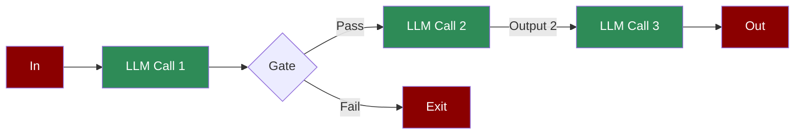

A workflow where the output of one LLM call becomes the input for the next. This sequential design allows for structured reasoning and step-by-step task completion.

## Quick Start

<Steps>
    <Step title="Install Package">
        First, install the PraisonAI Agents package:
        ```bash
        pip install praisonaiagents
        ```
    </Step>

    <Step title="Set API Key">
        Set your OpenAI API key as an environment variable in your terminal:
        ```bash
        export OPENAI_API_KEY=your_api_key_here
        ```
    </Step>

    <Step title="Create a file">
        Create a new file `app.py` with the basic setup:
        ```python
        from praisonaiagents import Agent, Workflow

        # Create agents for each step in the chain
        researcher = Agent(
            name="Researcher",
            role="Research Analyst",
            goal="Research and gather information",
            instructions="Research the given topic thoroughly. Provide factual information."
        )

        analyst = Agent(
            name="Analyst",
            role="Data Analyst",
            goal="Analyze research findings",
            instructions="Analyze the research provided. Extract key insights and patterns."
        )

        writer = Agent(
            name="Writer",
            role="Content Writer",
            goal="Write clear content",
            instructions="Based on the analysis, write a clear and engaging summary."
        )

        editor = Agent(
            name="Editor",
            role="Content Editor",
            goal="Polish and refine content",
            instructions="Edit and polish the content. Ensure clarity and quality."
        )

        from praisonaiagents import WorkflowHooksConfig
        
        # Create sequential workflow (prompt chaining)
        # Each agent's output becomes the next agent's input
        workflow = Workflow(
            steps=[researcher, analyst, writer, editor],
            hooks=WorkflowHooksConfig(
                on_step_complete=lambda name, r: print(f"✅ {name} completed")
            )
        )

        # Run the workflow
        result = workflow.start("What are the benefits of renewable energy?")
        print(f"\nFinal Result: {result['output'][:500]}...")
        ```
    </Step>

    <Step title="Start Workflow">
        Type this in your terminal to run your workflow:
        ```bash
        python app.py
        ```
    </Step>
</Steps>

<Note>
  **Requirements**
  - Python 3.10 or higher
  - OpenAI API key. Generate OpenAI API key [here](https://platform.openai.com/api-keys). Use Other models using [this guide](/models).   
  - Basic understanding of Python
</Note>

## Understanding Prompt Chaining

<Card title="What is Prompt Chaining?" icon="question">
  Prompt chaining enables:
  - Sequential execution of prompts
  - Data flow between agents
  - Conditional branching in workflows
  - Step-by-step processing of complex tasks
</Card>

## Features

<CardGroup cols={2}>
  <Card title="Sequential Processing" icon="arrow-right">
    Execute tasks in a defined sequence with data passing between steps.
  </Card>
  <Card title="Decision Points" icon="code-branch">
    Implement conditional logic to control workflow progression.
  </Card>
  <Card title="Data Flow" icon="arrows-up-down">
    Pass data seamlessly between agents in the chain.
  </Card>
  <Card title="Process Control" icon="sliders">
    Monitor and control the execution of each step in the chain.
  </Card>
</CardGroup>

## Configuration Options

### Early Exit from Chain

Use `stop_workflow=True` to exit the chain early:

```python
def validate_step(ctx: WorkflowContext) -> StepResult:
    if not is_valid(ctx.input):
        return StepResult(output="Invalid", stop_workflow=True)  # Exit chain
    return StepResult(output="Valid")
```

### Conditional Branching

Use `route()` for conditional paths:

```python
from praisonaiagents import route

workflow = Workflow(
    steps=[
        classifier_step,
        route({
            "success": [process_step, finalize_step],
            "failure": [error_handler],
            "default": [fallback_step]
        })
    ]
)
```

### Conditional Step Execution

Use `should_run` to conditionally skip steps:

```python
from praisonaiagents import Task

def should_process(ctx: WorkflowContext) -> bool:
    return ctx.variables.get("validated", False)

workflow = Workflow(steps=[
    validate_step,
    Task(
        name="process",
        handler=process_step,
        should_run=should_process  # Only runs if validated
    )
])
```

## Troubleshooting

<CardGroup cols={2}>
  <Card title="Chain Issues" icon="triangle-exclamation">
    If chain execution fails:
    - Verify task connections
    - Check condition logic
    - Enable verbose mode for debugging
  </Card>

  <Card title="Data Flow" icon="diagram-project">
    If data flow is incorrect:
    - Review task outputs
    - Check agent configurations
    - Verify task dependencies
  </Card>
</CardGroup>

## Next Steps

<CardGroup cols={2}>
  <Card title="AutoAgents" icon="robot" href="./autoagents">
    Learn about automatically created and managed AI agents
  </Card>
  <Card title="Mini Agents" icon="microchip" href="./mini">
    Explore lightweight, focused AI agents
  </Card>
</CardGroup>

<Note>
  For optimal results, ensure your chain is properly configured with clear task dependencies and conditions for branching logic.
</Note>