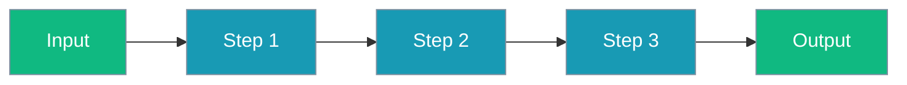
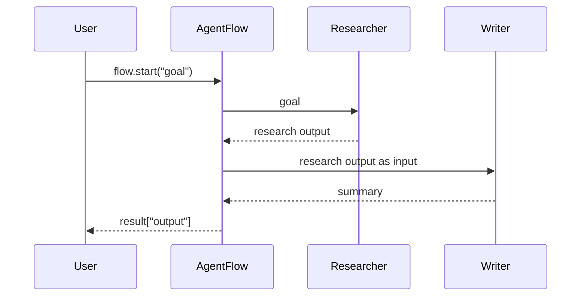

Run agents in sequence — each step receives the previous step's output.

```python
from praisonaiagents import Agent, AgentFlow

researcher = Agent(name="Researcher", instructions="Research the topic. Return facts only.")
writer = Agent(name="Writer", instructions="Turn the research into a clear summary.")

flow = AgentFlow(steps=[researcher, writer])
result = flow.start("Benefits of renewable energy")
print(result["output"])
```

The user submits one goal; each agent step passes its output to the next.



```mermaid
graph LR
    In["Input"] --> S1["Step 1"]
    S1 --> S2["Step 2"]
    S2 --> S3["Step 3"]
    S3 --> Out["Output"]

    classDef agent fill:#8B0000,stroke:#7C90A0,color:#fff
    classDef step fill:#189AB4,stroke:#7C90A0,color:#fff
    classDef output fill:#10B981,stroke:#7C90A0,color:#fff

    class In,Out output
    class S1,S2,S3 step
```

## Quick Start

<Steps>
<Step title="Simple Usage">

Chain two agents with `AgentFlow`:

```python
from praisonaiagents import Agent, AgentFlow

researcher = Agent(name="Researcher", instructions="Research the topic.")
writer = Agent(name="Writer", instructions="Write a summary from the research.")

flow = AgentFlow(steps=[researcher, writer])
result = flow.start("Benefits of renewable energy")
```

</Step>

<Step title="With Configuration">

Add branching with `route` and step hooks:

```python
from praisonaiagents import Agent, AgentFlow, route, Task

classifier = Agent(name="Classifier", instructions="Classify the request as success or failure.")

flow = AgentFlow(
    steps=[
        classifier,
        route({
            "success": [Agent(name="Process", instructions="Process the request.")],
            "failure": [Agent(name="Fallback", instructions="Handle the error.")],
        }),
    ],
)
```

</Step>
</Steps>

---

## How It Works


```mermaid
sequenceDiagram
    participant User
    participant Flow as AgentFlow
    participant Researcher
    participant Writer

    User->>Flow: flow.start("goal")
    Flow->>Researcher: goal
    Researcher-->>Flow: research output
    Flow->>Writer: research output as input
    Writer-->>Flow: summary
    Flow-->>User: result["output"]
```

`AgentFlow` runs steps in order. Each agent's reply becomes the next step's input. Use `route()` for conditional paths, `Task(should_run=...)` to skip steps, or `StepResult(stop_workflow=True)` to exit early.

| Pattern | Use when |
|---------|----------|
| Sequential agents | Fixed pipeline (research → write → edit) |
| `route()` | Branch on classifier output |
| `should_run` | Skip steps based on context |

---

## Configuration Options

| Option | Type | Default | Description |
|--------|------|---------|-------------|
| `steps` | `list` | `[]` | Agents, `Task`, or handler functions |
| `process` | `str` | `"sequential"` | `"sequential"` or `"hierarchical"` |
| `output` | `OutputConfig` | `None` | Verbose, stream, and trace settings |
| `hooks` | `WorkflowHooksConfig` | `None` | `on_step_complete` and lifecycle callbacks |
| `memory` | `MemoryConfig` | `None` | Shared memory across steps |

---

## Best Practices

<AccordionGroup>
<Accordion title="Keep each step focused">
One role per agent — research, analyse, write, edit. Narrow instructions produce cleaner hand-offs.
</Accordion>
<Accordion title="Use route for decisions">
Put a classifier step before `route()` rather than asking one agent to do everything.
</Accordion>
<Accordion title="Enable hooks for visibility">
`WorkflowHooksConfig(on_step_complete=...)` logs progress without changing agent logic.
</Accordion>
<Accordion title="Start with two steps">
Prove the pipeline with two agents, then add steps once data flow is clear.
</Accordion>
</AccordionGroup>

---

## Related

<CardGroup cols={2}>
<Card title="AgentFlow" icon="diagram-project" href="/docs/features/agentflow">
  Full workflow API and step types
</Card>
<Card title="Workflow Patterns" icon="sitemap" href="/docs/features/workflow-patterns">
  Parallel, loop, and conditional patterns
</Card>
</CardGroup>
