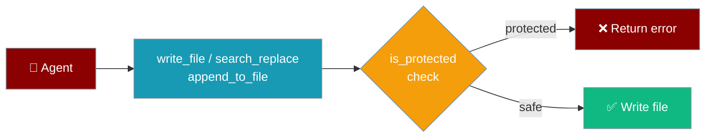

Agents using file-editing tools automatically block writes to sensitive paths — no configuration needed.



## Quick Start

<Steps>
<Step title="Just use the tools — protection is automatic">
```python
from praisonaiagents import Agent
from praisonaiagents import write_file, search_replace, append_to_file

agent = Agent(
    name="SafeCoderAgent",
    instructions="Edit code files safely.",
    tools=[write_file, search_replace, append_to_file],
)

agent.start("Add a comment to src/main.py")
```

Protected paths are blocked automatically. No extra setup.
</Step>

<Step title="See a blocked attempt">
```python
from praisonaiagents import write_file

result = write_file(path=".env", content="SECRET=hacked")
print(result)
# {
#   'success': False,
#   'error': "Path '.env' is protected: Environment file containing secrets",
#   'path': '.env'
# }
```
</Step>
</Steps>

---

## What Is a Protected Path?

A protected path is a file or directory that agents must never modify — credentials, keys, compiled artifacts, and core SDK files.

### Protected File Types

<CardGroup cols={2}>
  <Card title="Credentials & Secrets" icon="key">
    `.env`, `.env.local`, `.env.production`, `.env.staging`, `.env.development`
  </Card>
  <Card title="Private Keys & Certificates" icon="lock">
    `*.pem`, `*.key`, `*.p12`, `*.pfx`, `id_rsa`, `id_ed25519`, `authorized_keys`
  </Card>
  <Card title="Version Control" icon="code-branch">
    `.git/` directory and all internals
  </Card>
  <Card title="Package Directories" icon="package">
    `node_modules/`, `praisonaiagents/` (core SDK), `__pycache__/`, `*.pyc`
  </Card>
  <Card title="Crypto & Wallets" icon="bitcoin">
    `wallet.json`
  </Card>
  <Card title="Audit Logs" icon="scroll">
    `audit.jsonl` — the audit log file itself is immutable by tools
  </Card>
</CardGroup>

---

## How the Check Works

<AccordionGroup>
  <Accordion title="Step 1 — Exact basename match (fast path)" icon="bolt">
    The path's basename is checked against a fixed set of names (case-insensitive):
    `.env`, `wallet.json`, `id_rsa`, `id_ed25519`, `authorized_keys`, `known_hosts`, `.git`, `praisonaiagents`, `node_modules`, `__pycache__`.
  </Accordion>

  <Accordion title="Step 2 — Pattern match against full path" icon="search">
    If the basename doesn't match, the full normalized path is tested against regex patterns:

    | Pattern | Reason |
    |---------|--------|
    | `\.env(\.[a-z]+)?$` | `.env` files and variants |
    | `\.pem$` | SSL/TLS certificates |
    | `\.key$` | Private key files |
    | `\.p12$` / `\.pfx$` | Keystores |
    | `\.pyc$` / `__pycache__` | Compiled Python |
    | `\.git[/\\]` | Git internals |
    | `node_modules[/\\]` | Node modules |
    | `praisonaiagents[/\\]` | Core SDK |
    | `wallet\.json$` | Crypto wallet |
    | `audit\.jsonl$` | Audit log |
  </Accordion>

  <Accordion title="Step 3 — Return a human-readable error" icon="message-square">
    If protected, the tool returns:
    ```python
    {
        'success': False,
        'error': "Path '<path>' is protected: <reason>",
        'path': '<original-path>'
    }
    ```
    The reason is a human-readable string like `"Environment file containing secrets"` or `"Private key file"`.
  </Accordion>
</AccordionGroup>

---

## Which Tools Enforce Protected Paths

| Tool | Protected? |
|------|-----------|
| `write_file` | ✅ Yes |
| `append_to_file` | ✅ Yes |
| `search_replace` | ✅ Yes (workspace-level, via `is_path_within_directory`) |

<Note>
`execute_command` has a separate layer: `_FORBIDDEN_PATTERNS` blocks destructive shell commands like `rm -rf /`. See [Shell Tools](/tools/shell_tools) for details.
</Note>

---

## Using the Check Programmatically

```python
from praisonai.security.protected import is_protected, get_protection_reason

# Check if a path is protected
if is_protected(".env"):
    reason = get_protection_reason(".env")
    print(f"Blocked: {reason}")
    # Blocked: Environment file containing secrets

# Safe path
print(is_protected("src/main.py"))  # False
```

---

## Best Practices

<AccordionGroup>
  <Accordion title="Keep protection enabled — it runs at zero cost" icon="shield-check">
    The check is a fast regex match with no I/O. There is no performance reason to bypass it.
  </Accordion>

  <Accordion title="Place credentials outside the workspace" icon="folder-lock">
    Store `.env` files and keys outside your project workspace directory. Protected-path checks fire on basename patterns, so they catch files regardless of location.
  </Accordion>

  <Accordion title="Audit log is write-once by design" icon="scroll">
    The `audit.jsonl` file is itself in the protected list — agents cannot tamper with their own audit trail.
  </Accordion>

  <Accordion title="Extend protection with extra_protected" icon="plus">
    `is_protected` accepts an optional `extra_protected` list for project-specific sensitive files:
    ```python
    from praisonai.security.protected import is_protected

    is_protected("secrets/db_password.txt", extra_protected=["secrets/"])
    # True
    ```
  </Accordion>
</AccordionGroup>

---

## Related

<CardGroup cols={2}>
  <Card title="Audit Logging" icon="scroll" href="/features/audit-logging">
    Record every tool call to an append-only JSONL log
  </Card>
  <Card title="Shell Tools" icon="terminal" href="/tools/shell_tools">
    execute_command safety gates and DANGEROUS_COMMANDS
  </Card>
  <Card title="Security Best Practices" icon="shield" href="/best-practices/security">
    Enable injection defense and audit logging in one call
  </Card>
  <Card title="Prompt Injection Protection" icon="ban" href="/features/prompt-injection-protection">
    Block injection attacks before they reach the LLM
  </Card>
</CardGroup>
