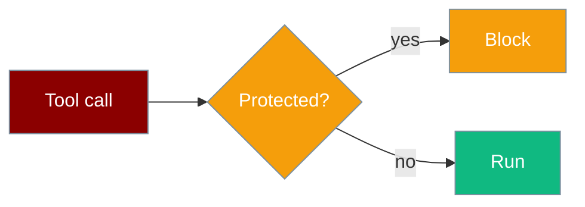
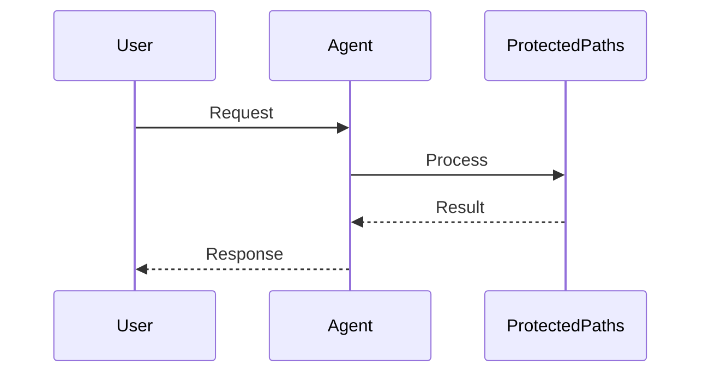
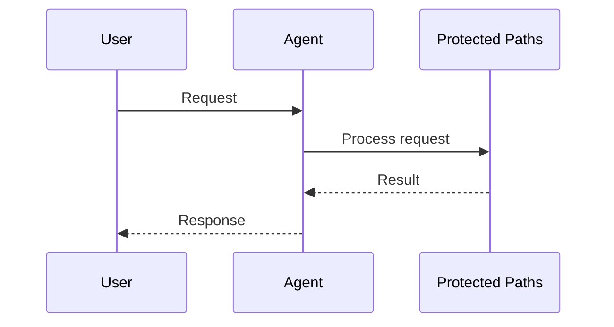

File tools reject writes to sensitive paths — `.env`, SSH keys, the SDK, and system files.

```python
from praisonaiagents import Agent
from praisonai.code.tools import write_file

agent = Agent(
    name="SafeCoder",
    instructions="Edit project files only. Never touch system paths.",
    tools=[write_file],
)

agent.start("Append 'test' to /etc/passwd")
# Tool returns: Path '/etc/passwd' is protected
```

The user asks the agent to change files; protected-path rules block dangerous writes before the tool runs.




## How It Works




## Quick Start

<Steps>
<Step title="Simple Usage">

Protected-path checks apply automatically when using `praisonai` code tools:

```python
from praisonaiagents import Agent
from praisonai.code.tools import write_file

agent = Agent(name="Coder", instructions="Edit safely", tools=[write_file])
agent.start("Write hello to src/app.py")
```

</Step>

<Step title="With Configuration">

Inspect protection before a write:

```python
from praisonai.security import is_protected, get_protection_reason

if is_protected(".env"):
    print(get_protection_reason(".env"))
# Environment file containing secrets
```

</Step>
</Steps>

---

## How It Works




`is_protected()` and `get_protection_reason()` in `praisonai.security.protected` guard `write_file`, `append_to_file`, `search_replace`, and `apply_diff`.

Protected targets include environment files, `.git/`, SSH keys, `~/.aws/`, `/etc/passwd`, `praisonaiagents/`, and `audit.jsonl`.

Blocked calls return:

```python
{"success": False, "error": "Path '/etc/passwd' is protected: <reason>"}
```

---

## Configuration Options

| Function | Returns | Description |
|----------|---------|-------------|
| `is_protected(path)` | `bool` | Whether the path is blocked |
| `get_protection_reason(path)` | `str \| None` | Human-readable reason |
| `is_protected(path, extra_protected=[...])` | `bool` | Add project-specific paths |

---

## Best Practices

<AccordionGroup>
<Accordion title="Never disable in production">
Protected-path checks are a safety default — extend `extra_protected` only after review.
</Accordion>
<Accordion title="Use praisonai code tools">
Protection is enforced in `praisonai.code.tools`, not the core `FileTools` class.
</Accordion>
<Accordion title="Check before custom tools">
Call `is_protected()` in custom write tools that bypass the built-in guards.
</Accordion>
<Accordion title="Keep secrets out of prompts">
Even with protection, avoid passing `.env` contents into agent context.
</Accordion>
</AccordionGroup>

---

## Related

<CardGroup cols={2}>
<Card title="Security Overview" icon="shield" href="/docs/security">
  Full security feature matrix
</Card>
<Card title="Shell Tools" icon="terminal" href="/docs/tools/shell_tools">
  Dangerous command protection
</Card>
</CardGroup>
