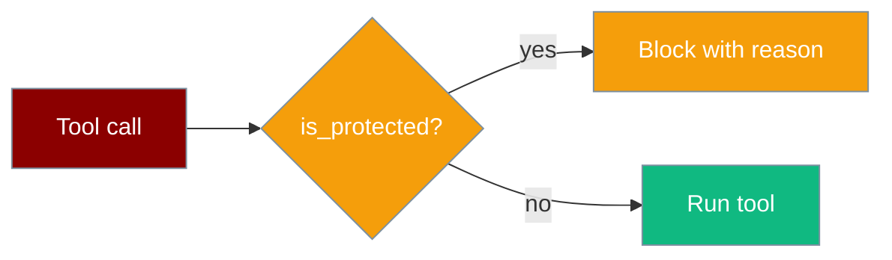

Protected paths prevent agents from modifying sensitive files — system configs, keys, environment files, and the SDK itself.



## Quick Start

```python
from praisonaiagents import Agent, search_replace, append_to_file, write_file

agent = Agent(
    name="SafeCoderAgent",
    instructions="Edit code safely. Never touch system files.",
    tools=[search_replace, append_to_file, write_file],
)

# Returns error — /etc/passwd is protected
agent.start("Append 'test' to /etc/passwd")
```

---

## How It Works

`is_protected(abs_path)` and `get_protection_reason(abs_path)` from `praisonai.security.protected` guard file-modifying tools.

Protected targets include:

- Environment files (`.env`, `.env.local`, …)
- Git internals (`.git/`)
- SSH keys (`~/.ssh/`, `id_rsa`, …)
- AWS credentials (`~/.aws/`)
- Boot/system paths (`/etc/passwd`, `/boot/`)
- Core SDK (`praisonaiagents/`)
- Audit log (`audit.jsonl`)

Error response shape:

```python
{
    "success": False,
    "error": "Path '/etc/passwd' is protected: <reason>",
}
```

---

## Tools That Enforce Protection

| Tool | Enforces `is_protected()` |
|------|---------------------------|
| `write_file` | Yes |
| `append_to_file` | Yes (PR #2062) |
| `search_replace` | Yes (PR #2062) |
| `apply_diff` | Yes |

---

## Inspecting Protection

```python
from praisonai.security import is_protected, get_protection_reason

is_protected(".env")           # True
get_protection_reason(".env")  # "Environment file containing secrets"
is_protected("src/app.py")     # False
```

Do not disable protected-path checks in production — extend the list only for deliberate, reviewed exceptions.

---

## Related

<CardGroup cols={2}>
  <Card title="Security Overview" icon="shield" href="/docs/security">
    Full security feature matrix
  </Card>
  <Card title="Shell Tools" icon="terminal" href="/docs/tools/shell_tools">
    Dangerous command protection
  </Card>
</CardGroup>
