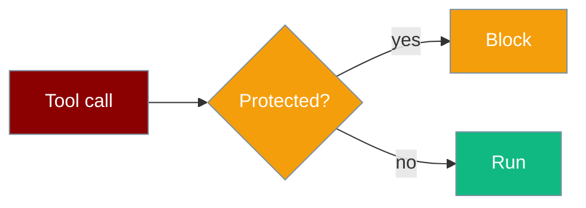
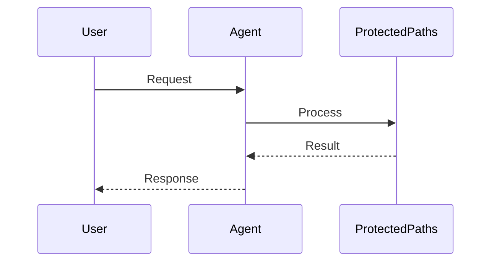
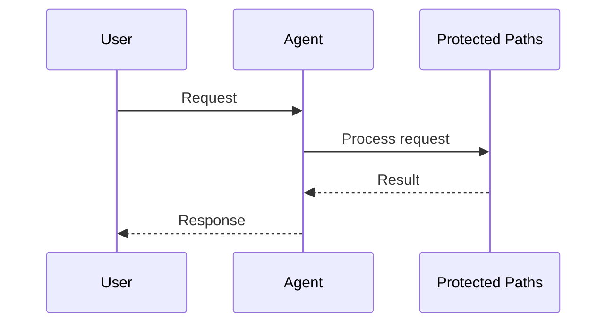

File tools reject writes to sensitive paths — `.env`, SSH keys, the SDK, and system files — and follow symlinks so a `harmless.txt → .env` link is still blocked.

```python
from praisonaiagents import Agent
from praisonai.code.tools import write_file

agent = Agent(
    name="SafeCoder",
    instructions="Edit project files only. Never touch system paths.",
    tools=[write_file],
)

agent.start("Append 'test' to /etc/passwd")
# Tool returns: Path '/etc/passwd' is protected
```

The user asks the agent to change files; protected-path rules block dangerous writes before the tool runs.



```mermaid
graph LR
    T[Tool call] --> C{Protected?}
    C -->|yes| B[Block]
    C -->|no| R[Run]

    classDef agent fill:#8B0000,stroke:#7C90A0,color:#fff
    classDef gate fill:#F59E0B,stroke:#7C90A0,color:#fff
    classDef ok fill:#10B981,stroke:#7C90A0,color:#fff

    class T agent
    class C,B gate
    class R ok
```

## How It Works


```mermaid
sequenceDiagram
    participant User
    participant Agent
    participant ProtectedPaths

    User->>Agent: Request
    Agent->>ProtectedPaths: Process
    ProtectedPaths-->>Agent: Result
    Agent-->>User: Response
```


## Quick Start

<Steps>
<Step title="Simple Usage">

Protected-path checks apply automatically when using `praisonai` code tools:

```python
from praisonaiagents import Agent
from praisonai.code.tools import write_file

agent = Agent(name="Coder", instructions="Edit safely", tools=[write_file])
agent.start("Write hello to src/app.py")
```

</Step>

<Step title="With Configuration">

Inspect protection before a write:

```python
from praisonai.security import is_protected, get_protection_reason, resolve_real_path

if is_protected(".env"):
    print(get_protection_reason(".env"))
# Environment file containing secrets
```

</Step>
</Steps>

---

## How It Works


```mermaid
sequenceDiagram
    participant User
    participant Agent
    participant Feature as Protected Paths

    User->>Agent: Request
    Agent->>Feature: Process request
    Feature-->>Agent: Result
    Agent-->>User: Response
```


`is_protected()` and `get_protection_reason()` in `praisonai.security.protected` guard `write_file`, `append_to_file`, `search_replace`, and `apply_diff`. Both resolve symlinks (`os.path.realpath`) before matching, so a same-directory symlink to a protected file is checked by its real target, not its name.

Protected targets include environment files, `.git/`, SSH keys, `~/.aws/`, `/etc/passwd`, `praisonaiagents/`, and `audit.jsonl`.

> Symlinks are resolved before matching — a symlink to a protected file is protected. `is_protected()` and `get_protection_reason()` call `os.path.realpath()` on the input first, so a same-directory `harmless.txt → .env` symlink is blocked as `.env` ([PR #3616](https://github.com/MervinPraison/PraisonAI/pull/3616)).

The protected-path check runs **before** workspace confinement — both apply to every write. See [Code Editing → Workspace Security](/code/editing#workspace-security).

Blocked calls return:

```python
{"success": False, "error": "Path '/etc/passwd' is protected: <reason>"}
```

---

## Configuration Options

| Function | Returns | Description |
|----------|---------|-------------|
| `is_protected(path)` | `bool` | Whether the path is blocked (symlink-resolved) |
| `get_protection_reason(path)` | `str \| None` | Human-readable reason (symlink-resolved) |
| `is_protected(path, extra_protected=[...])` | `bool` | Add project-specific paths |
| `resolve_real_path(path)` | `str` | Symlink-resolved absolute path; falls back to input on `OSError` |

---

## Symlink-safe writes

`write_file`, `append_to_file`, `apply_diff`, and `search_replace` resolve symlinks before both the protection check *and* the write. A same-directory symlink like `harmless.txt → .env` is refused with the same reason as `.env` itself, and a symlink that changes target between the check and the write cannot redirect an approved edit into a protected file.

```python
from praisonai.security import resolve_real_path, is_protected

real = resolve_real_path("./harmless.txt")   # → "/…/.env"
is_protected(real)                            # → True
```

---

## Best Practices

<AccordionGroup>
<Accordion title="Never disable in production">
Protected-path checks are a safety default — extend `extra_protected` only after review.
</Accordion>
<Accordion title="Use praisonai code tools">
Protection is enforced in `praisonai.code.tools`, not the core `FileTools` class.
</Accordion>
<Accordion title="Check before custom tools">
Call `is_protected()` in custom write tools that bypass the built-in guards.
</Accordion>
<Accordion title="Keep secrets out of prompts">
Even with protection, avoid passing `.env` contents into agent context.
</Accordion>
</AccordionGroup>

---

## Related

<CardGroup cols={2}>
<Card title="Security Overview" icon="shield" href="/security">
  Full security feature matrix
</Card>
<Card title="Shell Tools" icon="terminal" href="/tools/shell_tools">
  Dangerous command protection
</Card>
</CardGroup>
