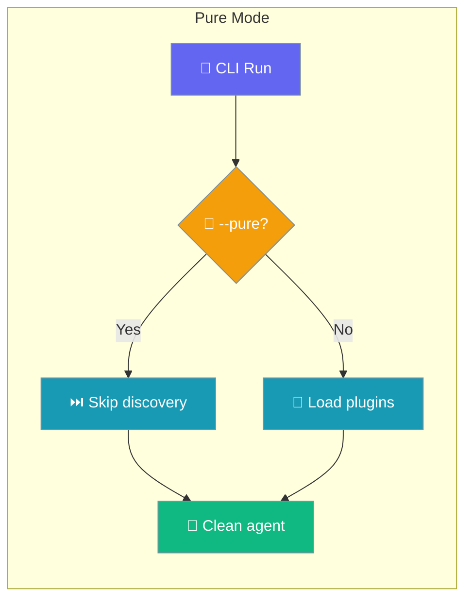
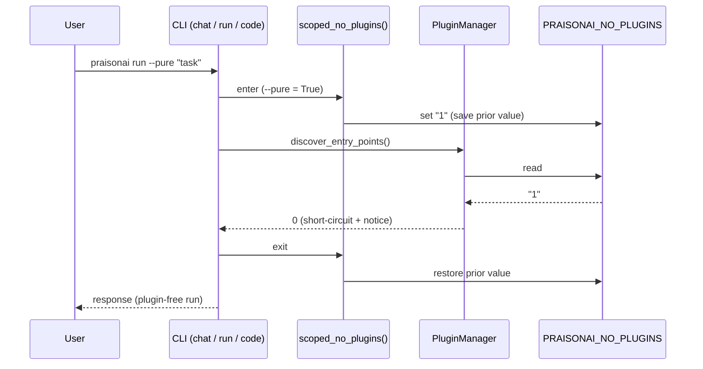
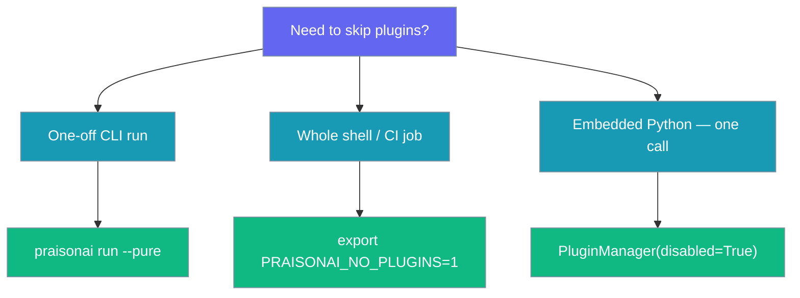

Pure Mode skips external-plugin discovery for a single run without touching your saved enable/disable state.



## Quick Start

<Steps>
<Step title="Use the CLI flag">

```bash
praisonai run --pure "Summarise this file"
```

</Step>

<Step title="Or set the env var">

```bash
export PRAISONAI_NO_PLUGINS=1
praisonai chat
```

</Step>
</Steps>

---

## How It Works

The CLI flag sets `PRAISONAI_NO_PLUGINS` only for the current run, then restores the prior value on return.



The `@scopes_no_plugins` decorator wraps each command, so suppression is restored on return and never leaks into a later in-process call. The run emits one log line: *"Running without external plugins (--pure / PRAISONAI_NO_PLUGINS)"*.

<Note>
Pure Mode only changes **whether** entry-point plugins are discovered — it does not change precedence. Even in a normal (non-pure) run, entry-point plugins never override a shipped built-in: since [PR #4176](https://github.com/MervinPraison/PraisonAI/pull/4176) the base `PluginRegistry` skips any entry point whose name (case-insensitive) collides with a built-in. See [Plugin Precedence](/features/plugin-precedence).
</Note>

---

## Configuration

Three surfaces suppress plugins. A constructor `disabled=True` wins; otherwise the env var decides.

| Surface | Precedence | Persists? | Use when |
|---------|-----------|-----------|----------|
| `PluginManager(disabled=True)` | 1 (wins) | No | Embedded Python, one call, deterministic |
| `--pure` / `--no-plugins` CLI flag | 2 | No — scoped, auto-restored | One CLI invocation |
| `PRAISONAI_NO_PLUGINS=1` env var | 3 | Only for the shell | Whole CI job / shell session |
| *(none)* — default | 4 | — | Normal use (backward-compatible) |

The env var accepts `true`, `1`, or `yes` (case-insensitive). Pure Mode never mutates `.praisonai/config.yaml` or any persisted enable/disable state.



Python parity forces suppression regardless of the env var:

```python
from praisonaiagents.plugins import PluginManager

manager = PluginManager(disabled=True)
manager.discover_entry_points()   # returns 0; no plugins loaded
```

---

## Common Patterns

Reproduce a CI failure without whatever plugin your machine has enabled:

```bash
praisonai run --pure "Reproduce the failing task"
```

Debug a plugin regression by comparing a normal run with a plugin-free one:

```bash
praisonai chat --no-plugins
```

Reuse in a notebook — one cell runs pure, the next picks plugins back up automatically:

```python
from praisonai_code.cli.commands.run import run_main

run_main(pure=True)   # this call: no plugins
run_main()            # next call: plugins restored automatically
```

---

## Best Practices

<AccordionGroup>
<Accordion title="Use --pure for bug reports">
Attach the plugin-free reproduction alongside the normal one — it makes obvious whether a plugin is involved.
</Accordion>

<Accordion title="Prefer the CLI flag over the env var for one-offs">
The flag's scope is guaranteed — it always restores the prior value on return.
</Accordion>

<Accordion title="Keep PRAISONAI_NO_PLUGINS out of your shell rc">
A persistent export defeats the one-shot contract and hides real plugin behaviour from every command.
</Accordion>

<Accordion title="Check plugins doctor to see which mode you're in">
`praisonai plugins doctor` tells you whether plugins are suppressed for the current process.
</Accordion>
</AccordionGroup>

---

## Related

<CardGroup cols={2}>
  <Card title="Plugins CLI" icon="plug" href="/cli/plugins">
    List, enable, disable, and diagnose plugins
  </Card>
  <Card title="Plugins" icon="puzzle-piece" href="/features/plugins">
    Write, load, and configure plugins
  </Card>
</CardGroup>
