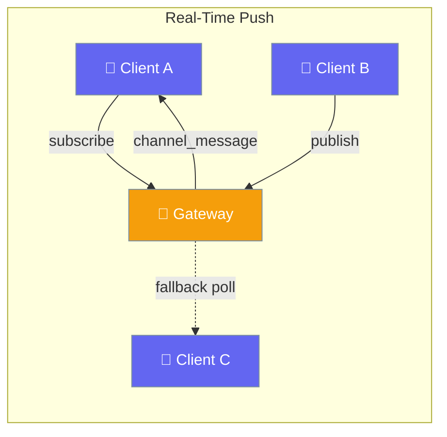
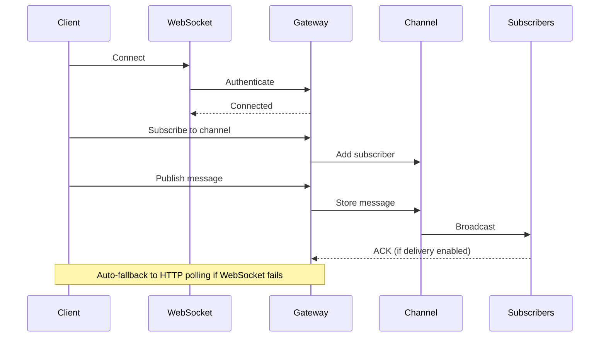
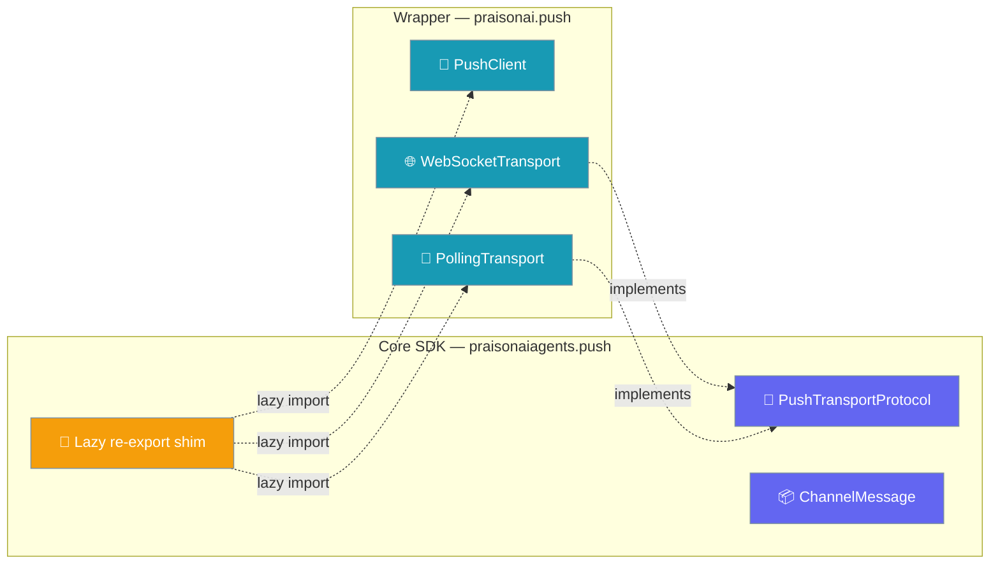
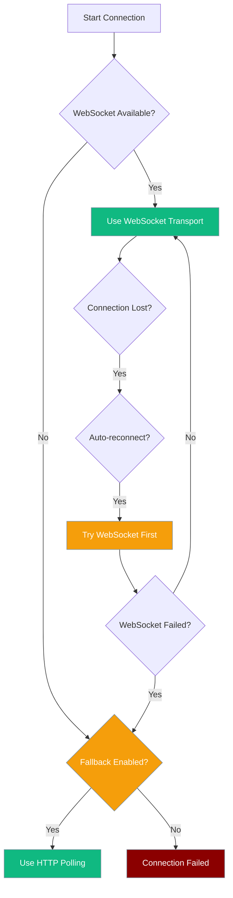

Push notifications deliver real-time messages from a PraisonAI gateway to subscribed clients over WebSocket (with HTTP polling fallback).

<Note>
`PushClient` requires the `praisonai` wrapper package (`pip install praisonai`). The core `praisonaiagents` package only ships the push **protocols** and `ChannelMessage` model — concrete client and transport implementations live in the wrapper. You can still import via `from praisonaiagents.push import PushClient` (a lazy re-export), or directly via `from praisonai.push import PushClient`.
</Note>



## Quick Start

<Steps>

<Step title="Install Prerequisites">
`PushClient` and its transports ship in the `praisonai` wrapper package. Install it before importing:

```bash
pip install praisonai
```

The core `praisonaiagents` package contains only the push **protocols** and the `ChannelMessage` model. The concrete `PushClient`, `WebSocketTransport`, and `PollingTransport` classes live in the wrapper.
</Step>

<Step title="Enable Push on Gateway">
```python
from praisonaiagents import GatewayConfig, PushConfig

config = GatewayConfig(
    push=PushConfig(enabled=True)
)
```
</Step>

<Step title="Connect PushClient">
```python
from praisonaiagents.push import PushClient

client = PushClient("ws://localhost:8765/ws", auth_token="my-token")
await client.connect()
```
</Step>

<Step title="Subscribe and Receive Messages">
```python
@client.on("channel_message")
async def on_message(msg):
    print(f"Received on {msg.channel}: {msg.data}")

await client.subscribe("alerts")
await client.wait_closed()
```
</Step>

</Steps>

---

## Agent-Centric Example

```python
from praisonaiagents import Agent
from praisonaiagents.push import PushClient

agent = Agent(
    name="alerts-agent",
    instructions="Watch the 'alerts' channel and summarise incoming events"
)

client = PushClient("ws://localhost:8765/ws", auth_token="my-token")
await client.connect()

@client.on("channel_message")
async def on_msg(msg):
    summary = agent.start(f"Summarise this alert: {msg.data}")
    print(summary)

await client.subscribe("alerts")
await client.wait_closed()
```

---

## Import Paths

Two equivalent import paths are supported:

```python
# Recommended (explicit wrapper import)
from praisonai.push import PushClient, WebSocketTransport, PollingTransport

# Backward-compatible (lazy re-export from core)
from praisonaiagents.push import PushClient, WebSocketTransport, PollingTransport
```

Both resolve to the same classes in the `praisonai` wrapper package. The `praisonaiagents.push` path is kept for backward compatibility and will raise a clear `ImportError` if the `praisonai` wrapper is not installed.

The core `praisonaiagents.push` module only exports protocol-level types:

```python
from praisonaiagents.push import ChannelMessage           # dataclass
from praisonaiagents.push import PushTransportProtocol    # typing.Protocol
```

---

## How It Works



| Component | Purpose |
|-----------|---------|
| **PushClient** | Client SDK with auto-reconnect and transport fallback |
| **WebSocket** | Primary real-time transport |
| **HTTP Polling** | Fallback transport for restricted networks |
| **Channels** | Named message streams for pub/sub |
| **Presence** | Track online/offline status of clients |
| **Delivery Guarantees** | At-least-once message delivery with ACKs |



---

## Configuration Options

### PushConfig

| Option | Type | Default | Description |
|--------|------|---------|-------------|
| `enabled` | `bool` | `False` | Feature toggle (push is opt-in; zero overhead when disabled) |
| `redis` | `Optional[RedisConfig]` | `None` | Redis config for cross-server scaling |
| `presence` | `PresenceConfig` | `PresenceConfig()` | Presence tracking settings |
| `delivery` | `DeliveryConfig` | `DeliveryConfig()` | Delivery guarantee settings |
| `polling` | `PollingConfig` | `PollingConfig()` | Polling fallback settings |

### RedisConfig

| Option | Type | Default | Description |
|--------|------|---------|-------------|
| `url` | `Optional[str]` | `None` | Full Redis URL (takes precedence over host/port) |
| `host` | `str` | `"localhost"` | Redis host |
| `port` | `int` | `6379` | Redis port |
| `db` | `int` | `0` | Redis database number |
| `password` | `Optional[str]` | `None` | Redis password |
| `prefix` | `str` | `"praison:push:"` | Key prefix namespace |
| `max_connections` | `int` | `20` | Connection pool size |

### PresenceConfig

| Option | Type | Default | Description |
|--------|------|---------|-------------|
| `enabled` | `bool` | `True` | Toggle presence tracking |
| `heartbeat_interval` | `int` | `15` | Expected heartbeat frequency (seconds) |
| `offline_timeout` | `int` | `45` | Mark offline after this many seconds without heartbeat |
| `broadcast_changes` | `bool` | `True` | Broadcast presence changes to subscribed channels |

### DeliveryConfig

| Option | Type | Default | Description |
|--------|------|---------|-------------|
| `enabled` | `bool` | `True` | Toggle delivery guarantees |
| `ack_timeout` | `int` | `30` | Seconds to wait for ACK before retrying |
| `max_retries` | `int` | `3` | Maximum retry attempts |
| `retry_backoff` | `float` | `2.0` | Exponential backoff multiplier |
| `message_ttl` | `int` | `86400` | How long to retain unacknowledged messages (seconds) |
| `store_backend` | `str` | `"memory"` | `"memory"` or `"redis"` |

### PollingConfig

| Option | Type | Default | Description |
|--------|------|---------|-------------|
| `enabled` | `bool` | `True` | Toggle polling fallback |
| `long_poll_timeout` | `int` | `30` | Long-poll hang duration (seconds) |
| `max_batch_size` | `int` | `100` | Max messages per poll response |

---

## Custom Transports (Advanced)

Implement `PushTransportProtocol` to plug in a custom transport (e.g. SSE, gRPC):

```python
from praisonaiagents.push import PushTransportProtocol

class MyTransport:
    @property
    def is_connected(self) -> bool: ...
    async def connect(self) -> None: ...
    async def disconnect(self) -> None: ...
    async def send(self, data: dict) -> None: ...
    async def receive(self) -> dict: ...
```

| Method / Property | Purpose |
|---|---|
| `is_connected` (property) | Whether the transport is currently connected |
| `connect()` | Establish the underlying connection |
| `disconnect()` | Close the connection |
| `send(data)` | Send a JSON-serialisable dict to the gateway |
| `receive()` | Await and return the next JSON message from the gateway |

---

## Common Patterns

### Publish/Subscribe

```python
from praisonaiagents.push import PushClient

# Publisher
publisher = PushClient("ws://localhost:8765/ws")
await publisher.connect()
await publisher.publish("events", {"type": "user_login", "user_id": 123})

# Subscriber
subscriber = PushClient("ws://localhost:8765/ws")
await subscriber.connect()

@subscriber.on("channel_message")
async def handle_event(msg):
    print(f"Event: {msg.data}")

await subscriber.subscribe("events")
```

### One-shot Wait

```python
from praisonaiagents.push import PushClient

client = PushClient("ws://localhost:8765/ws")
await client.connect()

# Wait for next message on channel with timeout
try:
    msg = await client.wait_for("notifications", timeout=60.0)
    print(f"Got notification: {msg.data}")
except asyncio.TimeoutError:
    print("No notification received within 60 seconds")
```

### Presence Tracking

```python
from praisonaiagents.push import PushClient

client = PushClient("ws://localhost:8765/ws")
await client.connect()

# Set your status
await client.set_status("available", {"role": "agent"})

# Query who's online
@client.on("presence_list")
async def on_presence(data):
    for user in data.get("clients", []):
        print(f"{user['client_id']}: {user['status']}")

await client.get_presence()
```

---

## Best Practices

<AccordionGroup>

<Accordion title="When to Enable Redis">
Enable Redis when running multiple gateway servers that need to share push channels:

```python
from praisonaiagents import GatewayConfig, PushConfig, RedisConfig

config = GatewayConfig(
    push=PushConfig(
        enabled=True,
        redis=RedisConfig(
            host="redis.example.com",
            password="your-redis-password"
        )
    )
)
```

Without Redis, channels only exist on a single gateway instance.
</Accordion>

<Accordion title="Choosing Delivery Store Backend">
Use `memory` for low-latency scenarios where message loss on restart is acceptable:

```python
delivery=DeliveryConfig(store_backend="memory")
```

Use `redis` for high-availability scenarios where messages must survive server restarts:

```python
delivery=DeliveryConfig(store_backend="redis")
```
</Accordion>

<Accordion title="Tuning Heartbeat and Timeout">
Adjust based on network conditions and desired responsiveness:

```python
# Fast networks, quick presence updates
presence=PresenceConfig(
    heartbeat_interval=10,
    offline_timeout=30
)

# Slow networks, conservative timeouts
presence=PresenceConfig(
    heartbeat_interval=30,
    offline_timeout=90
)
```
</Accordion>

<Accordion title="When Polling Fallback Matters">
Polling is crucial for corporate firewalls and mobile networks that block WebSocket connections:

```python
# Ensure fallback is enabled (default)
client = PushClient(
    "ws://localhost:8765/ws",
    fallback_to_polling=True
)
```

Clients automatically switch to HTTP polling if WebSocket connection fails.
</Accordion>

</AccordionGroup>

---

## Choosing a Transport



---

## Related

<CardGroup cols={2}>
<Card title="Gateway" icon="tower-broadcast" href="/features/gateway">
  The gateway that hosts push notification channels
</Card>
<Card title="A2A Push Notifications" icon="webhook" href="/features/a2a-push-notifications">
  Webhook-based task updates (different from real-time channels)
</Card>
</CardGroup>