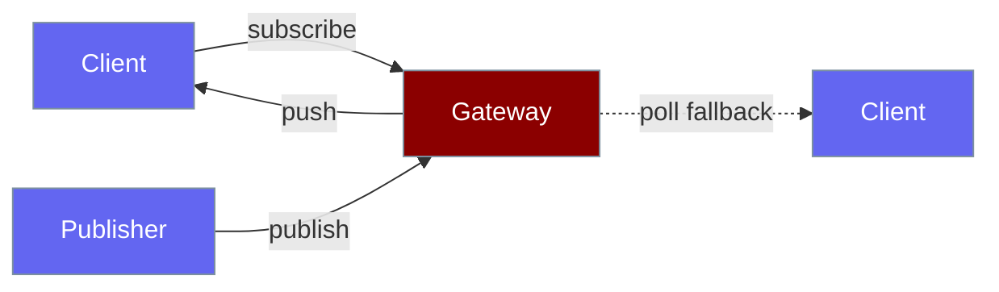
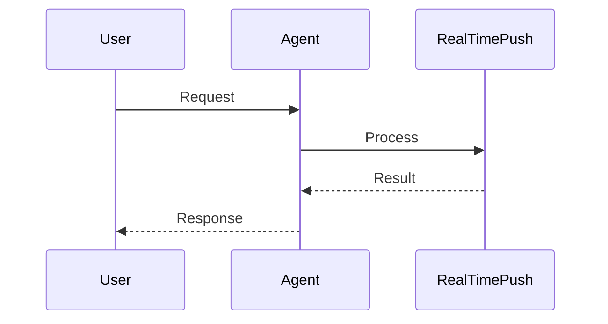
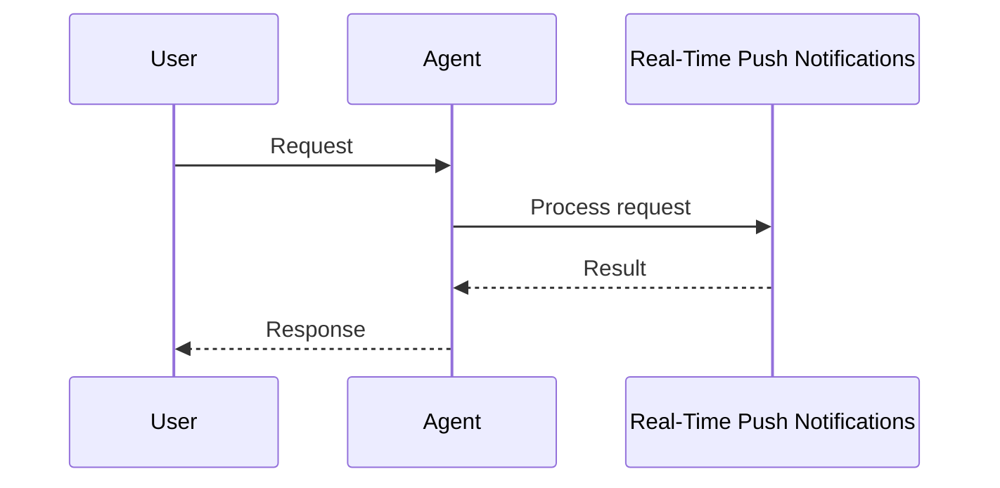

Subscribe to gateway channels and receive real-time messages — WebSocket first, polling when blocked.

```python
from praisonaiagents import Agent
from praisonaiagents.push import PushClient

agent = Agent(
    name="alerts-agent",
    instructions="Summarise incoming alert events in one sentence",
)

client = PushClient("ws://localhost:8765/ws", auth_token="my-token")
await client.connect()

@client.on("channel_message")
async def on_msg(msg):
    print(agent.start(f"Summarise: {msg.data}"))

await client.subscribe("alerts")
await client.wait_closed()
```

The user subscribes to a channel; push events arrive over WebSocket and the agent summarises each message.


<Note>
`PushClient` ships in the `praisonai` wrapper (`pip install praisonai`). Core `praisonaiagents.push` exports protocols and `ChannelMessage` only.
</Note>



## How It Works




## Quick Start

<Steps>
<Step title="Simple Usage">

Connect and subscribe:

```python
from praisonaiagents.push import PushClient

client = PushClient("ws://localhost:8765/ws", auth_token="my-token")
await client.connect()

@client.on("channel_message")
async def on_message(msg):
    print(f"{msg.channel}: {msg.data}")

await client.subscribe("alerts")
await client.wait_closed()
```

</Step>

<Step title="With Configuration">

Enable push on the gateway:

```python
from praisonaiagents import GatewayConfig
from praisonaiagents.gateway import PushConfig

config = GatewayConfig(push=PushConfig(enabled=True))
```

</Step>
</Steps>

---

## How It Works




| Component | Purpose |
|-----------|---------|
| `PushClient` | Auto-reconnect, transport fallback |
| `WebSocketTransport` | Primary real-time transport |
| `PollingTransport` | Fallback for restricted networks |
| Channels | Named pub/sub streams |
| `PushConfig` | Opt-in gateway toggle (off by default) |

Import paths:

```python
from praisonai.push import PushClient                    # wrapper (recommended)
from praisonaiagents.push import PushClient              # lazy re-export
from praisonaiagents.push import ChannelMessage          # core dataclass
```

---

## Configuration Options

### PushConfig

| Option | Type | Default | Description |
|--------|------|---------|-------------|
| `enabled` | `bool` | `False` | Feature toggle |
| `redis` | `RedisConfig` | `None` | Cross-server scaling |
| `presence` | `PresenceConfig` | `PresenceConfig()` | Online/offline tracking |
| `delivery` | `DeliveryConfig` | `DeliveryConfig()` | ACK and retry settings |
| `polling` | `PollingConfig` | `PollingConfig()` | Long-poll fallback |

### DeliveryConfig

| Option | Type | Default | Description |
|--------|------|---------|-------------|
| `enabled` | `bool` | `True` | Delivery guarantees |
| `ack_timeout` | `int` | `30` | Seconds to wait for ACK |
| `max_retries` | `int` | `3` | Retry attempts |
| `store_backend` | `str` | `"memory"` | `"memory"` or `"redis"` |

---

## Best Practices

<AccordionGroup>
<Accordion title="Enable Redis for multi-server">
Without Redis, channels exist on one gateway instance only.
</Accordion>
<Accordion title="Keep push opt-in">
`PushConfig(enabled=False)` adds zero overhead — enable only when clients subscribe.
</Accordion>
<Accordion title="Use polling fallback on corporate networks">
Set `fallback_to_polling=True` on `PushClient` when WebSocket is blocked.
</Accordion>
<Accordion title="Separate from A2A webhooks">
Real-time channels differ from A2A task webhooks — use the right page for your pattern.
</Accordion>
</AccordionGroup>

---

## Related

<CardGroup cols={2}>
<Card title="Gateway" icon="tower-broadcast" href="/docs/features/gateway">
  Host push channels on the gateway
</Card>
<Card title="A2A Push Notifications" icon="webhook" href="/docs/features/a2a-push-notifications">
  Webhook-based task updates
</Card>
</CardGroup>
