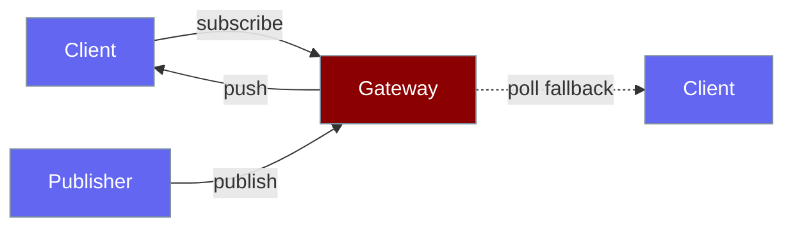
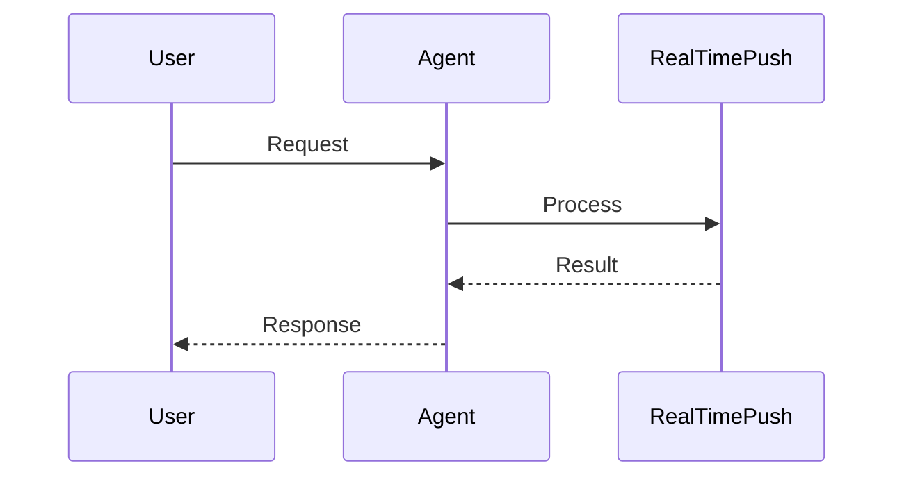
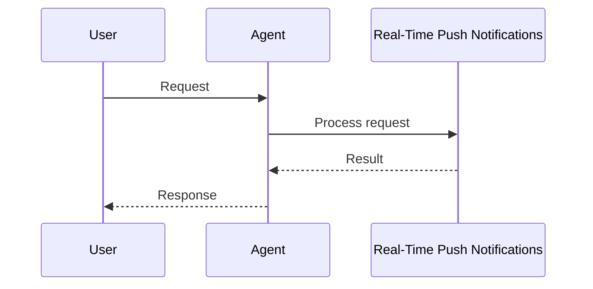
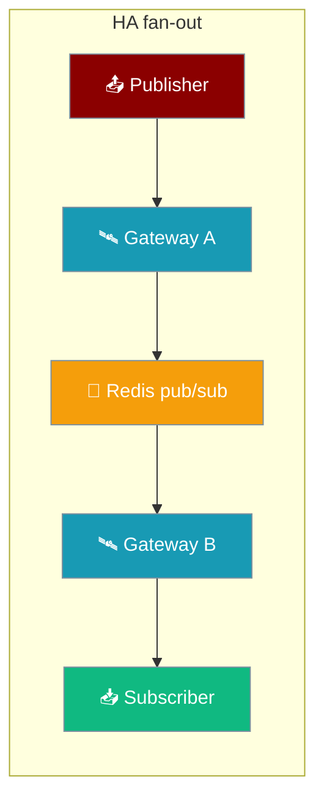
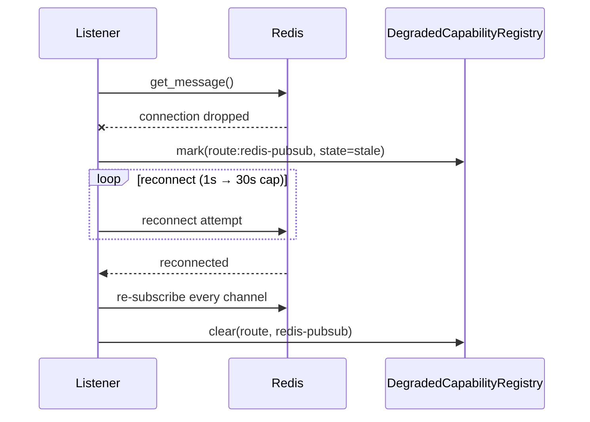

Subscribe to gateway channels and receive real-time messages — WebSocket first, polling when blocked.

```python
from praisonaiagents import Agent
from praisonaiagents.push import PushClient

agent = Agent(
    name="alerts-agent",
    instructions="Summarise incoming alert events in one sentence",
)

client = PushClient("ws://localhost:8765/ws", auth_token="my-token")
await client.connect()

@client.on("channel_message")
async def on_msg(msg):
    print(agent.start(f"Summarise: {msg.data}"))

await client.subscribe("alerts")
await client.wait_closed()
```

The user subscribes to a channel; push events arrive over WebSocket and the agent summarises each message.


<Note>
`PushClient` ships in the `praisonai` wrapper (`pip install praisonai`). Core `praisonaiagents.push` exports protocols and `ChannelMessage` only.
</Note>


```mermaid
graph LR
    C1[Client] -->|subscribe| G[Gateway]
    C2[Publisher] -->|publish| G
    G -->|push| C1
    G -.->|poll fallback| C3[Client]

    classDef client fill:#6366F1,stroke:#7C90A0,color:#fff
    classDef gateway fill:#8B0000,stroke:#7C90A0,color:#fff

    class C1,C2,C3 client
    class G gateway
```

## How It Works


```mermaid
sequenceDiagram
    participant User
    participant Agent
    participant RealTimePush

    User->>Agent: Request
    Agent->>RealTimePush: Process
    RealTimePush-->>Agent: Result
    Agent-->>User: Response
```


## Quick Start

<Steps>
<Step title="Simple Usage">

Connect and subscribe:

```python
from praisonaiagents.push import PushClient

client = PushClient("ws://localhost:8765/ws", auth_token="my-token")
await client.connect()

@client.on("channel_message")
async def on_message(msg):
    print(f"{msg.channel}: {msg.data}")

await client.subscribe("alerts")
await client.wait_closed()
```

</Step>

<Step title="With Configuration">

Enable push on the gateway:

```python
from praisonaiagents import GatewayConfig
from praisonaiagents.gateway import PushConfig

config = GatewayConfig(push=PushConfig(enabled=True))
```

</Step>
</Steps>

---

## How It Works


```mermaid
sequenceDiagram
    participant User
    participant Agent
    participant Feature as Real-Time Push Notifications

    User->>Agent: Request
    Agent->>Feature: Process request
    Feature-->>Agent: Result
    Agent-->>User: Response
```


| Component | Purpose |
|-----------|---------|
| `PushClient` | Auto-reconnect, transport fallback |
| `WebSocketTransport` | Primary real-time transport |
| `PollingTransport` | Fallback for restricted networks |
| Channels | Named pub/sub streams |
| `PushConfig` | Opt-in gateway toggle (off by default) |

Import paths:

```python
from praisonai.push import PushClient                    # wrapper (recommended)
from praisonaiagents.push import PushClient              # lazy re-export
from praisonaiagents.push import ChannelMessage          # core dataclass
```

---

## After fallback: producer contract

**Polling is subscribe-only.** After a WebSocket → polling fallback, `publish()`, `create_channel()`, and `get_presence()` raise `NotImplementedError` — the polling contract has no matching server routes. Gate producer code on `PushClient.supports_publish` before calling any of them.

```python
await client.connect()
if client.supports_publish:
    await client.publish("alerts", {"kind": "info", "text": "hi"})
else:
    # WS blocked → subscribe-only mode. Publish elsewhere.
    logger.warning("Push client in polling fallback; skipping publish.")
```

`supports_publish` is `True` only when a transport is connected and is not the polling fallback. It is `False` before `connect()`, after `disconnect()`, and after a WS → polling fallback.

The client also emits a `WARNING` log the moment it falls back, so an operator watching the log knows publish is unavailable without instrumenting every call site:

```
PushClient fell back to polling transport. Unavailable operations under polling:
publish, create_channel, get_presence (they will raise NotImplementedError).
Gate producer code on the supports_publish property.
```

<Warning>
Under polling fallback, `PollingTransport.send({"type": "channel.publish", ...})` (and `channel.create` / `presence.query`) raises `NotImplementedError` instead of silently dropping the message ([PR #3634](https://github.com/MervinPraison/PraisonAI/pull/3634)).
</Warning>

---

## HA & cross-instance delivery

With `PushConfig(redis=...)`, multiple gateway instances fan out channel messages through Redis pub/sub so a subscriber on any instance receives every publish.


```mermaid
graph LR
    subgraph "HA fan-out"
        P[📤 Publisher] --> GA[🛰️ Gateway A]
        GA --> R[🔀 Redis pub/sub]
        R --> GB[🛰️ Gateway B]
        GB --> S[📥 Subscriber]
    end

    classDef pub fill:#8B0000,stroke:#7C90A0,color:#fff
    classDef gw fill:#189AB4,stroke:#7C90A0,color:#fff
    classDef redis fill:#F59E0B,stroke:#7C90A0,color:#fff
    classDef sub fill:#10B981,stroke:#7C90A0,color:#fff

    class P pub
    class GA,GB gw
    class R redis
    class S sub
```

### Self-healing on Redis outage

The fan-out adapter (`RedisPubSubAdapter`) survives a dropped Redis connection without operator intervention:

- **Bounded exponential backoff** — reconnects starting at `1s`, doubling on each failed attempt, capped at `30s`. It never gives up unless the adapter is disconnected.
- **Automatic re-subscription** — every channel is re-subscribed on the fresh pub/sub handle after reconnect, so operators do not re-subscribe.
- **Degraded surfacing** — records itself as `route:redis-pubsub` in the degraded registry with a redacted reason and a `retry_hint`, so `gateway status` / `gateway doctor` / `health()["degraded_owners"]` show the outage.
- **Dropped-write counting** — `publish`, `set_presence`, `remove_presence`, `store_message`, and `delete_message` calls made while disconnected are counted (previously silent no-ops) and exposed as `dropped_writes`.
- **Clears on recovery** — the degraded record is removed and delivery resumes once Redis is reachable again.


```mermaid
sequenceDiagram
    participant Listener
    participant Redis
    participant Registry as DegradedCapabilityRegistry

    Listener->>Redis: get_message()
    Redis--xListener: connection dropped
    Listener->>Registry: mark(route:redis-pubsub, state=stale)
    loop reconnect (1s → 30s cap)
        Listener->>Redis: reconnect attempt
    end
    Redis-->>Listener: reconnected
    Listener->>Redis: re-subscribe every channel
    Listener->>Registry: clear(route, redis-pubsub)
```

### What operators see

During an outage, `gateway status` reports the degraded transport under `push` and lists the owner in `degraded_owners`:

```json
{
  "push": {
    "redis_connected": false,
    "redis_degraded": true,
    "redis_dropped_writes": 3,
    "online_clients": 12
  },
  "degraded_owners": [
    {
      "owner_kind": "route",
      "owner_id": "redis-pubsub",
      "state": "stale",
      "reason": "redis pub/sub disconnected: Connection refused",
      "retry_hint": "check Redis connectivity; see `praisonai gateway doctor`"
    }
  ]
}
```

After recovery, the three `redis_*` fields return to healthy and the `route:redis-pubsub` entry is gone:

```json
{
  "push": {
    "redis_connected": true,
    "redis_degraded": false,
    "redis_dropped_writes": 3,
    "online_clients": 12
  },
  "degraded_owners": []
}
```

The reason only ever contains the exception message — the Redis connection URL and password are never surfaced. The log line to watch for on recovery is `Redis push adapter reconnected (server_id=<uuid>)`.

<Warning>
Messages published while `redis_degraded: true` are counted in `redis_dropped_writes` and are **not** replayed on reconnect. If you need durable cross-instance delivery, publish from a source of truth you can replay.
</Warning>

---

## Configuration Options

### PushConfig

| Option | Type | Default | Description |
|--------|------|---------|-------------|
| `enabled` | `bool` | `False` | Feature toggle |
| `redis` | `RedisConfig` | `None` | Cross-server scaling |
| `presence` | `PresenceConfig` | `PresenceConfig()` | Online/offline tracking |
| `delivery` | `DeliveryConfig` | `DeliveryConfig()` | ACK and retry settings |
| `polling` | `PollingConfig` | `PollingConfig()` | Long-poll fallback |

### DeliveryConfig

| Option | Type | Default | Description |
|--------|------|---------|-------------|
| `enabled` | `bool` | `True` | Delivery guarantees |
| `ack_timeout` | `int` | `30` | Seconds to wait for ACK |
| `max_retries` | `int` | `3` | Retry attempts |
| `store_backend` | `str` | `"memory"` | `"memory"` or `"redis"` |

---

## Best Practices

<AccordionGroup>
<Accordion title="Enable Redis for multi-server">
Without Redis, channels exist on one gateway instance only.
</Accordion>
<Accordion title="Keep push opt-in">
`PushConfig(enabled=False)` adds zero overhead — enable only when clients subscribe.
</Accordion>
<Accordion title="Use polling fallback on corporate networks">
Set `fallback_to_polling=True` on `PushClient` when WebSocket is blocked — the client will still receive messages, but publish / create-channel / presence-query become unavailable. Check `client.supports_publish` before producer calls.
</Accordion>
<Accordion title="Separate from A2A webhooks">
Real-time channels differ from A2A task webhooks — use the right page for your pattern.
</Accordion>
<Accordion title="Watch redis_dropped_writes in HA deployments">
A non-zero `push.redis_dropped_writes` after an outage tells you how many events fanned out one-sided. Alert on it if replay matters — those writes are gone from the cross-instance transport's perspective.
</Accordion>
<Accordion title="Alert on route:redis-pubsub degradation">
The `degraded_owners` entry for `route:redis-pubsub` is the single place to hook a pager for cross-instance-transport outages. It appears for the duration of the outage and clears automatically on reconnect.
</Accordion>
</AccordionGroup>

---

## Related

<CardGroup cols={2}>
<Card title="Gateway" icon="tower-broadcast" href="/features/gateway">
  Host push channels on the gateway
</Card>
<Card title="A2A Push Notifications" icon="webhook" href="/features/a2a-push-notifications">
  Webhook-based task updates
</Card>
</CardGroup>
