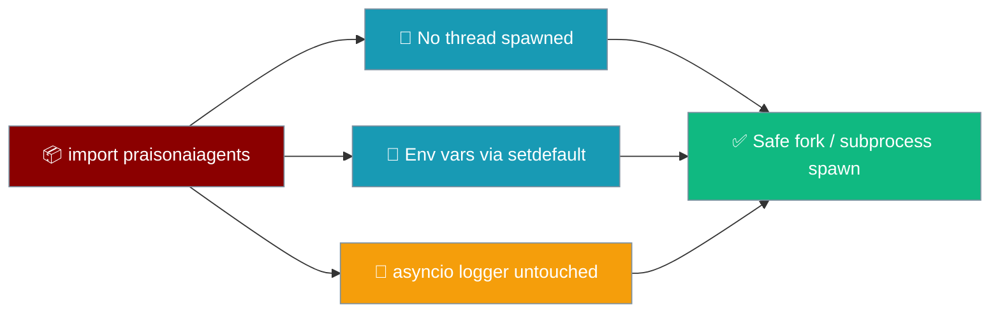

`import praisonaiagents` spawns no background thread, preserves host environment variables via `setdefault`, and leaves the host `asyncio` logger untouched — so it is safe to import at the parent of a pre-fork server before workers fork.

```python
from praisonaiagents import Agent

# Importing the package spawns nothing and overwrites nothing.
agent = Agent(instructions="You are a helpful assistant")
agent.start("Hello")
```

The user imports the SDK inside a gunicorn master or a `multiprocessing` parent; nothing starts a daemon thread or corrupts the environment before workers fork.



Reference: [PraisonAI PR #5219](https://github.com/MervinPraison/PraisonAI/pull/5219), fixes [#5162](https://github.com/MervinPraison/PraisonAI/issues/5162). This is the Python companion to [JS Import Safety & Runtimes](/features/js-import-safety).

## What's safe on import (after PR #5219)

Three import-time side effects that used to corrupt the host process are gone.

<Steps>
<Step title="Host environment variables are preserved">
`praisonaiagents._logging._configure_environment()` uses `os.environ.setdefault(key, value)`. A value the host exported before launch (`LITELLM_LOG`, `LITELLM_TELEMETRY`, `PYDANTIC_WARNINGS_ENABLED`, and the rest) is kept — and no longer leaks a different value into subprocesses spawned afterwards.

```python
import os
import praisonaiagents

# If the host exported LITELLM_LOG=DEBUG before launch, it survives import.
print(os.environ.get("LITELLM_LOG"))
```

See [Logging Configuration → Environment variables: setdefault, not overwrite](/features/logging-configuration#environment-variables-setdefault-not-overwrite) for the full variable list.
</Step>

<Step title="The asyncio logger is left alone">
`"asyncio"` was removed from the SDK's noisy-logger list. Import no longer forces `logging.getLogger("asyncio")` to `CRITICAL`, so host asyncio errors (`Task exception was never retrieved`, scheduling failures) continue to surface.
</Step>

<Step title="No cleanup thread is spawned at import">
The `runtime/resolve.py` cleanup daemon starts **lazily on the first cache write** — inside `resolve_runtime` under `_runtime_cache_lock` — not at module import. A bare `import praisonaiagents` or a touch of `runtime.SessionContext` spawns nothing, which is exactly the guarantee pre-fork server deployments need.

```python
import praisonaiagents
from praisonaiagents.runtime import SessionContext

# Neither line starts a background thread — the daemon waits for the
# first resolve_runtime() cache write.
ctx = SessionContext(session_id="parent")
```

See [Runtime Resolution → Background cleanup thread](/features/runtime-resolution#background-cleanup-thread-pr-5219).
</Step>
</Steps>

## What is still not safe on import

PR #5219 intentionally kept two behaviours. Be honest with your host application about them.

<AccordionGroup>
<Accordion title="Root logger is still reconfigured (basicConfig force=True)" icon="scroll">
`praisonaiagents` still calls `logging.basicConfig(force=True)` at import. If your host configured logging **before** importing PraisonAI, its handler is closed and replaced.

**Workaround:** import PraisonAI first, then configure your own logging — or accept the SDK's default config.

```python
import praisonaiagents          # imports and runs basicConfig(force=True)

import logging                  # now configure your handlers, after the import
logging.getLogger().addHandler(my_handler)
```
</Accordion>

<Accordion title="warnings.warn is still monkeypatched" icon="triangle-exclamation">
`warnings.warn` and `warnings.warn_explicit` remain patched to suppress a hardcoded pattern list plus any `UserWarning` mentioning "pydantic". Your own warnings matching those patterns will be swallowed.

**Workaround:** save the originals yourself before importing, or reinstate them from the module (verify the attribute name in `_warning_patch.py` at head — the originals are stored as `_original_warn` / `_original_warn_explicit`).

```python
import warnings
_real_warn = warnings.warn            # save before importing PraisonAI

import praisonaiagents               # patches warnings.warn

warnings.warn = _real_warn           # restore if you need your own warnings
```
</Accordion>
</AccordionGroup>

## Fork-safety guide

Import at the parent, then fork — as long as no `resolve_runtime` call happens before the fork, no daemon thread is cloned into a child in an undefined state.

<Tabs>
<Tab title="gunicorn (pre-fork)">
```bash
# --preload imports your app (and praisonaiagents) once in the master,
# then forks sync workers. Safe after PR #5219: no import-time daemon
# thread is cloned into each worker.
gunicorn --worker-class sync --workers 4 --preload myapp:app
```

```python
# myapp.py — imported once in the master before fork.
from praisonaiagents import Agent

agent = Agent(instructions="You are a helpful assistant")

def app(environ, start_response):
    # resolve_runtime (and the lazy cleanup thread) happens per-worker,
    # after fork — never in the master.
    reply = agent.start("Hello")
    start_response("200 OK", [("Content-Type", "text/plain")])
    return [reply.encode()]
```
</Tab>

<Tab title="multiprocessing.Process">
```python
import multiprocessing as mp
from praisonaiagents import Agent   # imported in the parent — safe

def worker(prompt):
    agent = Agent(instructions="You are a helpful assistant")
    return agent.start(prompt)

if __name__ == "__main__":
    procs = [mp.Process(target=worker, args=(f"Q{i}",)) for i in range(4)]
    for p in procs:
        p.start()
    for p in procs:
        p.join()
```
</Tab>

<Tab title="ProcessPoolExecutor">
```python
from concurrent.futures import ProcessPoolExecutor
from praisonaiagents import Agent   # imported in the parent — safe

def worker(prompt):
    agent = Agent(instructions="You are a helpful assistant")
    return agent.start(prompt)

if __name__ == "__main__":
    with ProcessPoolExecutor(max_workers=4) as pool:
        results = list(pool.map(worker, [f"Q{i}" for i in range(4)]))
```
</Tab>
</Tabs>

<Note>
Before PR #5219 the import-time cleanup thread was cloned into every child at `fork()` in an undefined state — a known cause of hangs and duplicate cache eviction under gunicorn pre-fork workers, `multiprocessing.Process`, and Celery prefork. After PR #5219, importing at the parent is safe as long as no `resolve_runtime` call happens before fork.
</Note>

## Best Practices

<AccordionGroup>
<Accordion title="Import at the parent, resolve in the child" icon="code-fork">
Under a pre-fork server, keep `import praisonaiagents` in the master and let the first `agent.start()` / `resolve_runtime` happen inside each worker. The lazy cleanup daemon then starts per-worker, never in the master.
</Accordion>

<Accordion title="Configure host logging after importing PraisonAI" icon="scroll">
`basicConfig(force=True)` still runs at import. Import the SDK first, then attach your own handlers so they survive.
</Accordion>

<Accordion title="Set env vars before launch to keep them" icon="terminal">
Export `LITELLM_LOG`, `LITELLM_TELEMETRY`, and friends in your shell / systemd / Docker before the process starts. `setdefault` preserves them and never leaks a different value into subprocesses.
</Accordion>

<Accordion title="Re-suppress asyncio yourself if you need it" icon="volume-xmark">
Import no longer silences the asyncio logger. If you want the old quiet behaviour, call `logging.getLogger("asyncio").setLevel(logging.CRITICAL)` in your own code.
</Accordion>
</AccordionGroup>

## Related

<CardGroup cols={2}>
  <Card title="Import Safety (JS)" icon="shield-check" href="/features/js-import-safety">
    JavaScript companion — no dotenv side effects on import
  </Card>
  <Card title="Logging Configuration" icon="scroll" href="/features/logging-configuration">
    setdefault env vars and the untouched asyncio logger
  </Card>
  <Card title="Runtime Resolution" icon="rotate" href="/features/runtime-resolution">
    Lazy cleanup-thread start and fork safety
  </Card>
  <Card title="Thread Safety" icon="lock" href="/features/thread-safety">
    Output-singleton locks and concurrent agent guarantees
  </Card>
</CardGroup>
