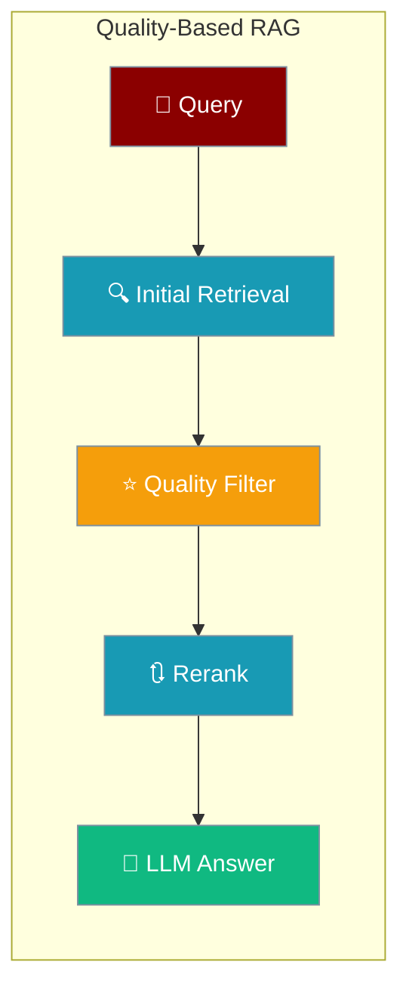
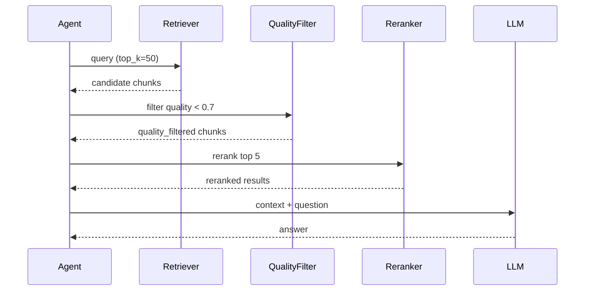

PraisonAI implements sophisticated quality-based retrieval patterns that go beyond simple semantic search. The system evaluates and scores retrieved content across multiple dimensions to ensure high-quality, relevant responses.

## Quick Start

<Steps>
<Step title="Enable quality filtering on an agent">
```python
from praisonaiagents import Agent

agent = Agent(
    name="Quality RAG Agent",
    instructions="You retrieve and answer with high-quality information.",
    memory={
        "backend": "rag",
        "quality_threshold": 0.7,
        "auto_quality_check": True
    }
)
```
</Step>

<Step title="Enable reranking on knowledge">
```python
agent = Agent(
    name="Reranking Agent",
    instructions="Search with advanced reranking.",
    knowledge={
        "sources": ["path/to/documents"],
        "rerank": True,
        "top_k": 5,
        "score_threshold": 0.7
    }
)

response = agent.start("What are the key features of the product?")
```
</Step>
</Steps>

---

## How It Works



---

## Overview

Quality-Based RAG in PraisonAI includes:
- Multi-dimensional quality scoring (completeness, relevance, clarity, accuracy)
- Automatic quality assessment using LLMs
- Quality-based storage decisions
- Advanced reranking capabilities
- Confidence-based filtering
- Hybrid search with quality weighting

## Quality Metrics System

PraisonAI evaluates content quality across four dimensions:

```python
from praisonaiagents import Agent

# Create agent with quality-based memory
agent = Agent(
    name="Quality RAG Agent",
    instructions="You retrieve and answer with high-quality information.",
    memory={
        "backend": "rag",
        "quality_threshold": 0.7,
        "auto_quality_check": True
    }
)

# Quality metrics are automatically calculated for stored content
# - Completeness: How complete is the information?
# - Relevance: How relevant to the context?
# - Clarity: How clear and understandable?
# - Accuracy: How accurate and factual?
```

## Quality-Based Storage

Only high-quality information is stored in long-term memory:

```python
from praisonaiagents import Agent

# Agent with quality-filtered storage
agent = Agent(
    name="Quality Storage Agent",
    instructions="Only store high-quality information.",
    memory={
        "backend": "rag",
        "quality_threshold": 0.8,
        "metrics_weights": {
            "completeness": 0.3,
            "relevance": 0.3,
            "clarity": 0.2,
            "accuracy": 0.2
        }
    }
)

# Content below threshold is automatically filtered
response = agent.start("Remember that Python is a programming language.")
```

## Advanced Reranking

Rerank search results based on quality and relevance:

```python
from praisonaiagents import Agent

# Agent with reranking-enabled knowledge
agent = Agent(
    name="Reranking Agent",
    instructions="Search with advanced reranking.",
    knowledge={
        "sources": ["path/to/documents"],
        "rerank": True,
        "top_k": 5,
        "score_threshold": 0.7
    }
)

# Search with reranking automatically applied
response = agent.start("What are the key features of the product?")

# Results are ordered by reranking scores
for result in results:
    print(f"Score: {result['rerank_score']:.3f} - {result['text'][:100]}...")
```

## Multi-Stage Retrieval Pipeline

Implement sophisticated multi-stage retrieval:

```python
from praisonaiagents import Agent, Knowledge

class MultiStageRAGAgent(Agent):
    def __init__(self, name, knowledge_base):
        super().__init__(name=name)
        self.knowledge = knowledge_base
    
    def retrieve_with_quality(self, query, stages=3):
        # Stage 1: Initial broad retrieval
        initial_results = self.knowledge.search(
            query=query,
            top_k=50,  # Get more candidates
            similarity_threshold=0.6  # Lower threshold
        )
        
        # Stage 2: Quality filtering
        quality_filtered = [
            r for r in initial_results 
            if r.get("quality_score", 0) > 0.7
        ]
        
        # Stage 3: Reranking
        if len(quality_filtered) > 5:
            reranked = self.knowledge.rerank(
                query=query,
                documents=quality_filtered,
                top_k=5
            )
            return reranked
        
        return quality_filtered[:5]

# Use multi-stage retrieval
agent = MultiStageRAGAgent(
    name="Advanced RAG",
    knowledge_base=knowledge
)
```

## Confidence-Based Filtering

Filter results based on confidence scores:

```python
from praisonaiagents import Knowledge
import numpy as np

class ConfidenceRAG:
    def __init__(self, knowledge_base):
        self.kb = knowledge_base
    
    def search_with_confidence(self, query, min_confidence=0.8):
        # Get results with scores
        results = self.kb.search(query, return_scores=True)
        
        # Calculate confidence based on score distribution
        scores = [r["score"] for r in results]
        mean_score = np.mean(scores)
        std_score = np.std(scores)
        
        # Filter by confidence
        confident_results = []
        for result in results:
            # Confidence based on z-score
            z_score = (result["score"] - mean_score) / std_score
            confidence = 1 / (1 + np.exp(-z_score))  # Sigmoid
            
            if confidence >= min_confidence:
                result["confidence"] = confidence
                confident_results.append(result)
        
        return confident_results
```

## Hybrid Search with Quality Weighting

Combine semantic and keyword search with quality scores:

```python
from praisonaiagents import Knowledge

# Configure hybrid search
knowledge = Knowledge(
    data="documents/",
    config={
        "hybrid_search": {
            "enabled": True,
            "semantic_weight": 0.7,
            "keyword_weight": 0.3,
            "quality_weight": 0.2  # Additional quality component
        }
    }
)

# Perform hybrid search
results = knowledge.search(
    query="machine learning algorithms",
    keyword_search=True,  # Enable keyword component
    semantic_search=True,  # Enable semantic component
    quality_filter=True,   # Apply quality filtering
    top_k=10
)

# Results are scored by weighted combination
for result in results:
    print(f"Hybrid Score: {result['hybrid_score']:.3f}")
    print(f"  - Semantic: {result['semantic_score']:.3f}")
    print(f"  - Keyword: {result['keyword_score']:.3f}")
    print(f"  - Quality: {result['quality_score']:.3f}")
```

## Quality Metrics Tracking

Monitor and improve retrieval quality:

```python
from praisonaiagents import Memory
from datetime import datetime
import json

class MonitoredMemory(Memory):
    def __init__(self, *args, **kwargs):
        super().__init__(*args, **kwargs)
        self.quality_history = []
    
    def add_with_tracking(self, content, metadata=None):
        # Calculate quality metrics
        metrics = self._evaluate_quality_metrics(content)
        
        # Track metrics
        self.quality_history.append({
            "timestamp": datetime.now().isoformat(),
            "metrics": metrics,
            "content_length": len(content),
            "metadata": metadata
        })
        
        # Store if quality is sufficient
        if sum(metrics.values()) / len(metrics) >= 0.7:
            return self.add(content, metadata)
        return False
    
    def get_quality_report(self):
        if not self.quality_history:
            return "No quality data available"
        
        # Calculate averages
        avg_metrics = {
            "completeness": 0,
            "relevance": 0,
            "clarity": 0,
            "accuracy": 0
        }
        
        for entry in self.quality_history:
            for metric, value in entry["metrics"].items():
                avg_metrics[metric] += value
        
        for metric in avg_metrics:
            avg_metrics[metric] /= len(self.quality_history)
        
        return {
            "total_entries": len(self.quality_history),
            "average_metrics": avg_metrics,
            "quality_trend": self._calculate_trend()
        }
```

## Dynamic Quality Thresholds

Adjust quality thresholds based on context:

```python
from praisonaiagents import Agent, Memory

class AdaptiveQualityAgent(Agent):
    def __init__(self, name):
        super().__init__(
            name=name,
            memory=Memory(config={"provider": "mem0"})
        )
        self.quality_thresholds = {
            "critical": 0.9,    # Critical information
            "important": 0.8,   # Important facts
            "general": 0.7,     # General knowledge
            "casual": 0.6       # Casual conversation
        }
    
    def store_with_context(self, content, context_type="general"):
        # Get appropriate threshold
        threshold = self.quality_thresholds.get(context_type, 0.7)
        
        # Temporarily adjust memory threshold
        original_threshold = self.memory.config.get("quality_threshold", 0.7)
        self.memory.config["quality_threshold"] = threshold
        
        # Store with context-appropriate threshold
        result = self.memory.add(
            content,
            metadata={"context_type": context_type}
        )
        
        # Restore original threshold
        self.memory.config["quality_threshold"] = original_threshold
        
        return result
```

## Query Expansion with Quality

Expand queries while maintaining quality:

```python
from praisonaiagents import Knowledge

class QueryExpansionRAG:
    def __init__(self, knowledge_base, llm):
        self.kb = knowledge_base
        self.llm = llm
    
    def search_with_expansion(self, query):
        # Generate query variations
        prompt = f"""Generate 3 alternative phrasings for this query:
        Query: {query}
        
        Alternatives:"""
        
        variations = self.llm.generate(prompt)
        queries = [query] + self._parse_variations(variations)
        
        # Search with all queries
        all_results = []
        for q in queries:
            results = self.kb.search(q, top_k=5)
            all_results.extend(results)
        
        # Deduplicate and rerank by quality
        unique_results = self._deduplicate(all_results)
        return self._rerank_by_quality(unique_results, query)
```

## Best Practices

<AccordionGroup>
<Accordion title="Set appropriate quality thresholds per domain">
For factual/critical content use `quality_threshold: 0.85` with accuracy weight 0.4. For creative/general content use `0.7` with relevance weight 0.4.
</Accordion>

<Accordion title="Implement fallback strategies">
If high-threshold search returns fewer than 3 results, retry with a lower threshold before falling back to no filter.

```python
results = knowledge.search(query, quality_threshold=0.8, top_k=5)
if len(results) < 3:
    results = knowledge.search(query, quality_threshold=0.6, top_k=5)
```
</Accordion>

<Accordion title="Use multi-stage retrieval for large corpora">
Broad retrieval (top_k=50, threshold=0.6) → quality filter → rerank top 5 gives the best precision/recall tradeoff.
</Accordion>

<Accordion title="Monitor retrieval quality over time">
Track `avg_quality` per query to detect drift. If average quality drops, your documents may need re-indexing or threshold tuning.
</Accordion>
</AccordionGroup>

---

## Related

<CardGroup cols={2}>
<Card title="Smart Retrieval" icon="magnifying-glass" href="/features/smart-retrieval">
  Hybrid search with keyword prefiltering and reranking
</Card>
<Card title="Retrieval Strategies" icon="route" href="/features/retrieval-strategies">
  Automatic strategy selection by corpus size
</Card>
</CardGroup>