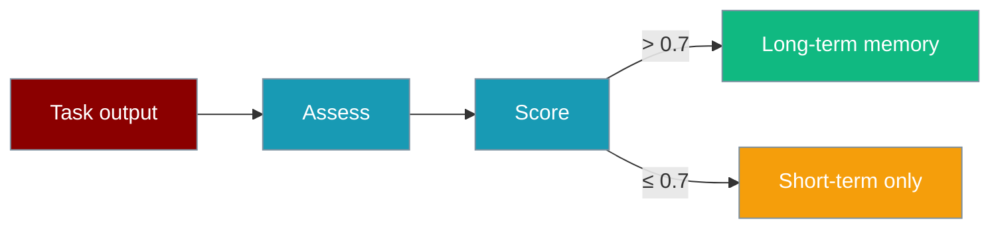

Tasks with `quality_check=True` score outputs and store high-quality results in memory.

```python
from praisonaiagents import Agent, Task, AgentTeam, Memory

agent = Agent(
    name="Writer",
    instructions="Write clear, complete articles.",
    memory=Memory(),
)

task = Task(
    description="Write a short article on AI ethics",
    expected_output="Introduction, three sections, and conclusion",
    agent=agent,
    quality_check=True,
)

AgentTeam(agents=[agent], tasks=[task]).start()
```

The user runs a team task; quality scoring decides whether outputs land in long-term memory.




## Quick Start

<Steps>
<Step title="Simple Usage">

Enable quality checking on a task (default is `True`):

```python
from praisonaiagents import Agent, Task, AgentTeam, Memory

agent = Agent(name="Writer", instructions="Be thorough.", memory=Memory())

task = Task(
    description="Explain quantum computing in plain English",
    expected_output="500-word explanation with examples",
    agent=agent,
    quality_check=True,
)

AgentTeam(agents=[agent], tasks=[task]).start()
```

</Step>

<Step title="With Configuration">

Disable for fast runs or use execution presets:

```python
from praisonaiagents import Agent, Task, AgentTeam

agent = Agent(name="Draft", instructions="Quick drafts only.")

task = Task(
    description="Draft a tweet",
    agent=agent,
    quality_check=False,
)

AgentTeam(agents=[agent], tasks=[task]).start()
```

</Step>
</Steps>

---

## How It Works

When `quality_check=True` and memory is configured:

1. Agent completes the task
2. `Memory.calculate_quality_metrics()` scores completeness, relevance, clarity, accuracy via LLM
3. `finalize_task_output()` stores in long-term memory only when score exceeds **0.7**
4. Quality metadata attaches to the task result

Memory is required — without it, quality checking logs a warning and skips storage.

---

## Configuration Options

| Option | Type | Default | Description |
|--------|------|---------|-------------|
| `quality_check` | `bool` | `True` | Enable LLM quality assessment |
| `expected_output` | `str` | `None` | Benchmark for scoring (strongly recommended) |
| `memory` | `Memory` | `None` | Required for quality storage |

Execution presets: `"fast"` disables quality check; `"balanced"` and `"thorough"` enable it.

---

## Best Practices

<AccordionGroup>
<Accordion title="Always set expected_output">
Clear expectations produce meaningful scores — vague tasks score inconsistently.
</Accordion>
<Accordion title="Configure memory first">
Quality checking stores to memory — attach `memory=Memory()` to the agent or task.
</Accordion>
<Accordion title="Disable for drafts">
Set `quality_check=False` on brainstorming or speed-critical tasks.
</Accordion>
<Accordion title="Retrieve high-quality history">
Search with `min_quality=0.7` to reuse past strong outputs as context.
</Accordion>
</AccordionGroup>

---

## Related

<CardGroup cols={2}>
<Card title="Quality-Based RAG" icon="star-half-stroke" href="/docs/features/quality-based-rag">
  Quality scoring for retrieval
</Card>
<Card title="Memory" icon="brain" href="/docs/features/memory">
  Memory configuration and search
</Card>
</CardGroup>
