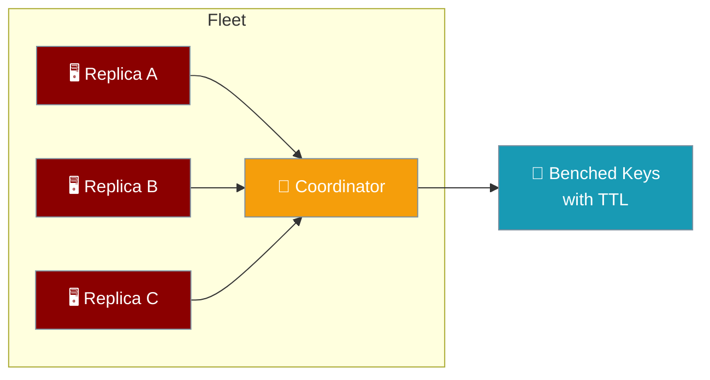
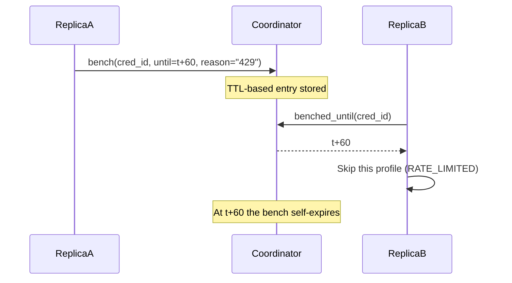
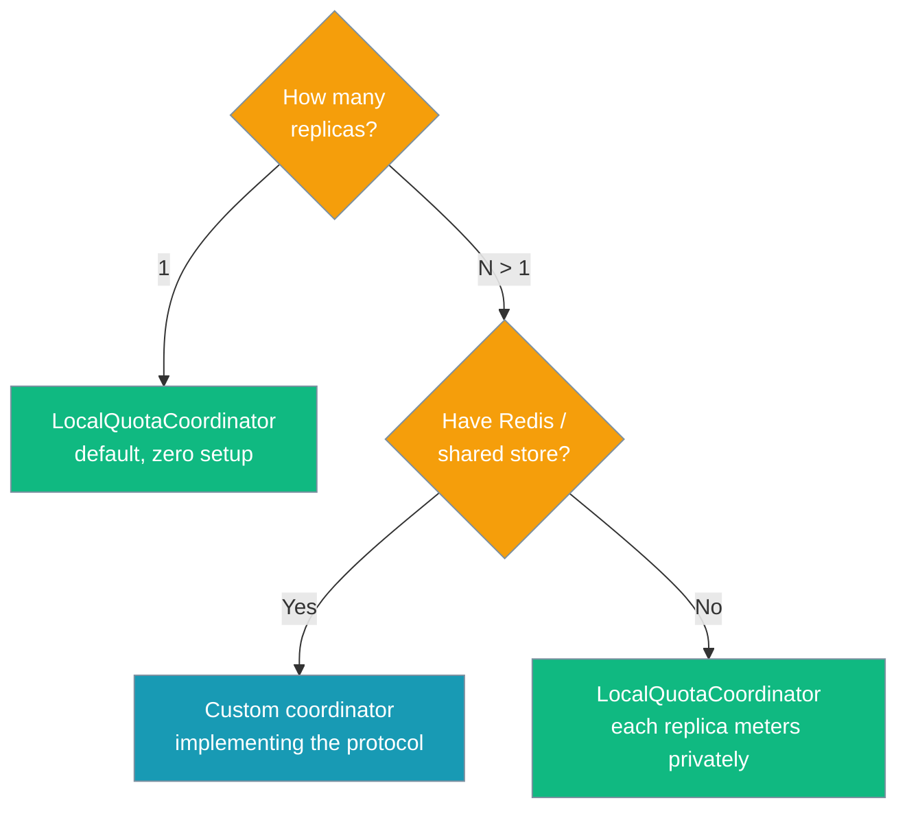

The Quota Coordinator lets multiple replicas share credential cooldowns — when one replica benches an API key after a 429, every replica skips it until the cooldown expires.



<Note>
The Quota Coordinator symbols live in `praisonaiagents.llm`: `from praisonaiagents.llm import LocalQuotaCoordinator`. `Agent`, `AuthProfile`, and `FailoverManager` import from the top-level `praisonaiagents` package.
</Note>

## Quick Start

<Steps>

<Step title="Default (single replica)">
```python
from praisonaiagents import Agent, AuthProfile, FailoverManager

# No coordinator argument = the default in-memory coordinator.
# Single-replica behaviour is exactly as before.
manager = FailoverManager()
manager.add_profile(AuthProfile(name="openai", provider="openai", api_key="sk-..."))

agent = Agent(name="assistant", llm={"model": "gpt-4o-mini", "failover_manager": manager})
agent.start("Hello!")
```
</Step>

<Step title="Attach a coordinator">
```python
from praisonaiagents import Agent, AuthProfile, FailoverManager
from praisonaiagents.llm import LocalQuotaCoordinator

coordinator = LocalQuotaCoordinator()
manager = FailoverManager(coordinator=coordinator)
manager.add_profile(AuthProfile(name="openai", provider="openai", api_key="sk-..."))

agent = Agent(name="assistant", llm={"model": "gpt-4o-mini", "failover_manager": manager})
```
</Step>

<Step title="Share across managers in one process">
```python
from praisonaiagents import AuthProfile, FailoverManager
from praisonaiagents.llm import LocalQuotaCoordinator

shared = LocalQuotaCoordinator()

# Two independent failover managers now share cooldowns.
mgr_a = FailoverManager(coordinator=shared)
mgr_b = FailoverManager(coordinator=shared)

mgr_a.add_profile(AuthProfile(name="key1", provider="openai", api_key="sk-shared"))
mgr_b.add_profile(AuthProfile(name="key1", provider="openai", api_key="sk-shared"))
```
</Step>

<Step title="Bring your own backend (replicas > 1)">
```python
from praisonaiagents import FailoverManager
from praisonaiagents.llm import QuotaCoordinatorProtocol

# A concrete Redis-backed coordinator lives in the wrapper/bot package and
# implements the same protocol. Core stays dependency-free.
manager = FailoverManager(coordinator=my_redis_coordinator)
```
</Step>

</Steps>

---

## How It Works

Replica A hits a 429, benches the credential, then replica B skips the benched key based on the shared coordinator state.



| Step | What happens |
|------|--------------|
| Bench | Replica A calls `bench(cred_id, until=t+60)` on a rate-limit failure. |
| Sync | Replica B calls `get_next_profile()`, which reads `benched_until(cred_id)`. |
| Skip | Replica B marks its local profile `RATE_LIMITED` and skips it. |
| Expire | At `t+60` the bench self-clears; the key returns to rotation fleet-wide. |

---

## Choosing a Backend

Pick a coordinator based on how many replicas run and whether you have a shared store.



---

## Configuration Options

`QuotaCoordinatorConfig` selects the backend.

```python
from praisonaiagents.llm import QuotaCoordinatorConfig, build_quota_coordinator

config = QuotaCoordinatorConfig(backend="local")
coordinator = build_quota_coordinator(config)
```

| Option | Type | Default | Description |
|--------|------|---------|-------------|
| `backend` | `str` | `"local"` | `"local"` (in-memory, default) or a shared backend name such as `"redis"` provided by the wrapper/bot package. |
| `url` | `Optional[str]` | `None` | Optional backend URL. When omitted a shared backend reuses the already-established connection (e.g. gateway `RedisConfig`). |

`QuotaCoordinatorProtocol` defines the contract every coordinator implements.

| Method | Signature | Purpose |
|--------|-----------|---------|
| `bench` | `bench(cred_id, *, until, reason="")` | Bench a credential until an epoch timestamp (TTL-based). |
| `is_benched` | `is_benched(cred_id, *, now=None) -> bool` | Return True if the credential is currently benched. |
| `benched_until` | `benched_until(cred_id, *, now=None) -> Optional[float]` | Return the epoch timestamp the credential is benched until, or None. |
| `clear` | `clear(cred_id) -> None` | Clear any bench for the credential (e.g. on recovery). |

---

## Key Behaviours

Each behaviour is enforced by the SDK and covered by tests.

| Behaviour | What it means |
|-----------|---------------|
| **Fail-open by contract** | Any coordinator error is logged as a warning and treated as "not benched" so the failover path is never wedged. |
| **TTL semantics** | Bench entries carry an expiry — a dead replica's benches self-expire. |
| **Longest-cooldown wins** | `bench()` on an already-benched credential keeps the later expiry, never shortens it. |
| **Hashed credential id** | `AuthProfile.credential_id` derives a stable, non-secret 16-char SHA-256 digest from `provider + base_url + api_key`. Two profiles named `"default"` with different keys will not collide. |
| **Stale success is safe** | `mark_success` clears the shared bench only when it is not newer than the cooldown being recovered from. |
| **Backward-compatible default** | `FailoverManager()` with no `coordinator` creates a `LocalQuotaCoordinator` internally — single-replica behaviour is unchanged. |

<Warning>
Never wrap coordinator calls in your own catch/retry blocks. A coordinator outage degrades to local behaviour automatically — extra retries only add latency.
</Warning>

---

## Credential Identity

Benches key on the credential, not the profile label, so two profiles named `"default"` with different keys stay independent.

```python
from praisonaiagents import AuthProfile

p1 = AuthProfile(name="default", provider="openai", api_key="key-1")
p2 = AuthProfile(name="default", provider="openai", api_key="key-2")

# Distinct, stable, non-secret ids — the raw key is never exposed.
assert p1.credential_id != p2.credential_id
```

---

## Best Practices

<AccordionGroup>
  <Accordion title="Default is safe">
    Single-replica or single-process deployments do not need to set anything — leave `coordinator` unset and `FailoverManager` uses a private in-memory coordinator.
  </Accordion>

  <Accordion title="Share across agents in the same process">
    Pass one `LocalQuotaCoordinator` to every `FailoverManager` in the process so all agents observe each other's benches.
  </Accordion>

  <Accordion title="Bring your own backend for replicas > 1">
    The concrete Redis coordinator ships in the wrapper/bot package to keep core dependency-free. Wire it up via config and pass the instance to `FailoverManager(coordinator=...)`.
  </Accordion>

  <Accordion title="Trust the fail-open">
    A coordinator outage logs a warning and degrades to local behaviour — never write catch/retry blocks around coordinator calls at the call site.
  </Accordion>
</AccordionGroup>

---

## Related

<CardGroup cols={2}>
  <Card title="Failover" icon="rotate" href="/features/failover">
    Automatic fallback between LLM providers
  </Card>
  <Card title="Rate Limiter" icon="gauge" href="/features/rate-limiter">
    Throttle requests to stay within provider limits
  </Card>
  <Card title="LLM Error Classification" icon="triangle-exclamation" href="/features/llm-error-classification">
    Typed errors that drive failover decisions
  </Card>
  <Card title="Thread Safety" icon="lock" href="/features/thread-safety">
    Share a credential pool across concurrent agents
  </Card>
</CardGroup>
