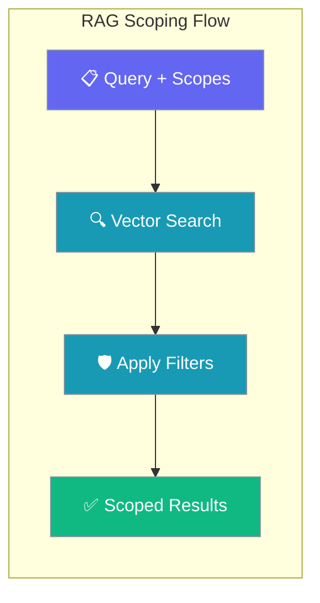
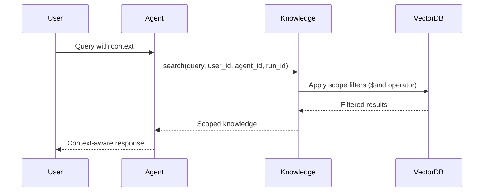

RAG scoping enables precise filtering of retrieval results using scope identifiers, allowing multi-tenant isolation and session-specific knowledge retrieval.



## Quick Start

<Steps>
<Step title="Single Scope Usage">
Filter knowledge by user, agent, or session:

```python
from praisonaiagents import Agent

# User-specific knowledge
agent = Agent(
    name="PersonalAssistant",
    instructions="You are a personal assistant.",
    knowledge=["./documents/"],
    user_id="alice",
)

agent.start("Find my recent notes about the project")
```
</Step>

<Step title="Combined Scopes">
Combine multiple scopes for fine-grained isolation:

```python
from praisonaiagents import Agent

# Multi-tenant SaaS support bot
agent = Agent(
    name="SupportBot",
    instructions="Answer customer questions using their session history.",
    knowledge=["./support_docs/"],
    user_id="customer_42",
    agent_id="support_bot_v1", 
    run_id="session_2026_05_30",
)

agent.start("What was the status of my refund request?")
```
</Step>
</Steps>

---

## How It Works



| Scope Type | Purpose | Example Use Case |
|------------|---------|------------------|
| `user_id` | Per-user isolation | Personal documents, user-specific data |
| `agent_id` | Per-agent isolation | Different bot types sharing infrastructure |
| `run_id` | Per-session isolation | Conversation-specific temporary context |

---

## Configuration Options

<Card title="Knowledge Backend Configuration" icon="code" href="/docs/features/knowledge-backends">
  Learn about different vector store backends and their scoping support
</Card>

---

## Common Patterns

### Multi-Tenant SaaS Application

```python
from praisonaiagents import Agent

def create_customer_agent(customer_id, session_id):
    return Agent(
        name="CustomerSupportBot",
        instructions="Provide customer support using account history.",
        knowledge=["./knowledge_base/"],
        user_id=customer_id,           # Isolate per customer
        agent_id="support_bot_v2",     # Shared bot knowledge
        run_id=session_id,             # Session-specific context
    )

# Each customer gets isolated knowledge
agent = create_customer_agent("cust_12345", "sess_abc")
```

### Department-Specific Knowledge

```python
# Sales team agent
sales_agent = Agent(
    name="SalesAssistant",
    instructions="Help with sales inquiries and product information.",
    knowledge=["./sales_materials/"],
    agent_id="sales_assistant",
    user_id="sales_team",
)

# Support team agent  
support_agent = Agent(
    name="SupportAgent",
    instructions="Resolve technical support issues.",
    knowledge=["./support_docs/"], 
    agent_id="support_assistant",
    user_id="support_team",
)
```

### Session-Based Memory

```python
from praisonaiagents import Agent

# Create conversation-specific memory
def start_conversation(user_id):
    import uuid
    session_id = str(uuid.uuid4())
    
    agent = Agent(
        name="ChatBot",
        instructions="Remember our conversation context.",
        knowledge=[],  # Will accumulate during conversation
        user_id=user_id,
        run_id=session_id,
    )
    
    return agent, session_id
```

---

## Best Practices

<AccordionGroup>
<Accordion title="Choose the Right Scope Level">
**Single scope** for simple use cases:
- Use `user_id` for personal documents
- Use `agent_id` for shared knowledge bases
- Use `run_id` for temporary session data

**Combined scopes** for complex multi-tenant applications:
- All three scopes provide maximum isolation
- Omit scopes to broaden access as needed
</Accordion>

<Accordion title="Scope Identifier Naming">
Use consistent, readable naming patterns:

```python
# Good - descriptive and consistent
user_id = "customer_alice_123"
agent_id = "support_bot_v2"
run_id = "session_2026_05_30_14_30"

# Avoid - unclear or inconsistent
user_id = "u123"
agent_id = "bot1"
run_id = "abc"
```
</Accordion>

<Accordion title="Backend Compatibility">
**mem0 backend** requires at least one scope identifier.
**ChromaDB backend** supports all scoping patterns and automatically combines multiple scopes with `$and` operator.
**Internal backend** has limited scoping support.

Choose your backend based on scoping requirements.
</Accordion>

<Accordion title="Performance Considerations">
More specific scopes = faster queries:
- Narrow scopes reduce the search space
- Combined scopes create more selective filters
- Consider indexing strategies for your vector database

Monitor query performance with different scope combinations.
</Accordion>
</AccordionGroup>

---

## Related

<CardGroup cols={2}>
<Card title="Knowledge Backends" icon="database" href="/docs/features/knowledge-backends">
  Configure different vector store backends with scoping support
</Card>
<Card title="Agents" icon="user" href="/docs/concepts/agents">
  Learn how agents use knowledge and memory systems
</Card>
</CardGroup>