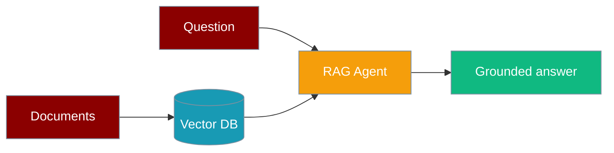
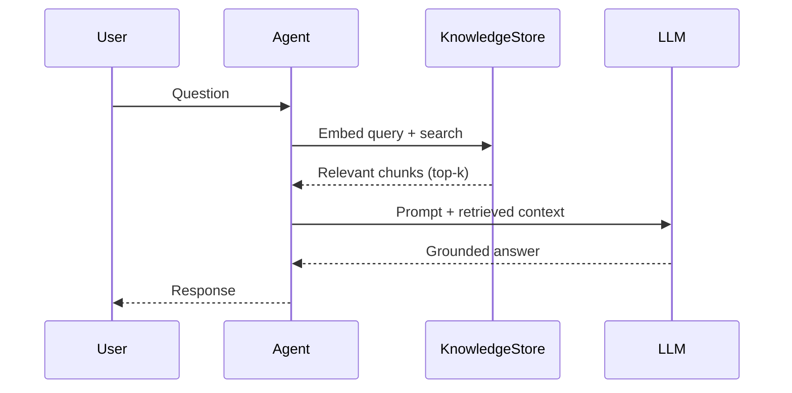

RAG agents retrieve relevant chunks from your documents before answering, grounding responses in your own knowledge.

```python
from praisonaiagents import Agent

agent = Agent(
    name="Knowledge Agent",
    instructions="Answer from the provided knowledge only.",
    knowledge=["small.pdf"],
)

agent.start("What is KAG in one line?")
```

The user asks from their documents; the agent retrieves relevant chunks and grounds the reply.




## Quick Start

<Steps>
<Step title="Simple Usage">

Pass file paths or directories — the agent indexes on first run, then retrieves on each query:

```python
from praisonaiagents import Agent

agent = Agent(
    name="Knowledge Agent",
    instructions="Answer from the knowledge base.",
    knowledge=["small.pdf"],
)

agent.start("What is KAG in one line?")
```

</Step>

<Step title="With Configuration">

Use `KnowledgeConfig` for vector store, chunking, and reranking:

```python
from praisonaiagents import Agent, KnowledgeConfig

agent = Agent(
    name="Knowledge Agent",
    instructions="Answer from the provided knowledge.",
    knowledge=KnowledgeConfig(
        sources=["small.pdf"],
        vector_store={
            "provider": "chroma",
            "config": {"collection_name": "praison", "path": ".praison"},
        },
        retrieval_k=5,
        rerank=True,
    ),
)

agent.start("What is KAG in one line?")
```

</Step>
</Steps>

---

## How It Works



| Phase | What happens |
|---|---|
| 1. Index | Documents are chunked and embedded into the vector store on first access |
| 2. Retrieve | User query is embedded; top-k similar chunks are returned |
| 3. Generate | Retrieved context is injected before the LLM prompt; LLM answers from your data |

For pre-indexed stores, pass vector config via task context or call `agent.retrieve("query")` directly.

---

## Configuration Options

| Option | Type | Default | Description |
|--------|------|---------|-------------|
| `sources` | `List[str]` | `[]` | Files, directories, or URLs |
| `embedder` | `str` | `"openai"` | Embedding provider |
| `chunk_size` | `int` | `1000` | Chunk size in tokens |
| `chunk_overlap` | `int` | `200` | Overlap between chunks |
| `retrieval_k` | `int` | `5` | Chunks retrieved per query |
| `retrieval_threshold` | `float` | `0.0` | Minimum similarity score |
| `rerank` | `bool` | `False` | Rerank retrieved chunks |
| `auto_retrieve` | `bool` | `True` | Inject context automatically |
| `vector_store` | `dict` | `None` | Backend provider config |

Install knowledge extras: `pip install "praisonaiagents[knowledge]"`

---

## Best Practices

<AccordionGroup>
<Accordion title="Index documents before querying">
Pass sources via `knowledge=["file.pdf"]` at agent creation — first run indexes, later runs retrieve without re-indexing.
</Accordion>
<Accordion title="Use specific questions">
Narrow questions retrieve better chunks than broad prompts like "tell me everything".
</Accordion>
<Accordion title="Use persistent vector stores in production">
Set `vector_store` with Chroma path, Qdrant, or Pinecone — avoid in-memory stores for production.
</Accordion>
<Accordion title="Combine RAG with tools for live data">
Pair `knowledge=` with web tools when you need both static documents and real-time data.
</Accordion>
</AccordionGroup>

---

## Related

<CardGroup cols={2}>
<Card title="Vector Store" icon="database" href="/docs/features/vector-store">
  Pluggable embedding storage
</Card>
<Card title="Knowledge" icon="book" href="/docs/features/knowledge">
  Sources and retrieval strategies
</Card>
</CardGroup>
