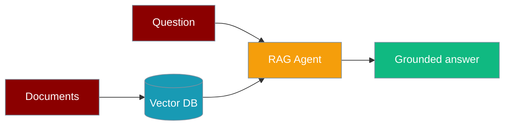
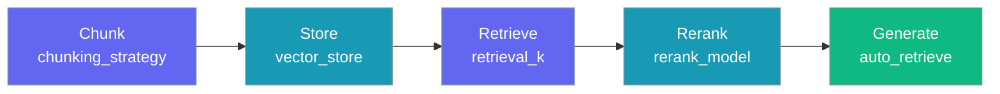
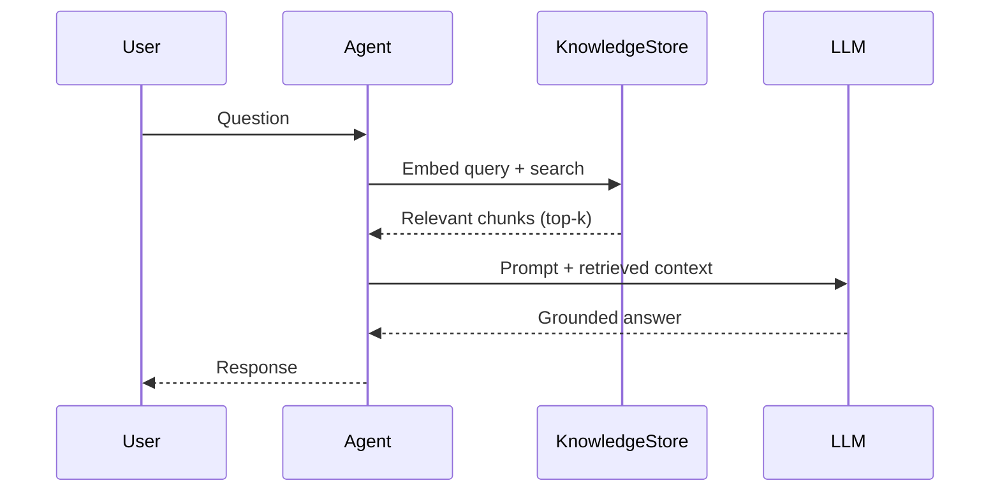
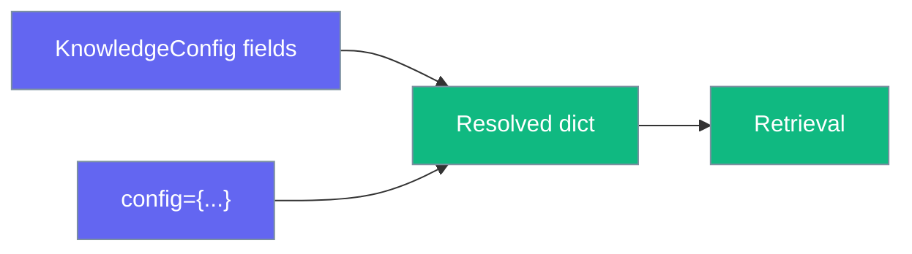

RAG agents retrieve relevant chunks from your documents before answering, grounding responses in your own knowledge.

```python
from praisonaiagents import Agent

agent = Agent(
    name="Knowledge Agent",
    instructions="Answer from the provided knowledge only.",
    knowledge=["small.pdf"],
)

agent.start("What is KAG in one line?")
```

The user asks from their documents; the agent retrieves relevant chunks and grounds the reply.



```mermaid
graph LR
    D[Documents] --> V[(Vector DB)]
    Q[Question] --> A[RAG Agent]
    V --> A
    A --> O[Grounded answer]

    classDef input fill:#8B0000,stroke:#7C90A0,color:#fff
    classDef store fill:#189AB4,stroke:#7C90A0,color:#fff
    classDef process fill:#F59E0B,stroke:#7C90A0,color:#fff
    classDef output fill:#10B981,stroke:#7C90A0,color:#fff

    class D,Q input
    class V store
    class A process
    class O output
```

Every stage below is now configurable from `KnowledgeConfig` after the fields were wired up.


```mermaid
graph LR
    Chunk[Chunk<br/>chunking_strategy] --> Store[Store<br/>vector_store]
    Store --> Retrieve[Retrieve<br/>retrieval_k]
    Retrieve --> Rerank[Rerank<br/>rerank_model]
    Rerank --> Generate[Generate<br/>auto_retrieve]

    classDef cfg fill:#6366F1,stroke:#7C90A0,color:#fff
    classDef store fill:#189AB4,stroke:#7C90A0,color:#fff
    classDef out fill:#10B981,stroke:#7C90A0,color:#fff

    class Chunk,Retrieve cfg
    class Store,Rerank store
    class Generate out
```

## Quick Start

<Steps>
<Step title="Simple Usage">

Pass file paths or directories — the agent indexes on first run, then retrieves on each query:

```python
from praisonaiagents import Agent

agent = Agent(
    name="Knowledge Agent",
    instructions="Answer from the knowledge base.",
    knowledge=["small.pdf"],
)

agent.start("What is KAG in one line?")
```

</Step>

<Step title="With Configuration">

Use `KnowledgeConfig` for vector store, chunking, and reranking:

```python
from praisonaiagents import Agent, KnowledgeConfig

agent = Agent(
    name="Knowledge Agent",
    instructions="Answer from the provided knowledge.",
    knowledge=KnowledgeConfig(
        sources=["small.pdf"],
        vector_store={
            "provider": "chroma",
            "config": {"collection_name": "praison", "path": ".praison"},
        },
        retrieval_k=5,
        rerank=True,
    ),
)

agent.start("What is KAG in one line?")
```

</Step>
</Steps>

### With a different embedder provider

Set `embedder_config` to embed with Gemini, Cohere, or a local Ollama model instead of OpenAI.

<Tabs>

<Tab title="Gemini">

```python
from praisonaiagents import Agent, KnowledgeConfig

agent = Agent(
    instructions="Answer from the knowledge base.",
    knowledge=KnowledgeConfig(
        sources=["small.pdf"],
        embedder_config={
            "provider": "gemini",
            "config": {"model": "models/text-embedding-004"},
        },
    ),
)
```

</Tab>

<Tab title="Cohere">

```python
from praisonaiagents import Agent, KnowledgeConfig

agent = Agent(
    instructions="Answer from the knowledge base.",
    knowledge=KnowledgeConfig(
        sources=["small.pdf"],
        embedder="cohere",
    ),
)
```

</Tab>

<Tab title="Ollama">

```python
from praisonaiagents import Agent, KnowledgeConfig

agent = Agent(
    instructions="Answer from the knowledge base.",
    knowledge=KnowledgeConfig(
        sources=["small.pdf"],
        embedder_config={
            "provider": "ollama",
            "config": {"model": "nomic-embed-text"},
        },
    ),
)
```

</Tab>

</Tabs>

<Tip>
`embedder="openai"` is the default and means "no override". See [Knowledge → Use a non-OpenAI embedder](/features/knowledge#use-a-non-openai-embedder) for the full guide.
</Tip>

---

## How It Works


```mermaid
sequenceDiagram
    participant User
    participant Agent
    participant KnowledgeStore
    participant LLM

    User->>Agent: Question
    Agent->>KnowledgeStore: Embed query + search
    KnowledgeStore-->>Agent: Relevant chunks (top-k)
    Agent->>LLM: Prompt + retrieved context
    LLM-->>Agent: Grounded answer
    Agent-->>User: Response
```

| Phase | What happens |
|---|---|
| 1. Index | Documents are chunked and embedded into the vector store on first access |
| 2. Retrieve | User query is embedded; top-k similar chunks are returned |
| 3. Generate | Retrieved context is injected before the LLM prompt; LLM answers from your data |

For pre-indexed stores, pass vector config via task context or call `agent.retrieve("query")` directly.

---

## Configuration Options

| Option | Type | Default | Description |
|--------|------|---------|-------------|
| `sources` | `List[str]` | `[]` | Files, directories, or URLs to index |
| `embedder` | `str` | `"openai"` | Provider shorthand; `"openai"` means "no override". See [Use a non-OpenAI embedder](/features/knowledge#use-a-non-openai-embedder). |
| `embedder_config` | `dict` | `None` | Full embedder dict `{"provider": ..., "config": {...}}` |
| `chunking_strategy` | `str` \| `ChunkingStrategy` | `"recursive"` | Chunking method — see [Chunking Strategies](/guides/rag/chunking) |
| `chunk_size` | `int` | `512` | Target chunk size in tokens |
| `chunk_overlap` | `int` | `50` | Overlap between adjacent chunks |
| `chunker` | `dict` | `None` | Full chunker dict — alternative to the three fields above: `{"type": "token", "chunk_size": 512, "chunk_overlap": 50}` |
| `vector_store` | `dict` | `None` | Backend provider config `{"provider": "chroma", "config": {"collection_name": "...", "path": "..."}}` |
| `retrieval_k` | `int` | `5` | Chunks retrieved per query |
| `retrieval_threshold` | `float` | `0.0` | Minimum similarity score |
| `rerank` | `bool` | `False` | Rerank retrieved chunks after search |
| `rerank_model` | `str` | `None` | Reranker model — use `"provider/model"` format (e.g. `"cohere/rerank-v3"`); provider is required for the reranker to load |
| `auto_retrieve` | `bool` | `True` | Automatically inject retrieved context into the prompt |
| `config` | `dict` | `None` | Advanced override — merged **on top of** the resolved config (does not replace it) |

<Note>
`config={...}` now updates the resolved retrieval config instead of replacing it — setting `retrieval_k=20, config={"note":"mine"}` keeps `retrieval_k=20` (previously it silently reset to 5).
</Note>

<Warning>
If you previously set `chunk_size` / `chunking_strategy` / `vector_store` and relied on the app running, those settings are now active and may require re-indexing to match new chunk boundaries or a different vector store.
</Warning>

Install knowledge extras: `pip install "praisonaiagents[knowledge]"`

---

## How `config=` overrides work

`config={...}` merges on top of the values resolved from `KnowledgeConfig` fields — it patches individual keys instead of replacing the whole config.

```python
# Resolved by KnowledgeConfig fields:  {retrieval_k: 20, min_score: 0.4, rerank: True}
# config={"top_k": 3}                  overrides just top_k
# Final:                               {retrieval_k: 3,  min_score: 0.4, rerank: True}
```


```mermaid
graph LR
    A[KnowledgeConfig fields] --> Merged[Resolved dict]
    B["config={...}"] --> Merged
    Merged --> Retrieval[Retrieval]

    classDef in fill:#6366F1,stroke:#7C90A0,color:#fff
    classDef out fill:#10B981,stroke:#7C90A0,color:#fff
    class A,B in
    class Merged,Retrieval out
```

---

## Every knob wired up

Chunking, vector store, retrieval, and reranking are all set from one `KnowledgeConfig`.

```python
from praisonaiagents import Agent, KnowledgeConfig

agent = Agent(
    name="Research Agent",
    instructions="Answer only from the provided knowledge.",
    knowledge=KnowledgeConfig(
        sources=["research_paper.pdf"],

        # Chunking (three fields, or use chunker={...} for the same thing)
        chunking_strategy="recursive",
        chunk_size=512,
        chunk_overlap=50,

        # Vector store
        vector_store={
            "provider": "chroma",
            "config": {"collection_name": "research", "path": ".praison"},
        },

        # Retrieval
        retrieval_k=5,
        retrieval_threshold=0.35,
        auto_retrieve=True,

        # Reranking — model must be "provider/model" for the reranker to load
        rerank=True,
        rerank_model="cohere/rerank-v3",
    ),
)

agent.start("What are the main findings?")
```

<Tip>
`rerank_model` must include a provider prefix (e.g. `"cohere/rerank-v3"`). A bare model name like `"rerank-v3"` is used as its own provider — set it deliberately or it will not load.
</Tip>

### Opting out of automatic context injection

Set `auto_retrieve=False` to retrieve manually instead of injecting context on every prompt.

```python
from praisonaiagents import Agent, KnowledgeConfig

agent = Agent(
    instructions="Retrieve on your own; do not auto-inject.",
    knowledge=KnowledgeConfig(sources=["docs/"], auto_retrieve=False),
)

# Do it manually when you need it:
context = agent.retrieve("What are the deployment steps?")
answer = agent.chat_with_context("Summarise", context)
```

---

## Best Practices

<AccordionGroup>
<Accordion title="Index documents before querying">
Pass sources via `knowledge=["file.pdf"]` at agent creation — first run indexes, later runs retrieve without re-indexing.
</Accordion>
<Accordion title="Use specific questions">
Narrow questions retrieve better chunks than broad prompts like "tell me everything".
</Accordion>
<Accordion title="Use persistent vector stores in production">
Set `vector_store` with Chroma path, Qdrant, or Pinecone — avoid in-memory stores for production.
</Accordion>
<Accordion title="Combine RAG with tools for live data">
Pair `knowledge=` with web tools when you need both static documents and real-time data.
</Accordion>
</AccordionGroup>

---

## Related

<CardGroup cols={2}>
<Card title="Vector Store" icon="database" href="/features/vector-store">
  Pluggable embedding storage
</Card>
<Card title="Knowledge" icon="book" href="/features/knowledge">
  Sources and retrieval strategies
</Card>
</CardGroup>
