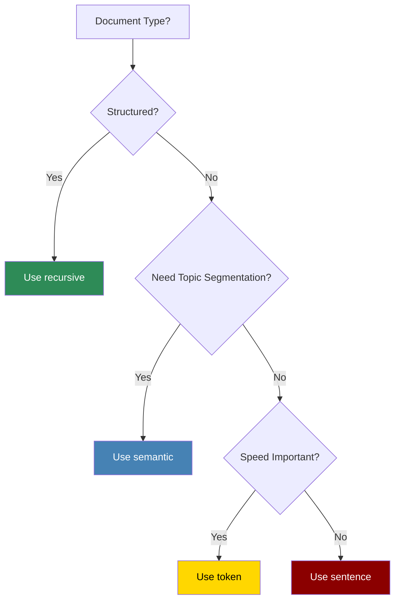

PraisonAI integrates [chonkie](https://github.com/chonkie-inc/chonkie), a high-performance chunking library, to provide flexible document processing strategies.

## Quick Start

<CodeGroup>
```python Agent with Chunking
from praisonaiagents import Agent

# Agent with semantic chunking
agent = Agent(
    instructions="Answer questions from documents.",
    knowledge={
        "sources": ["research.pdf"],
        "chunker": {
            "type": "semantic",
            "chunk_size": 512
        }
    }
)

response = agent.start("What are the key findings?")
```

```python Direct Chunking API
from praisonaiagents.knowledge.chunking import Chunking

# Create a chunker
chunker = Chunking(
    chunker_type="recursive",
    chunk_size=512,
    chunk_overlap=128
)

# Chunk some text
chunks = chunker.chunk("Your long document text here...")
for chunk in chunks:
    print(chunk.text)
```
</CodeGroup>

## Available Strategies

| Strategy | Alias | Best For | Speed |
|----------|-------|----------|-------|
| [Token](/features/rag/strategies/token) | `token` | Fixed-size chunks | ⚡ Fast |
| [Sentence](/features/rag/strategies/sentence) | `sentence` | Natural boundaries | ⚡ Fast |
| [Recursive](/features/rag/strategies/recursive) | `recursive` | Structured documents | ⚡ Fast |
| [Semantic](/features/rag/strategies/semantic) | `semantic` | Topic segmentation | 🔄 Medium |
| [SDPM](/features/rag/strategies/sdpm) | `sdpm` | Research papers | 🔄 Medium |
| [Late](/features/rag/strategies/late) | `late` | Better embeddings | 🔄 Medium |

## Choosing a Strategy



## Agent Configuration

### Simplest (Default Strategy)

```python
from praisonaiagents import Agent

# Uses token chunking by default
agent = Agent(
    instructions="Answer from documents.",
    knowledge=["docs/"]  # Default chunking
)
```

### With Chunking Config

```python
from praisonaiagents import Agent

agent = Agent(
    instructions="Answer from documents.",
    knowledge={
        "sources": ["research.pdf", "data/"],
        "chunker": {
            "type": "semantic",       # Strategy type
            "chunk_size": 512,        # Tokens per chunk
            "chunk_overlap": 128,     # Overlap between chunks
            "embedding_model": "all-MiniLM-L6-v2"  # For semantic/sdpm/late
        }
    }
)
```

### All Chunker Options

| Option | Type | Default | Description |
|--------|------|---------|-------------|
| `type` | str | `"token"` | Chunker type: token, sentence, recursive, semantic, sdpm, late |
| `chunk_size` | int | 512 | Target tokens per chunk |
| `chunk_overlap` | int | 128 | Overlap between chunks |
| `tokenizer_or_token_counter` | str | `"gpt2"` | Tokenizer for counting |
| `embedding_model` | str | auto | Embedding model (semantic/sdpm/late only) |

## Strategy Details

<CardGroup cols={2}>
  <Card title="Token Chunking" icon="hashtag" href="/features/rag/strategies/token">
    Fixed-size token chunks. Fast and predictable.
  </Card>
  <Card title="Sentence Chunking" icon="paragraph" href="/features/rag/strategies/sentence">
    Split at sentence boundaries. Natural flow.
  </Card>
  <Card title="Recursive Chunking" icon="sitemap" href="/features/rag/strategies/recursive">
    Hierarchical splitting. Great for markdown.
  </Card>
  <Card title="Semantic Chunking" icon="brain" href="/features/rag/strategies/semantic">
    Similarity-based splits. Topic coherence.
  </Card>
</CardGroup>

## Installation

Chunking requires the knowledge extra:

```bash
pip install "praisonaiagents[knowledge]"
```

This installs the `chonkie` library automatically.
