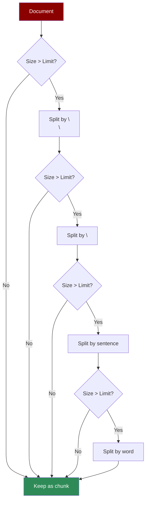

Splits text hierarchically using multiple separators (paragraphs → sentences → words). Ideal for structured documents like markdown.

## Quick Start

<CodeGroup>
```python Agent with Recursive Chunking
from praisonaiagents import Agent

agent = Agent(
    instructions="Answer questions from documentation.",
    knowledge={
        "sources": ["docs/"],
        "chunker": {
            "type": "recursive",
            "chunk_size": 512
        }
    }
)

response = agent.start("How do I configure the settings?")
```

```python Direct API
from praisonaiagents.knowledge.chunking import Chunking

chunker = Chunking(
    chunker_type="recursive",
    chunk_size=512
)

markdown_doc = """
# Introduction
This is the intro paragraph.

## Section 1
Content for section 1.

## Section 2  
Content for section 2.
"""

chunks = chunker.chunk(markdown_doc)
for chunk in chunks:
    print(chunk.text)
```
</CodeGroup>

## When to Use

<CardGroup cols={2}>
  <Card title="Good For" icon="check">
    - Markdown documentation
    - Technical manuals
    - Structured content
    - Code with comments
  </Card>
  <Card title="Consider Alternatives" icon="xmark">
    - Unstructured prose
    - Stream of consciousness
    - Very short documents
    - Topic-based splitting needed
  </Card>
</CardGroup>

## Parameters

| Parameter | Type | Default | Description |
|-----------|------|---------|-------------|
| `chunk_size` | int | 512 | Max tokens per chunk |
| `tokenizer_or_token_counter` | str | `"gpt2"` | Tokenizer for counting |

## Examples

### Documentation

```python
agent = Agent(
    instructions="Help users find answers in docs.",
    knowledge={
        "sources": ["README.md", "docs/"],
        "chunker": {
            "type": "recursive",
            "chunk_size": 512
        }
    }
)
```

### Large Codebase

```python
agent = Agent(
    instructions="Explain code and architecture.",
    knowledge={
        "sources": ["src/"],
        "chunker": {
            "type": "recursive",
            "chunk_size": 1024
        }
    }
)
```

## How It Works



The recursive approach tries larger separators first (paragraphs), then falls back to smaller ones (sentences, words) only when needed.

## Best Practices

1. **Match chunk size to content density** - Dense technical docs need smaller chunks
2. **Use with markdown** - Recursive chunking respects markdown structure well
3. **Combine with semantic search** - The hierarchical splits provide logical boundaries for retrieval
