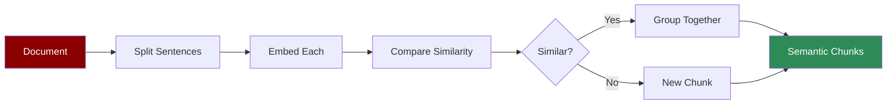

Uses embeddings to split text at semantic boundaries. Groups related content together for better retrieval.

## Quick Start

<CodeGroup>
```python Agent with Semantic Chunking
from praisonaiagents import Agent

agent = Agent(
    instructions="Answer questions from research papers.",
    knowledge={
        "sources": ["papers/"],
        "chunker": {
            "type": "semantic",
            "chunk_size": 512,
            "embedding_model": "all-MiniLM-L6-v2"
        }
    }
)

response = agent.start("What methodology did they use?")
```

```python Direct API
from praisonaiagents.knowledge.chunking import Chunking

chunker = Chunking(
    chunker_type="semantic",
    chunk_size=512,
    embedding_model="all-MiniLM-L6-v2"
)

chunks = chunker.chunk("Your research paper content here...")
for chunk in chunks:
    print(chunk.text)
```
</CodeGroup>

## When to Use

<CardGroup cols={2}>
  <Card title="Good For" icon="check">
    - Research papers
    - Topic-dense content
    - Multi-subject documents
    - Quality over speed
  </Card>
  <Card title="Consider Alternatives" icon="xmark">
    - Speed-critical pipelines
    - Uniform chunk sizes needed
    - Simple structured content
    - Very short documents
  </Card>
</CardGroup>

## Parameters

| Parameter | Type | Default | Description |
|-----------|------|---------|-------------|
| `chunk_size` | int | 512 | Max tokens per chunk |
| `embedding_model` | str | auto | Model for semantic similarity |

## Examples

### Research Analysis

```python
agent = Agent(
    instructions="Analyze academic papers.",
    knowledge={
        "sources": ["research/"],
        "chunker": {
            "type": "semantic",
            "chunk_size": 512,
            "embedding_model": "all-MiniLM-L6-v2"
        }
    }
)
```

### Knowledge Base

```python
agent = Agent(
    instructions="Answer from knowledge base.",
    knowledge={
        "sources": ["wiki/", "faq.txt"],
        "chunker": {
            "type": "semantic",
            "chunk_size": 256  # Smaller for precise retrieval
        }
    }
)
```

## How It Works



Semantic chunking:
1. Splits document into sentences
2. Generates embeddings for each sentence
3. Groups consecutive similar sentences
4. Creates new chunk when topic changes

## Performance Note

<Note>
Semantic chunking requires computing embeddings and is slower than token/sentence chunking. Use for quality-sensitive applications where retrieval accuracy matters more than speed.
</Note>

## Embedding Models

The default embedding model is `all-MiniLM-L6-v2`. You can use any model supported by the chonkie library:

```python
knowledge={
    "sources": ["docs/"],
    "chunker": {
        "type": "semantic",
        "embedding_model": "all-MiniLM-L6-v2"  # Default
        # Or: "text-embedding-3-small", etc.
    }
}
```
