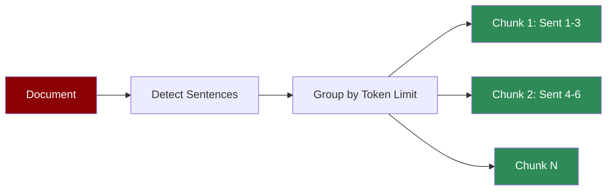

Splits text at sentence boundaries while respecting token limits. Preserves natural reading flow.

## Quick Start

<CodeGroup>
```python Agent with Sentence Chunking
from praisonaiagents import Agent

agent = Agent(
    instructions="Answer questions from documents.",
    knowledge={
        "sources": ["article.pdf"],
        "chunker": {
            "type": "sentence",
            "chunk_size": 512,
            "chunk_overlap": 64
        }
    }
)

response = agent.start("What are the main arguments?")
```

```python Direct API
from praisonaiagents.knowledge.chunking import Chunking

chunker = Chunking(
    chunker_type="sentence",
    chunk_size=512,
    chunk_overlap=64
)

chunks = chunker.chunk("Your document text here. With multiple sentences.")
for chunk in chunks:
    print(chunk.text)
```
</CodeGroup>

## When to Use

<CardGroup cols={2}>
  <Card title="Good For" icon="check">
    - Articles and blog posts
    - Natural language content
    - Readability matters
    - Question-answering tasks
  </Card>
  <Card title="Consider Alternatives" icon="xmark">
    - Code or technical docs
    - Very long sentences
    - Structured data
    - Markdown with headers
  </Card>
</CardGroup>

## Parameters

| Parameter | Type | Default | Description |
|-----------|------|---------|-------------|
| `chunk_size` | int | 512 | Max tokens per chunk |
| `chunk_overlap` | int | 128 | Token overlap between chunks |
| `tokenizer_or_token_counter` | str | `"gpt2"` | Tokenizer for counting |

## Examples

### News Articles

```python
agent = Agent(
    instructions="Summarize news articles.",
    knowledge={
        "sources": ["news/"],
        "chunker": {
            "type": "sentence",
            "chunk_size": 256  # Short chunks for news
        }
    }
)
```

### Long-form Content

```python
agent = Agent(
    instructions="Analyze essays and papers.",
    knowledge={
        "sources": ["essays/"],
        "chunker": {
            "type": "sentence",
            "chunk_size": 1024,
            "chunk_overlap": 128
        }
    }
)
```

## How It Works



Sentences are grouped together until the token limit is reached, then a new chunk starts.
