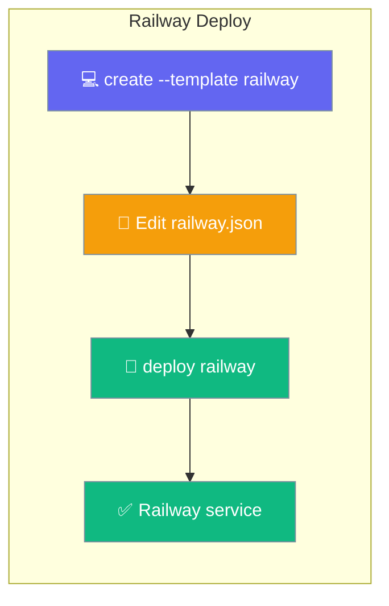
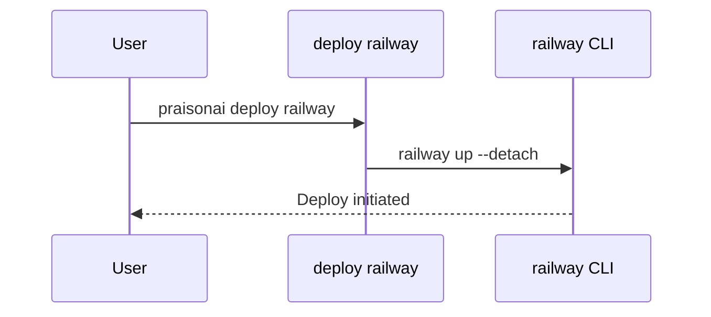

Deploy your agents to Railway with a starter `railway.json` and a single deploy command.



<Warning>
Starter templates ship in the git checkout, **not** in the PyPI wheel (`MANIFEST.in` excludes `infra/`). Run `create` from a monorepo checkout, or set `PRAISONAI_STARTERS_ROOT` / `PRAISONAI_INFRA_ROOT`.
</Warning>

## Quick Start

<Steps>
<Step title="Scaffold the project">
The starter drops `railway.json` and `agents.yaml` into the current directory.

```bash
praisonai deploy create --template railway
```
</Step>

<Step title="Authenticate with Railway">
Log in with the Railway CLI.

```bash
railway login
```
</Step>

<Step title="Deploy">
Push the service to Railway.

```bash
praisonai deploy railway
```
</Step>
</Steps>

---

## How It Works

The command shells out to `railway up --detach`.



---

## Command Options

| Argument | Default | Description |
|----------|---------|-------------|
| `FILE` (positional) | `agents.yaml` | Agent file to deploy. |

---

## Starter `railway.json`

The `railway` starter deploys the prebuilt image (no Dockerfile needed).

| Setting | Value |
|---------|-------|
| `healthcheckPath` | `/health` |
| `healthcheckTimeout` | `300` |
| `restartPolicyType` | `ON_FAILURE` |

<Note>
Set the service's source image to `ghcr.io/mervinpraison/praisonai` in Railway settings (pin a version tag for production). The image already exposes `/health` on port 8005.
</Note>

---

## Doctor

Check Railway readiness before deploying.

```bash
praisonai deploy doctor --provider railway
```

<Note>
`deploy doctor --provider railway` now checks the Railway CLI — previously this reported "Unknown provider".
</Note>

---

## Best Practices

<AccordionGroup>
<Accordion title="Pin the image tag for production">
Use a released `ghcr.io/mervinpraison/praisonai` tag instead of `latest` in the Railway service settings.
</Accordion>

<Accordion title="Store secrets as Railway variables">
Add `OPENAI_API_KEY` and other secrets as service variables in the Railway dashboard, not in Git.
</Accordion>

<Accordion title="Destroy from the dashboard">
`praisonai deploy destroy` is not automated for Railway — remove the service in the Railway dashboard or run `railway down` manually.
</Accordion>
</AccordionGroup>

---

## Related

<CardGroup cols={2}>
<Card title="Deploy Templates" icon="file-code" href="/docs/features/create-templates">
  Scaffold the railway starter.
</Card>
<Card title="Deploy to Render" icon="server" href="/docs/features/render">
  Another one-command PaaS target.
</Card>
</CardGroup>
