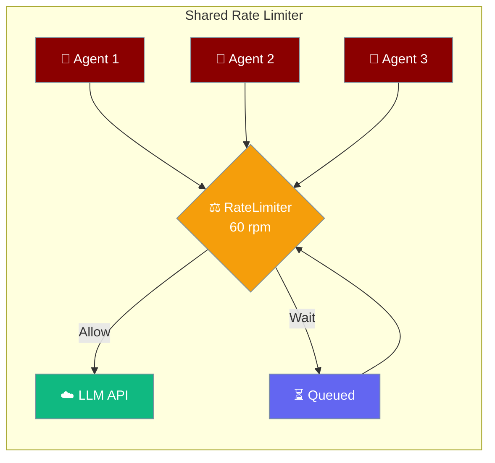
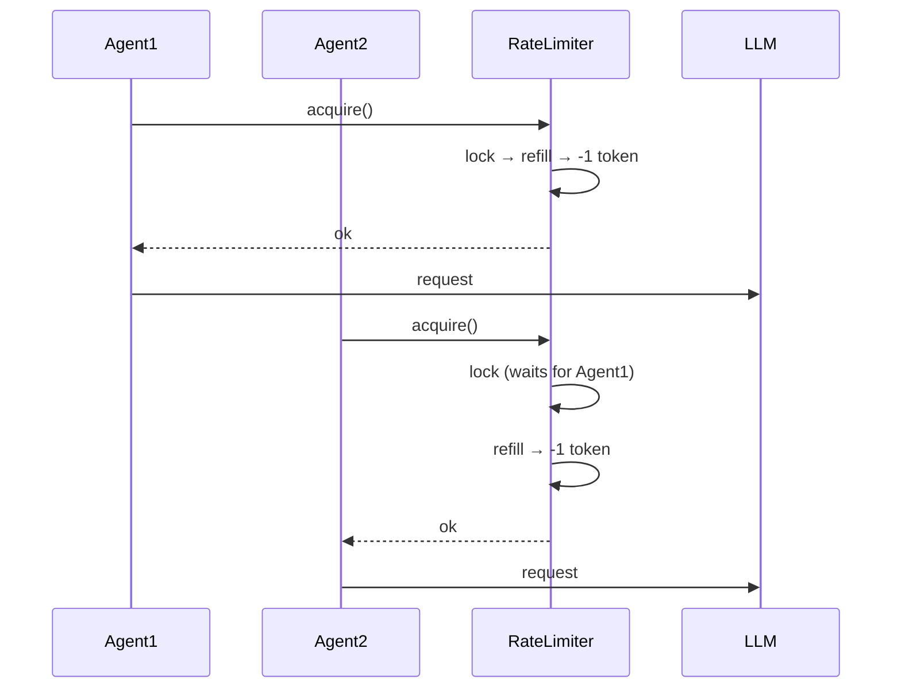
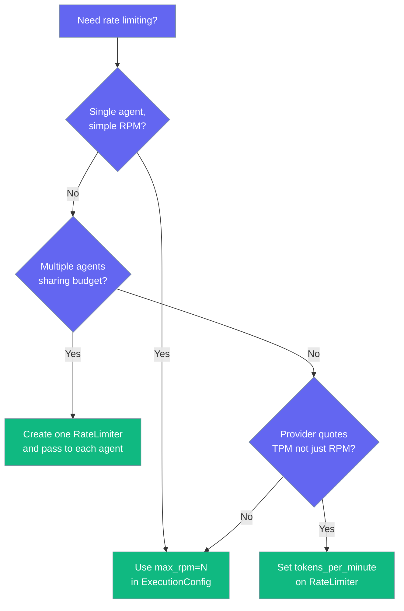

Rate Limiter caps how fast your agents call the LLM, so you stay inside provider rate limits and protect your budget — safely, even when many agents share the same limiter.



## Quick Start

<Steps>
<Step title="Simple RPM limit on one agent">
```python
from praisonaiagents import Agent
from praisonaiagents.config.feature_configs import ExecutionConfig

agent = Agent(
    name="Researcher",
    instructions="You research topics on the web.",
    execution=ExecutionConfig(max_rpm=60)
)

agent.start("Summarise the latest Mars rover news")
```
</Step>

<Step title="Share one limiter across multiple agents">
```python
from praisonaiagents import Agent, PraisonAIAgents
from praisonaiagents.config.feature_configs import ExecutionConfig
from praisonaiagents.llm import RateLimiter

shared = RateLimiter(requests_per_minute=60, burst=5)

researcher = Agent(
    name="Researcher",
    instructions="Research topics",
    execution=ExecutionConfig(rate_limiter=shared)
)
writer = Agent(
    name="Writer",
    instructions="Write articles",
    execution=ExecutionConfig(rate_limiter=shared)
)

team = PraisonAIAgents(agents=[researcher, writer])
team.start()
```

<Note>
The same `RateLimiter` instance can be shared across any number of agents and threads — the combined throughput stays inside the configured budget.
</Note>
</Step>

<Step title="Token-based limiting (for TPM-quoted providers)">
```python
from praisonaiagents import Agent
from praisonaiagents.config.feature_configs import ExecutionConfig
from praisonaiagents.llm import RateLimiter

limiter = RateLimiter(
    requests_per_minute=60,
    tokens_per_minute=90_000,
    burst=5,
)

agent = Agent(
    name="Analyst",
    instructions="Analyse long documents",
    execution=ExecutionConfig(rate_limiter=limiter)
)
```
</Step>
</Steps>

---

## How It Works



| Step | What happens |
|------|--------------|
| Refill | Tokens regenerate based on elapsed time and `requests_per_minute` / `tokens_per_minute`. |
| Acquire | A thread reserves a token; under contention, only one thread mutates state at a time. |
| Wait | If no tokens are available, the caller sleeps (sync) or awaits (async) until the next refill. |
| Release | No explicit release — tokens refill automatically on a rolling window. |

---

## Choose Your Mode



---

## Configuration Options

| Option | Type | Default | Description |
|--------|------|---------|-------------|
| `requests_per_minute` | `int` | Required | Max LLM requests per rolling 60-second window. |
| `tokens_per_minute` | `int` | `None` | Optional token-budget limit (for TPM-quoted providers). |
| `burst` | `int` | `1` | Max burst size — requests allowed back-to-back before the rate kicks in. |

---

## Thread Safety & Multi-Agent Use

<Note>
Every method on `RateLimiter` — both sync (`acquire`, `acquire_tokens`, `try_acquire`, `reset`) and async (`acquire_async`, `acquire_tokens_async`) — is safe to call concurrently. You can share a single `RateLimiter` across threads, `AgentTeam` members, `PraisonAIAgents`, and `ParallelToolCallExecutor` workers without exceeding the configured budget.
</Note>

### Thread pool with shared limiter

```python
from concurrent.futures import ThreadPoolExecutor
from praisonaiagents import Agent
from praisonaiagents.config.feature_configs import ExecutionConfig
from praisonaiagents.llm import RateLimiter

limiter = RateLimiter(requests_per_minute=60, burst=5)

def run_agent(question: str) -> str:
    agent = Agent(
        name="Worker",
        instructions="Answer concisely",
        execution=ExecutionConfig(rate_limiter=limiter),
    )
    return agent.start(question)

with ThreadPoolExecutor(max_workers=10) as pool:
    answers = list(pool.map(run_agent, [f"Q{i}" for i in range(50)]))
```

### Monitoring available budget

```python
limiter = RateLimiter(requests_per_minute=60, tokens_per_minute=90_000)

print(f"Requests left: {limiter.available_tokens:.1f}")
print(f"API tokens left: {limiter.available_api_tokens:.1f}")
```

<Note>
`available_tokens` and `available_api_tokens` are safe to read from any thread — they acquire the same locks as `acquire()` internally.
</Note>

---

## Manual Usage

When not using `ExecutionConfig`, you can acquire tokens directly:

```python
limiter = RateLimiter(requests_per_minute=60)

# Sync
limiter.acquire()  # Blocks if rate exceeded

# Async
await limiter.acquire_async()

# Non-blocking
if limiter.try_acquire():
    # Token acquired
    pass
```

---

## Best Practices

<AccordionGroup>
<Accordion title="Share one limiter across related agents">
If three agents hit the same provider key, give them the same `RateLimiter` so the combined throughput stays inside quota.
</Accordion>

<Accordion title="Match burst to your workload">
A low burst (1–5) smooths traffic; a high burst tolerates spiky demand.
</Accordion>

<Accordion title="Use tokens_per_minute when the provider charges by tokens">
OpenAI / Anthropic quote both RPM and TPM — limiting only on RPM can still trip 429s.
</Accordion>

<Accordion title="Prefer async paths in async flows">
`agent.achat(...)` automatically calls `acquire_async()`; avoid mixing sync and async limiters in one workflow.
</Accordion>
</AccordionGroup>

---

## CLI

```bash
praisonai "task" --rpm 60
```

---

## Related

<CardGroup cols={2}>
  <Card icon="lock" href="/docs/features/thread-safety">
    Thread-safe chat history and caches
  </Card>
  <Card icon="gauge" href="/docs/features/concurrency">
    Limit parallel agent runs
  </Card>
</CardGroup>