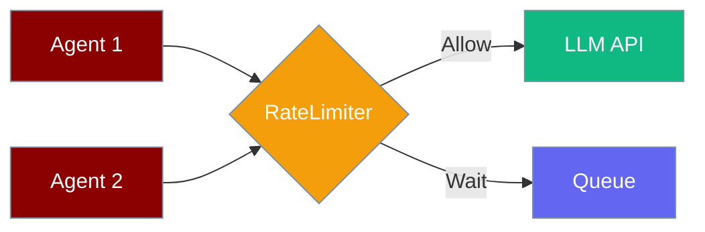

Cap LLM call rate so agents stay within provider quotas and budget — safely, even when many agents share one limiter.

```python
from praisonaiagents import Agent, ExecutionConfig

agent = Agent(
    name="Researcher",
    instructions="Research topics concisely.",
    execution=ExecutionConfig(max_rpm=60),
)

agent.start("Summarise the latest Mars rover news")
```

<Note>
For **bot/messaging rate limiting** (Telegram, Discord, Slack), see [Bot Rate Limiting](/docs/features/bot-rate-limiting). This page covers **LLM API** rate limiting.
</Note>



## Quick Start

<Steps>
<Step title="Simple Usage">

Set `max_rpm` on execution config for a single agent:

```python
from praisonaiagents import Agent, ExecutionConfig

agent = Agent(
    name="Researcher",
    instructions="You research topics on the web.",
    execution=ExecutionConfig(max_rpm=60),
)

agent.start("Summarise the latest Mars rover news")
```

</Step>

<Step title="With Configuration">

Share one `RateLimiter` across multiple agents:

```python
from praisonaiagents import Agent, AgentTeam, ExecutionConfig
from praisonaiagents.llm import RateLimiter

shared = RateLimiter(requests_per_minute=60, burst=5)

researcher = Agent(
    name="Researcher",
    instructions="Research topics",
    execution=ExecutionConfig(rate_limiter=shared),
)
writer = Agent(
    name="Writer",
    instructions="Write articles",
    execution=ExecutionConfig(rate_limiter=shared),
)

AgentTeam(agents=[researcher, writer]).start()
```

</Step>
</Steps>

---

## How It Works

Token bucket algorithm: tokens refill at `requests_per_minute / 60` per second; each LLM call consumes one token. Under contention, callers wait until a token is available.

The limiter applies to both the initial LLM call and the follow-up after tool execution in streaming mode.

| Step | What happens |
|------|--------------|
| Refill | Tokens regenerate on elapsed time |
| Acquire | Caller reserves a token (thread-safe) |
| Wait | Sleeps or awaits when bucket is empty |
| Release | Automatic — rolling window, no explicit release |

---

## Configuration Options

| Option | Type | Default | Description |
|--------|------|---------|-------------|
| `max_rpm` | `int` | `None` | Shorthand on `ExecutionConfig` |
| `requests_per_minute` | `int` | `None` | Max requests per rolling 60s window |
| `tokens_per_minute` | `int` | `None` | Token budget for TPM-quoted providers |
| `burst` | `int` | `1` | Back-to-back requests before rate kicks in |
| `max_retry_delay` | `int` | `120` | Max wait seconds when rate limited |

---

## Penalised Lanes

After a 429 from a messaging platform, `RateLimiter.penalise(channel_id, seconds)` widens the wait window for that channel — and the global window — so the next sends don't immediately re-trip the limit.

```python
from praisonaiagents import Agent
from praisonai.bots._rate_limit import RateLimiter

# Shared limiter for a Telegram bot
limiter = RateLimiter.for_platform("telegram")

agent = Agent(
    name="TelegramBot",
    instructions="Reply helpfully",
)

# When a 429 arrives, the delivery layer calls:
# limiter.penalise(channel_id="telegram-chat-123", seconds=30)
# — the channel's per_channel_delay grows for 30 s,
#   and the global bucket also absorbs the penalty.
```

`penalise` is called automatically by `_delivery.deliver_with_retry` via its optional `rate_limiter=` argument when a server-mandated `Retry-After` hint is detected. You can also call it manually if you observe 429s through other means.

| What penalise does | Effect |
|---|---|
| Widens per-channel wait window by `seconds` | That channel's sends space out |
| Adds a global bucket penalty | Other channels slow slightly too |
| Resets automatically after the penalty duration | Normal rate resumes without intervention |

---

## Best Practices

<AccordionGroup>
<Accordion title="Share one limiter across related agents">
When multiple agents use the same API key, pass the same `RateLimiter` so combined throughput stays in quota.
</Accordion>
<Accordion title="Match burst to your workload">
Low burst (1–5) smooths traffic; higher burst tolerates spiky demand.
</Accordion>
<Accordion title="Set tokens_per_minute for TPM limits">
Providers quote RPM and TPM — limiting only RPM can still trigger 429 errors.
</Accordion>
<Accordion title="Use async paths in async flows">
`agent.achat()` calls `acquire_async()` automatically; avoid mixing sync and async limiters.
</Accordion>
</AccordionGroup>

---

## CLI

```bash
praisonai "task" --rpm 60
```

---

## Related

<CardGroup cols={2}>
<Card title="Thread Safety" icon="lock" href="/docs/features/thread-safety">
  Thread-safe chat history and caches
</Card>
<Card title="Concurrency" icon="gauge" href="/docs/features/concurrency">
  Limit parallel agent runs
</Card>
</CardGroup>
