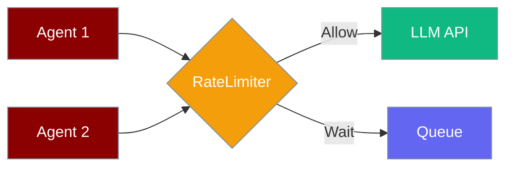
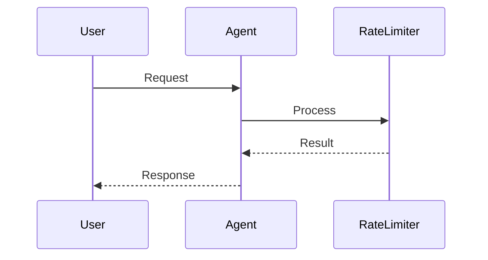
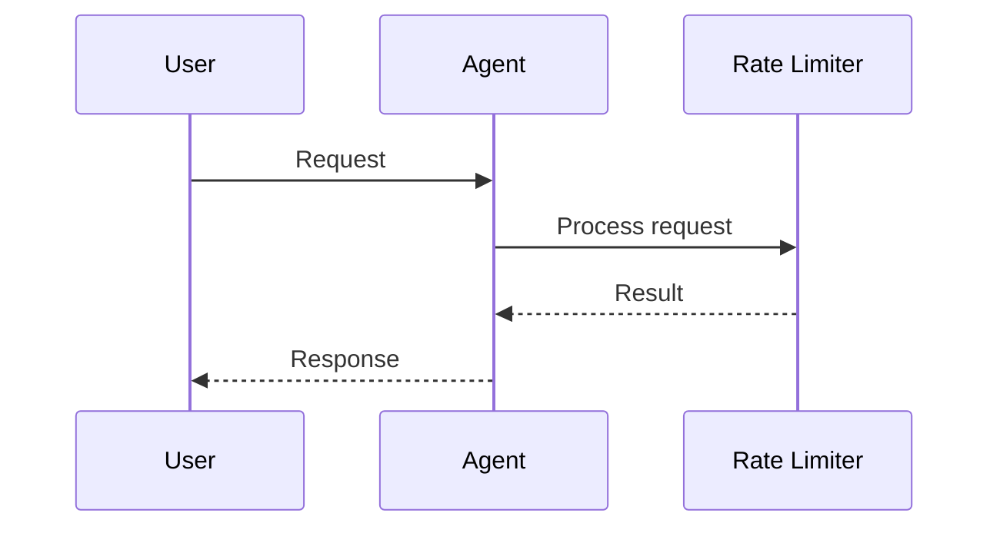
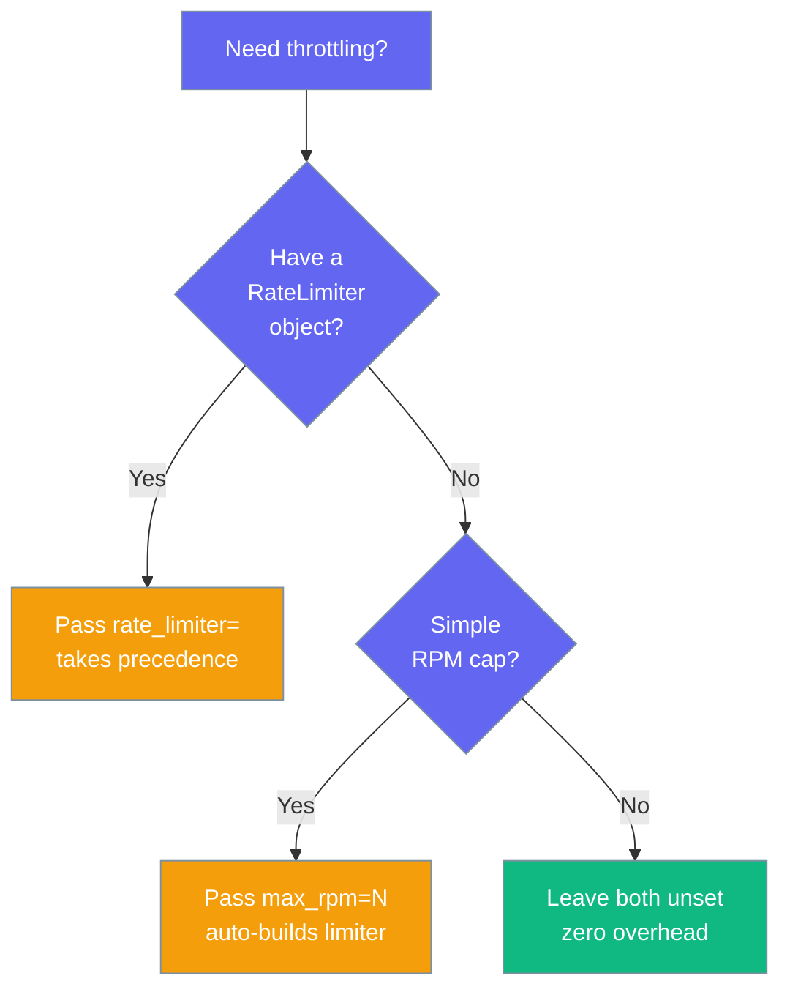

Cap LLM call rate so agents stay within provider quotas and budget — safely, even when many agents share one limiter.

```python
from praisonaiagents import Agent, ExecutionConfig

agent = Agent(
    name="Researcher",
    instructions="Research topics concisely.",
    execution=ExecutionConfig(max_rpm=60),
)

agent.start("Summarise the latest Mars rover news")
```

The user runs agents at scale; the limiter queues or throttles LLM calls so quotas are not exceeded.


<Note>
For **bot/messaging rate limiting** (Telegram, Discord, Slack), see [Bot Rate Limiting](/features/bot-rate-limiting). This page covers **LLM API** rate limiting.
</Note>


```mermaid
graph LR
    A1[Agent 1] --> L{RateLimiter}
    A2[Agent 2] --> L
    L -->|Allow| API[LLM API]
    L -->|Wait| Q[Queue]

    classDef agent fill:#8B0000,stroke:#7C90A0,color:#fff
    classDef limiter fill:#F59E0B,stroke:#7C90A0,color:#fff
    classDef api fill:#10B981,stroke:#7C90A0,color:#fff
    classDef queue fill:#6366F1,stroke:#7C90A0,color:#fff

    class A1,A2 agent
    class L limiter
    class API api
    class Q queue
```

## How It Works


```mermaid
sequenceDiagram
    participant User
    participant Agent
    participant RateLimiter

    User->>Agent: Request
    Agent->>RateLimiter: Process
    RateLimiter-->>Agent: Result
    Agent-->>User: Response
```


## Quick Start

<Steps>
<Step title="Simple Usage">

Set `max_rpm` on execution config for a single agent:

```python
from praisonaiagents import Agent, ExecutionConfig

agent = Agent(
    name="Researcher",
    instructions="You research topics on the web.",
    execution=ExecutionConfig(max_rpm=60),
)

agent.start("Summarise the latest Mars rover news")
```

`max_rpm=60` alone is enough — the Agent auto-creates a live `RateLimiter(requests_per_minute=60)` behind the scenes. No `RateLimiter` import required for the simple case.

</Step>

<Step title="With Configuration">

Share one `RateLimiter` across multiple agents:

```python
from praisonaiagents import Agent, AgentTeam, ExecutionConfig
from praisonaiagents.llm import RateLimiter

shared = RateLimiter(requests_per_minute=60, burst=5)

researcher = Agent(
    name="Researcher",
    instructions="Research topics",
    execution=ExecutionConfig(rate_limiter=shared),
)
writer = Agent(
    name="Writer",
    instructions="Write articles",
    execution=ExecutionConfig(rate_limiter=shared),
)

AgentTeam(agents=[researcher, writer]).start()
```

</Step>
</Steps>

---

## How It Works


```mermaid
sequenceDiagram
    participant User
    participant Agent
    participant Feature as Rate Limiter

    User->>Agent: Request
    Agent->>Feature: Process request
    Feature-->>Agent: Result
    Agent-->>User: Response
```


Token bucket algorithm: tokens refill at `requests_per_minute / 60` per second; each LLM call consumes one token. Under contention, callers wait until a token is available.

The limiter applies to both the initial LLM call and the follow-up after tool execution in streaming mode.

The rate limiter applies to every LLM call the agent issues — single-shot, streaming, tool-iteration and reflection turns, sync and async — so a per-model token budget is never spent on a path that bypasses throttling.

<Note>
Since PraisonAI PR [#3877](https://github.com/MervinPraison/PraisonAI/pull/3877), `achat()` / `astart()` / `arun()` and managed-backend delegation all `await rate_limiter.acquire_async()` before hitting the LLM. Earlier releases could burst past `max_rpm` on async entry points.
</Note>

| Step | What happens |
|------|--------------|
| Refill | Tokens regenerate on elapsed time |
| Acquire | Caller reserves a token (thread-safe) |
| Wait | Sleeps or awaits when bucket is empty |
| Release | Automatic — rolling window, no explicit release |

---

## Precedence

The Agent picks a limiter from three levels: an explicit `rate_limiter` wins, else `max_rpm` auto-builds one, else no throttling.

`rate_limiter` (explicit) > `max_rpm` (auto-built) > no limiter

`max_rpm <= 0` short-circuits and raises `ValueError` at construction — regardless of whether an explicit `rate_limiter` was also supplied, because validation runs before the precedence check.

| `max_rpm` | `rate_limiter` | Result |
|-----------|----------------|--------|
| `None` | `None` | No limiter — zero overhead |
| `N > 0` | `None` | Agent auto-builds `RateLimiter(requests_per_minute=N)` |
| `None` | object | Explicit limiter used as-is |
| `N > 0` | object | Explicit limiter wins; `max_rpm` still recorded on the Agent |
| `N <= 0` | any (including object) | `ValueError` at construction |


```mermaid
graph TB
    Start["Need throttling?"] --> HasLim{"Have a<br/>RateLimiter<br/>object?"}
    HasLim -->|Yes| UseLim["Pass rate_limiter=<br/>takes precedence"]
    HasLim -->|No| NeedRPM{"Simple<br/>RPM cap?"}
    NeedRPM -->|Yes| UseRPM["Pass max_rpm=N<br/>auto-builds limiter"]
    NeedRPM -->|No| Skip["Leave both unset<br/>zero overhead"]

    classDef q fill:#6366F1,stroke:#7C90A0,color:#fff
    classDef opt fill:#F59E0B,stroke:#7C90A0,color:#fff
    classDef ok fill:#10B981,stroke:#7C90A0,color:#fff
    class Start,HasLim,NeedRPM q
    class UseLim,UseRPM opt
    class Skip ok
```

---

## Configuration Options

| Option | Type | Default | Description |
|--------|------|---------|-------------|
| `max_rpm` | `int` | `None` | Positive int auto-builds `RateLimiter(requests_per_minute=max_rpm)` when no `rate_limiter` is passed; explicit `rate_limiter` takes precedence; `max_rpm <= 0` raises `ValueError` (validated before the precedence check, so `max_rpm=0` still raises even with a `rate_limiter`) |
| `requests_per_minute` | `int` | `None` | Max requests per rolling 60s window |
| `tokens_per_minute` | `int` | `None` | Token budget for TPM-quoted providers |
| `burst` | `int` | `1` | Back-to-back requests before rate kicks in |
| `max_retry_delay` | `int` | `120` | Max wait seconds when rate limited |

<Note>
Setting `max_rpm=N` on `ExecutionConfig` now auto-creates a live `RateLimiter` — passing a full `rate_limiter` object is only needed for `burst` or `tokens_per_minute` control.
</Note>

---

## Errors

Zero or negative `max_rpm` raises `ValueError` at construction, before the explicit-limiter precedence check.

```python
from praisonaiagents import Agent, ExecutionConfig
from praisonaiagents.llm import RateLimiter

# All three raise ValueError at construction:
Agent(name="a", instructions="x", execution=ExecutionConfig(max_rpm=0))
Agent(name="a", instructions="x", execution=ExecutionConfig(max_rpm=-5))
Agent(name="a", instructions="x",
      execution=ExecutionConfig(max_rpm=0, rate_limiter=RateLimiter(requests_per_minute=60)))
```

<Warning>
`max_rpm=0` raises even when a valid `rate_limiter` is also provided — validation runs before precedence.
</Warning>

---

## YAML

`max_rpm` in `agents.yaml` now throttles requests — it auto-creates a live `RateLimiter` when no limiter is set on the agent, and raises `ValueError` on `max_rpm <= 0`.

```yaml
agents:
  assistant:
    name: Assistant
    instructions: Be brief.
    llm: gpt-4o-mini
    max_rpm: 20      # now throttles at 20 rpm
```

---

## Best Practices

<AccordionGroup>
<Accordion title="Share one limiter across related agents">
When multiple agents use the same API key, pass the same `RateLimiter` so combined throughput stays in quota.
</Accordion>
<Accordion title="Match burst to your workload">
Low burst (1–5) smooths traffic; higher burst tolerates spiky demand.
</Accordion>
<Accordion title="Set tokens_per_minute for TPM limits">
Providers quote RPM and TPM — limiting only RPM can still trigger 429 errors.
</Accordion>
<Accordion title="Use async paths in async flows">
`agent.achat()` / `astart()` / `arun()` call `acquire_async()` automatically — sync and async entry points are throttled equally, so pick whichever fits your event loop.
</Accordion>
</AccordionGroup>

---

## CLI

```bash
praisonai "task" --rpm 60
```

---

## Related

<CardGroup cols={2}>
<Card title="Thread Safety" icon="lock" href="/features/thread-safety">
  Thread-safe chat history and caches
</Card>
<Card title="Concurrency" icon="gauge" href="/features/concurrency">
  Limit parallel agent runs
</Card>
</CardGroup>
