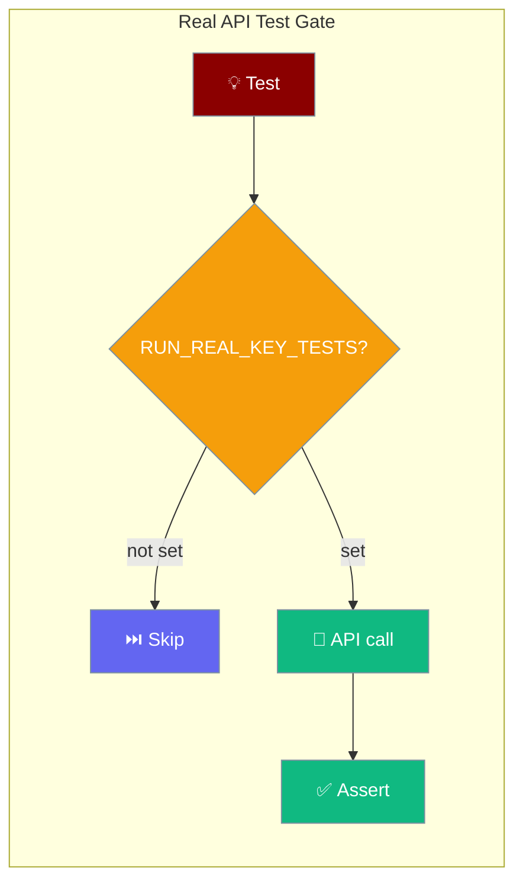
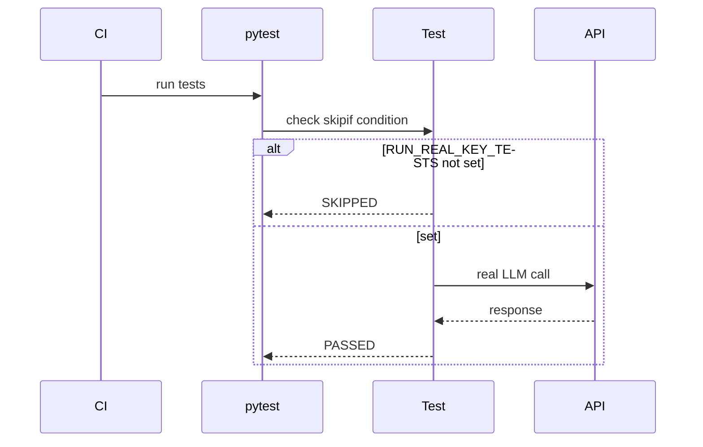

PraisonAI Agents includes a gated test harness for running integration tests with real API keys. Tests are skipped by default and only run when explicitly enabled.

## Quick Start

<Steps>
<Step title="Enable real API tests">
```bash
export RUN_REAL_KEY_TESTS=1
export OPENAI_API_KEY="your-key"

python -m pytest tests/integration/test_real_api.py -v
```
</Step>

<Step title="Write a gated test">
```python
import os
import pytest

SKIP_REAL_TESTS = pytest.mark.skipif(
    not os.environ.get("RUN_REAL_KEY_TESTS"),
    reason="Real API tests disabled"
)

@SKIP_REAL_TESTS
def test_agent_simple_chat():
    from praisonaiagents import Agent
    agent = Agent(name="TestAgent", instructions="Reply briefly.",
                  llm="gpt-4o-mini", output="silent")
    response = agent.chat("Say hello")
    assert len(response) > 0
```
</Step>
</Steps>

---

## How It Works



## Test Categories

### Agent Tests

Basic agent functionality with real LLM calls:

```python
import os
import pytest

@pytest.mark.skipif(
    not os.environ.get("RUN_REAL_KEY_TESTS"),
    reason="Real API tests disabled"
)
def test_agent_simple_chat():
    from praisonaiagents import Agent
    
    agent = Agent(
        name="TestAgent",
        instructions="Reply briefly.",
        llm="gpt-4o-mini",
        output="silent"
    )
    
    response = agent.chat("Say hello")
    assert len(response) > 0
```

### Tool Tests

Agent with tool execution:

```python
@pytest.mark.skipif(
    not os.environ.get("RUN_REAL_KEY_TESTS"),
    reason="Real API tests disabled"
)
def test_agent_with_tool():
    from praisonaiagents import Agent
    
    def add(a: int, b: int) -> int:
        """Add two numbers."""
        return a + b
    
    agent = Agent(
        name="MathAgent",
        instructions="Use tools when asked.",
        llm="gpt-4o-mini",
        tools=[add],
        output="silent"
    )
    
    response = agent.chat("What is 5 + 3?")
    assert "8" in response
```

### LiteAgent Tests

Lite package with real API:

```python
@pytest.mark.skipif(
    not os.environ.get("RUN_REAL_KEY_TESTS") or
    not os.environ.get("OPENAI_API_KEY"),
    reason="Real API tests disabled or no API key"
)
def test_lite_agent_with_openai():
    from praisonaiagents.lite import LiteAgent, create_openai_llm_fn
    
    llm_fn = create_openai_llm_fn(model="gpt-4o-mini")
    agent = LiteAgent(
        name="LiteTest",
        llm_fn=llm_fn,
        instructions="Reply briefly."
    )
    
    response = agent.chat("Say hi")
    assert len(response) > 0
```

## Supported Providers

### OpenAI

```bash
export OPENAI_API_KEY="sk-..."
export RUN_REAL_KEY_TESTS=1
python -m pytest tests/integration/test_real_api.py::TestAgentRealAPI -v
```

### Anthropic

```bash
export ANTHROPIC_API_KEY="sk-ant-..."
export RUN_REAL_KEY_TESTS=1
python -m pytest tests/integration/test_real_api.py::TestAnthropicAPI -v
```

### Google (Gemini)

```bash
export GOOGLE_API_KEY="..."
export RUN_REAL_KEY_TESTS=1
python -m pytest tests/integration/test_real_api.py::TestGoogleAPI -v
```

## Writing Real API Tests

### Test Structure

```python
import os
import pytest

# Skip decorator
SKIP_REAL_TESTS = pytest.mark.skipif(
    not os.environ.get("RUN_REAL_KEY_TESTS"),
    reason="Real API tests disabled"
)

class TestMyFeature:
    @SKIP_REAL_TESTS
    def test_with_real_api(self):
        # Test implementation
        pass
```

### Best Practices

1. **Minimize tokens** - Use short prompts and low max_tokens
2. **Use fast models** - Prefer gpt-4o-mini over gpt-4
3. **Set timeouts** - Avoid hanging tests
4. **Clean up resources** - Close connections properly

```python
@SKIP_REAL_TESTS
def test_minimal_tokens():
    agent = Agent(
        name="Test",
        instructions="One word only.",
        llm="gpt-4o-mini",
        output="silent"
    )
    response = agent.chat("Say hi")
    # Minimal token usage
```

## CI/CD Integration

### GitHub Actions

```yaml
name: Real API Tests

on:
  workflow_dispatch:  # Manual trigger only

jobs:
  test:
    runs-on: ubuntu-latest
    steps:
      - uses: actions/checkout@v4
      - uses: actions/setup-python@v5
        with:
          python-version: '3.11'
      - run: pip install praisonaiagents pytest
      - name: Run Real API Tests
        env:
          RUN_REAL_KEY_TESTS: "1"
          OPENAI_API_KEY: ${{ secrets.OPENAI_API_KEY }}
        run: |
          python -m pytest tests/integration/test_real_api.py -v
```

### Local Testing

```bash
# Run all real API tests
RUN_REAL_KEY_TESTS=1 python -m pytest tests/integration/ -v

# Run specific provider
RUN_REAL_KEY_TESTS=1 python -m pytest tests/integration/test_real_api.py::TestAgentRealAPI -v
```

## Security

- **Never commit API keys** - Use environment variables
- **Use secrets in CI** - Store keys in GitHub Secrets
- **Rotate keys regularly** - Especially after exposure
- **Limit key permissions** - Use restricted API keys for testing

---

## Best Practices

<AccordionGroup>
<Accordion title="Minimize tokens in test calls">
Use short prompts, `output='silent'`, and fast models like `gpt-4o-mini` to keep test costs low.
</Accordion>

<Accordion title="Only trigger real tests manually in CI">
Use `workflow_dispatch` in GitHub Actions so real API tests never run automatically on every push.
</Accordion>

<Accordion title="Use SKIP_REAL_TESTS decorator consistently">
Define the skip marker once at module level and reuse it on every test that makes real API calls.

```python
SKIP_REAL_TESTS = pytest.mark.skipif(
    not os.environ.get("RUN_REAL_KEY_TESTS"),
    reason="Real API tests disabled"
)
```
</Accordion>

<Accordion title="Set timeouts to avoid hanging tests">
Add `timeout=30` or use pytest-timeout to prevent tests from hanging when a provider is slow.
</Accordion>
</AccordionGroup>

---

## Related

<CardGroup cols={2}>
<Card title="Performance Benchmarks" icon="gauge-high" href="/features/performance-benchmarks">
  Import time and memory benchmark scripts
</Card>
<Card title="Lazy Imports" icon="bolt" href="/features/lazy-imports">
  Fast startup for faster test collection
</Card>
</CardGroup>
