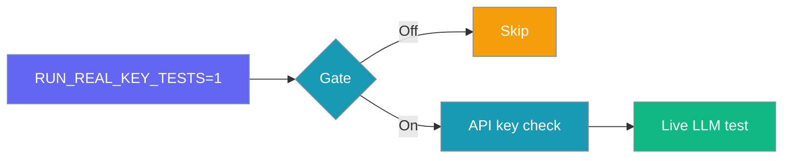
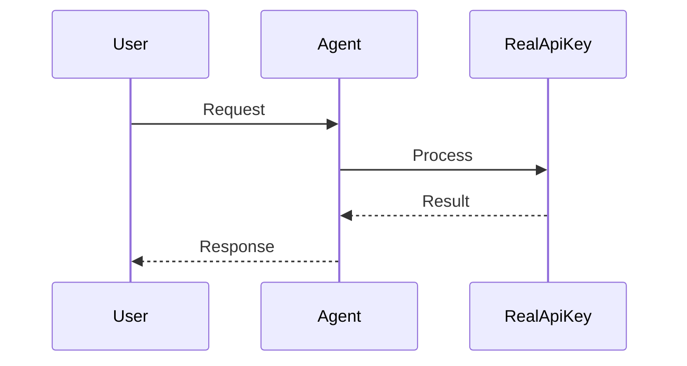
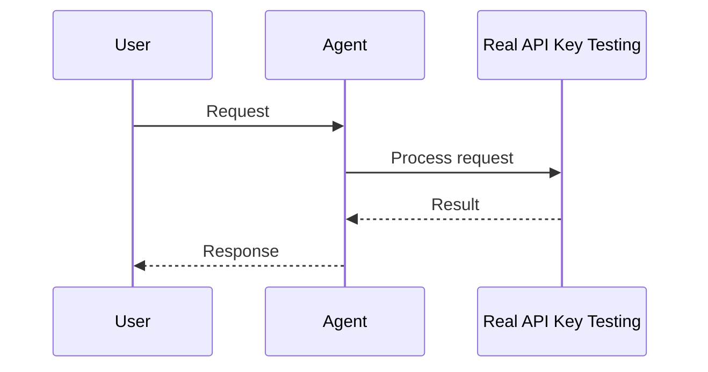

Run integration tests against live LLM providers — gated by `RUN_REAL_KEY_TESTS` so CI stays free and fast by default.

```python
import os
import pytest
from praisonaiagents import Agent

@pytest.mark.skipif(
    os.getenv("RUN_REAL_KEY_TESTS", "").lower() not in ("1", "true", "yes"),
    reason="Set RUN_REAL_KEY_TESTS=1 to enable",
)
def test_agent_simple_chat():
    agent = Agent(
        name="TestAgent",
        instructions="Reply briefly.",
        llm="gpt-4o-mini",
    )
    response = agent.start("Say hello in one word")
    assert len(response) > 0
```

The user sets `RUN_REAL_KEY_TESTS=1`; pytest runs a real agent chat against live provider keys.




## How It Works




## Quick Start

<Steps>
<Step title="Simple Usage">

Enable the gate and set your API key:

```bash
export RUN_REAL_KEY_TESTS=1
export OPENAI_API_KEY="$(printenv OPENAI_API_KEY)"

python -m pytest tests/integration/test_real_api.py -v
```

</Step>

<Step title="With Configuration">

Run a single test class for one provider:

```bash
export RUN_REAL_KEY_TESTS=1
export ANTHROPIC_API_KEY="$(printenv ANTHROPIC_API_KEY)"

python -m pytest tests/integration/test_real_api.py::TestAnthropicAPI -v
```

</Step>
</Steps>

---

## How It Works




All tests in `tests/integration/test_real_api.py` use a module-level skip when `RUN_REAL_KEY_TESTS` is unset. Accepted values: `1`, `true`, `yes` (case-insensitive).

| Variable | Required | Purpose |
|----------|----------|---------|
| `RUN_REAL_KEY_TESTS` | Yes | Enables live API tests |
| `OPENAI_API_KEY` | For OpenAI tests | Provider authentication |
| `ANTHROPIC_API_KEY` | For Claude tests | Optional provider |
| `GOOGLE_API_KEY` | For Gemini tests | Optional provider |

---

## Configuration Options

| Option | Type | Default | Description |
|--------|------|---------|-------------|
| `RUN_REAL_KEY_TESTS` | env | unset | Master gate — tests skipped when absent |
| `llm` | `str` | `"gpt-4o-mini"` | Use fast models to minimise cost |
| `output` | preset | `"silent"` | Suppress Rich output in tests |

---

## Best Practices

<AccordionGroup>
<Accordion title="Keep prompts short">
Use minimal prompts and prefer `gpt-4o-mini` — real tests consume tokens and cost money.
</Accordion>
<Accordion title="Never commit API keys">
Read keys from environment variables; store CI secrets in GitHub Secrets.
</Accordion>
<Accordion title="Gate CI with workflow_dispatch">
Trigger real API tests manually in GitHub Actions, not on every push.
</Accordion>
<Accordion title="Use the shared skip decorator">
Reuse `pytest.mark.skipif` on `RUN_REAL_KEY_TESTS` for consistent gating across modules.
</Accordion>
</AccordionGroup>

---

## CI Example

```yaml
name: Real API Tests
on:
  workflow_dispatch:
jobs:
  test:
    runs-on: ubuntu-latest
    steps:
      - uses: actions/checkout@v4
      - uses: actions/setup-python@v5
        with:
          python-version: "3.11"
      - run: pip install praisonaiagents pytest
      - name: Run real API tests
        env:
          RUN_REAL_KEY_TESTS: "1"
          OPENAI_API_KEY: ${{ secrets.OPENAI_API_KEY }}
        run: python -m pytest tests/integration/test_real_api.py -v
```

---

## Related

<CardGroup cols={2}>
<Card title="Real API Testing CLI" icon="terminal" href="/docs/cli/real-api-testing">
  CLI commands for live API tests
</Card>
<Card title="Performance Benchmarks" icon="chart-line" href="/docs/features/performance-benchmarks">
  Measure agent performance
</Card>
</CardGroup>
