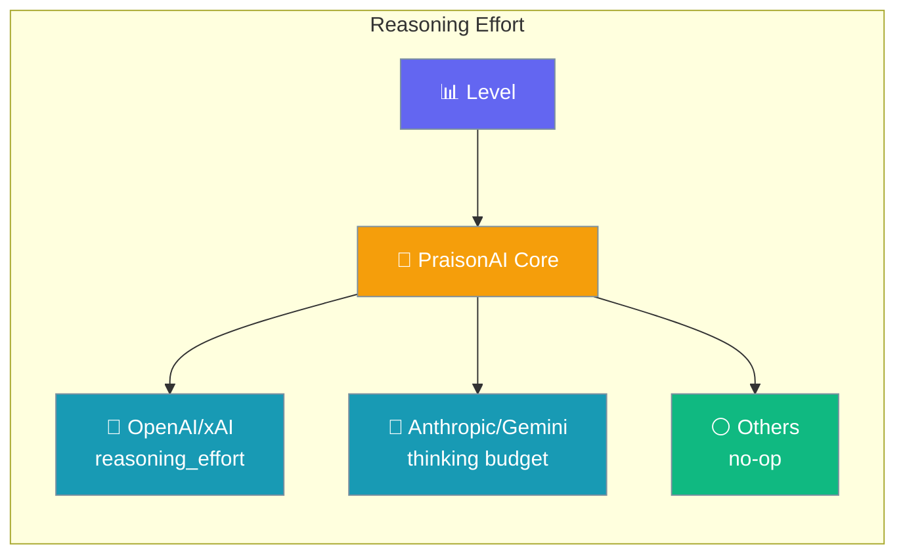
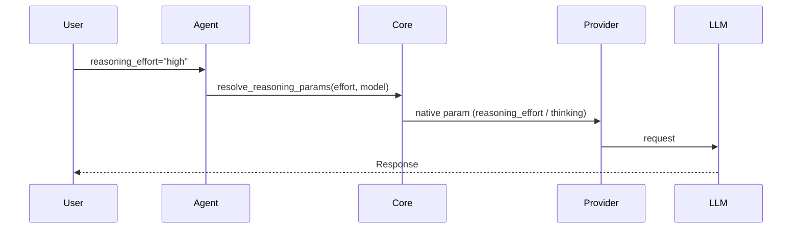
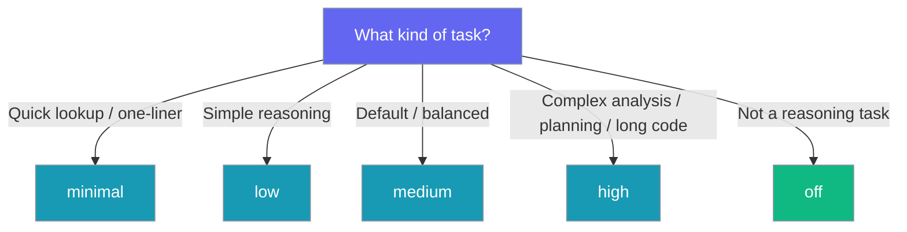

Set how hard the model thinks with one graded level; PraisonAI translates it to each provider's native reasoning control.

```python
from praisonaiagents import Agent

agent = Agent(
    instructions="Solve tricky problems step by step.",
    llm="openai/gpt-5",
    reasoning_effort="high",
)
agent.start("Design a load balancer for a spiky workload.")
```



## Quick Start

<Steps>
<Step title="Enable with a level">
Pass a graded level to the agent.

```python
from praisonaiagents import Agent

agent = Agent(
    instructions="Solve tricky problems step by step.",
    llm="openai/gpt-5",
    reasoning_effort="high",
)
agent.start("Design a load balancer for a spiky workload.")
```
</Step>

<Step title="Switch provider, same level">
The same level works on Anthropic and produces an extended-thinking budget under the hood.

```python
from praisonaiagents import Agent

agent = Agent(
    instructions="Solve tricky problems step by step.",
    llm="anthropic/claude-3-7-sonnet",
    reasoning_effort="high",
)
agent.start("Design a load balancer for a spiky workload.")
```
</Step>

<Step title="Turn it off">
`off` is a zero-overhead no-op.

```python
from praisonaiagents import Agent

agent = Agent(
    instructions="Answer directly.",
    llm="openai/gpt-5",
    reasoning_effort="off",
)
agent.start("What is the capital of France?")
```
</Step>

<Step title="Change it after construction">
The setter keeps a cached LLM in sync.

```python
from praisonaiagents import Agent

agent = Agent(instructions="Reason carefully.", llm="openai/gpt-5")
agent.reasoning_effort = "low"
agent.start("Summarise this in one line.")
```

The setter also updates an already-built LLM in place, so a change after the instance materialises still lands on the next request.

```python
from praisonaiagents import Agent

agent = Agent(instructions="Reason carefully.", llm="openai/gpt-5")

# Force the LLM to materialise (as `.start()` would).
_ = agent.llm_instance

# Change effort after materialisation — the very next request emits `high`.
agent.reasoning_effort = "high"
agent.start("Design a load balancer for a spiky workload.")
```

The CLI `--thinking <level>` flag uses this same setter path internally, so the flag takes effect even when it is applied after the LLM has been built.
</Step>
</Steps>

---

## How It Works



| Phase | What happens |
|---|---|
| 1. Set | You pass a graded level to the agent |
| 2. Resolve | Core maps the level to the model's native control |
| 3. Request | The provider receives its native reasoning parameter |

---

## Levels

Each level maps to a native parameter per provider family.

| Level | OpenAI/xAI request | Anthropic/Gemini request | Non-reasoning models |
|-------|--------------------|--------------------------|----------------------|
| `off` | — | — | — |
| `minimal` | `reasoning_effort="minimal"` | `thinking={"type":"enabled","budget_tokens":2000}` | ignored |
| `low` | `reasoning_effort="low"` | `budget_tokens=4000` | ignored |
| `medium` | `reasoning_effort="medium"` | `budget_tokens=8000` | ignored |
| `high` | `reasoning_effort="high"` | `budget_tokens=16000` | ignored |

---

## Provider Coverage

Which model families the level affects.

| Model family | Native control |
|---|---|
| OpenAI o-series (`o1`, `o3`, `o3-mini`) and GPT‑5 | `reasoning_effort` |
| xAI Grok reasoning models (`xai/grok-*`) | `reasoning_effort` |
| Anthropic Claude 3.7+ reasoning models | extended-thinking `thinking` budget |
| Gemini 2.5+ reasoning models | extended-thinking `thinking` budget |
| Everything else (e.g. `gpt-4o`, `gpt-4o-mini`) | silently ignored |

---

## Which Level Should I Pick?

Match the level to the task.



---

## Three Ways to Set It

The same level is available in Python, YAML, and the CLI.

<CodeGroup>
```python Python
from praisonaiagents import Agent

agent = Agent(instructions="Solve tricky problems.", llm="openai/gpt-5", reasoning_effort="high")
agent.start("Design a load balancer for a spiky workload.")
```

```yaml YAML
agent:
  reasoning_effort: high
```

```bash CLI
praisonai run --thinking high "Design a load balancer for a spiky workload."
```
</CodeGroup>

<Note>
`--thinking <level>` is applied to the agent after construction. It reaches the request pipeline even when the LLM instance has already been materialised — no rebuild required.
</Note>

---

## Session Persistence

The effort you were running is persisted on the session and restored on resume — you do not need to pass `--thinking` again.

```bash
praisonai run --thinking high "start work"
# later:
praisonai run --continue "keep going"     # still runs at high
```

<Note>
A per-invocation `--thinking <level>` on resume overrides the persisted value.
</Note>

---

## Backward Compatibility

`thinking_budget` remains a supported alias that folds into `reasoning_effort`.

```python
from praisonaiagents import Agent

# Graded string alias.
agent = Agent(instructions="x", llm="openai/gpt-5", thinking_budget="high")

# Legacy int budget — normalised to the nearest level (8000 -> medium).
agent = Agent(instructions="x", llm="openai/gpt-5", thinking_budget=8000)

# Post-construction int still routes through the effort setter.
agent.thinking_budget = 16000
```

The graded value is what gets persisted, so the effort stays provider-portable.

`agent.thinking_budget` reads back the last **integer** budget that was set (or `None`); the graded string level always lives on `agent.reasoning_effort`. Assigning a graded string (`agent.thinking_budget = "high"`) still routes through the effort setter, but `agent.thinking_budget` continues to report `None` in that case — read `agent.reasoning_effort` for the current level.

---

## Best Practices

<AccordionGroup>
<Accordion title="Match effort to task complexity">
Start at `medium` and raise to `high` for planning, analysis, or long code.
</Accordion>

<Accordion title="Use off on non-reasoning models">
`reasoning_effort="off"` is a no-op with no runtime cost.
</Accordion>

<Accordion title="Change effort mid-session">
Assign `agent.reasoning_effort` at any time; the setter updates a cached LLM in place.
</Accordion>

<Accordion title="Prefer the graded level over the legacy int">
Use a level (not a raw token budget) so the value stays provider-portable.
</Accordion>
</AccordionGroup>

---

## Related

<CardGroup cols={2}>
<Card title="Thinking Budgets" icon="brain" href="/features/thinking-budgets">
  Legacy alias and token-budget helper
</Card>
<Card title="Reflection" icon="rotate" href="/features/reflection">
  Self-review loops for higher-quality outputs
</Card>
</CardGroup>
