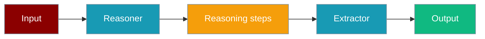

A reasoning agent breaks problems into steps; a follow-up agent extracts a concise answer from that chain.

```python
from praisonaiagents import Agent, Task, AgentTeam, OutputConfig

reasoner = Agent(
    name="Reasoner",
    instructions="Think step by step.",
    llm="deepseek/deepseek-reasoner",
    output=OutputConfig(reasoning_steps=True),
)

extractor = Agent(
    name="Extractor",
    instructions="Answer briefly using the prior reasoning.",
    llm="gpt-4o-mini",
)

team = AgentTeam(
    agents=[reasoner, extractor],
    tasks=[
        Task(description="How many r's in 'Strawberry'?", agent=reasoner),
        Task(description="From the reasoning, how many r's?", agent=extractor),
    ],
)

team.start()
```



## Quick Start

<Steps>
<Step title="Simple Usage">

Enable reasoning output on a reasoning-capable model:

```python
from praisonaiagents import Agent, OutputConfig

agent = Agent(
    name="Reasoner",
    instructions="Think step by step before answering.",
    llm="deepseek/deepseek-reasoner",
    output=OutputConfig(reasoning_steps=True),
)

agent.start("How many r's in 'Strawberry'?")
```

</Step>

<Step title="With Configuration">

Chain two agents — reasoner then extractor:

```python
from praisonaiagents import Agent, Task, AgentTeam, OutputConfig

reasoner = Agent(
    name="Reasoner",
    llm="deepseek/deepseek-reasoner",
    output=OutputConfig(reasoning_steps=True),
)
extractor = Agent(name="Extractor", llm="gpt-4o-mini")

AgentTeam(
    agents=[reasoner, extractor],
    tasks=[
        Task(description="Count r's in 'Strawberry'", agent=reasoner),
        Task(description="Give the final count only", agent=extractor),
    ],
).start()
```

</Step>
</Steps>

---

## How It Works

1. The reasoner runs with `output=OutputConfig(reasoning_steps=True)` — compatible models expose chain-of-thought content
2. Sequential tasks pass prior output as context to the next agent
3. The extractor distils the reasoning into a short, user-facing answer

Use a reasoning model (e.g. `deepseek-reasoner`, `o1-mini`) for the first agent and a fast model for extraction.

---

## Configuration Options

| Option | Type | Default | Description |
|--------|------|---------|-------------|
| `reasoning_steps` | `bool` | `False` | On `OutputConfig` — surface reasoning content |
| `llm` | `str` | `"gpt-4o-mini"` | Model per agent — use reasoning models first |
| `process` | `str` | `"sequential"` | Task order on `AgentTeam` |

---

## Best Practices

<AccordionGroup>
<Accordion title="Use a reasoning model for step one">
Models like `deepseek-reasoner` or `o1-mini` produce structured chains; general models may skip visible reasoning.
</Accordion>
<Accordion title="Keep the extractor prompt narrow">
Ask the second agent for the final answer only — avoid re-running full reasoning.
</Accordion>
<Accordion title="Enable reasoning_steps on OutputConfig">
Set `output=OutputConfig(reasoning_steps=True)` — not a standalone agent parameter.
</Accordion>
<Accordion title="Run tasks sequentially">
Use `AgentTeam` with ordered tasks so the extractor receives the reasoner's output as context.
</Accordion>
</AccordionGroup>

---

## Related

<CardGroup cols={2}>
<Card title="Reasoning" icon="brain" href="/docs/features/reasoning">
  Single-agent reasoning patterns
</Card>
<Card title="Output Config" icon="display" href="/docs/configuration/output-config">
  Control verbose, stream, and reasoning output
</Card>
</CardGroup>
