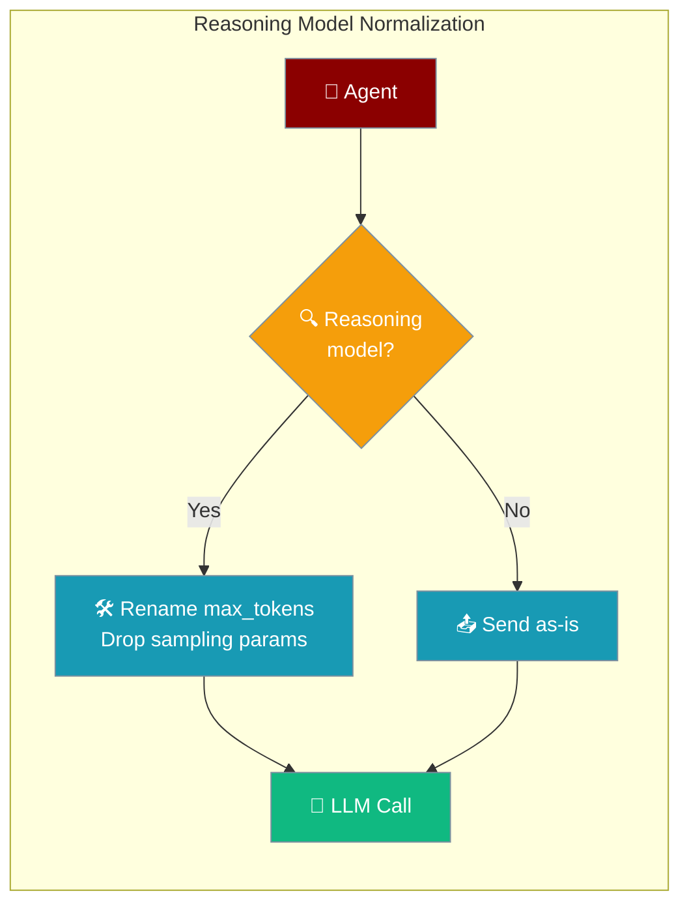
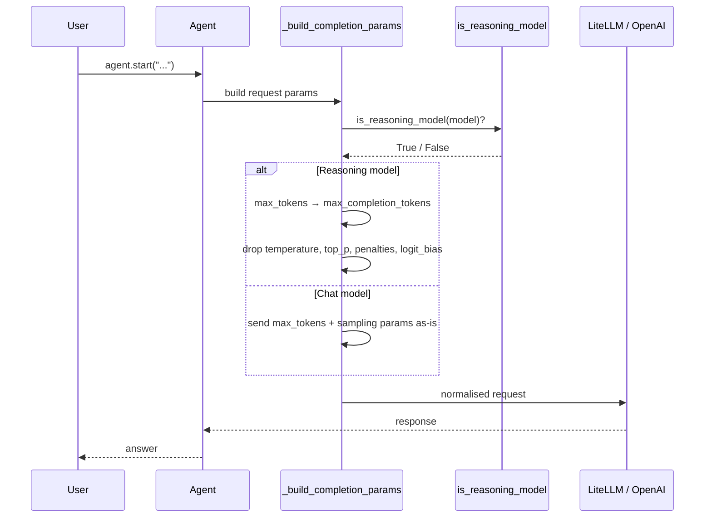
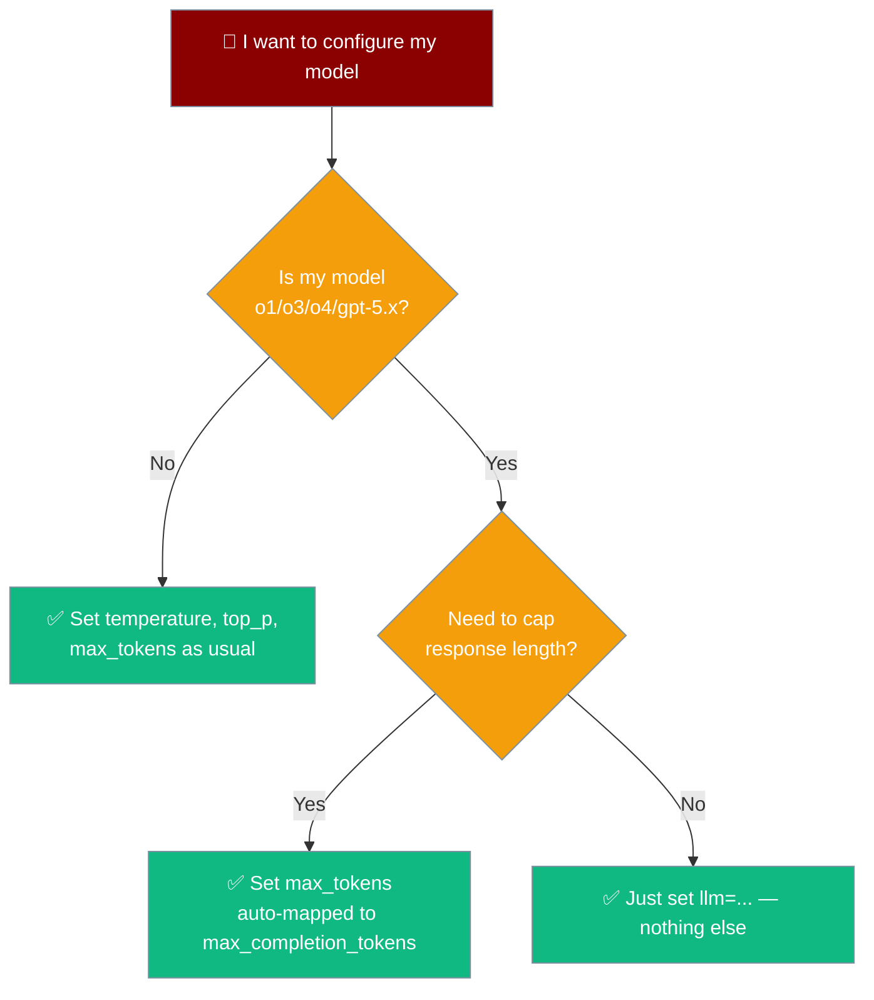

Reasoning models (OpenAI `o1`, `o3`, `o4`, `gpt-5.x`) accept a different set of parameters — PraisonAI detects them automatically and normalises your `Agent(...)` config so the same code just works.



## Quick Start

<Steps>
<Step title="Use a reasoning model">

```python
from praisonaiagents import Agent

agent = Agent(
    name="Reasoner",
    instructions="Solve the problem step by step.",
    llm="gpt-5",   # or "o1", "o3-mini", "o4-mini", etc.
)
agent.start("Design a caching layer for a high-traffic API.")
```

No extra flags. PraisonAI detects reasoning models and normalises parameters for you.
</Step>

<Step title="Cap the response length">

```python
from praisonaiagents import Agent

agent = Agent(
    name="Reasoner",
    instructions="Solve the problem step by step.",
    llm="o3-mini",
    max_tokens=4000,  # Automatically sent as max_completion_tokens
)
agent.start("Explain the CAP theorem with an example.")
```

You can keep writing `max_tokens=...` — on reasoning models it is rewritten to `max_completion_tokens` before the request.
</Step>
</Steps>

---

## How It Works

PraisonAI checks the model before every call and rewrites parameters only when the model is a reasoning model.



| Step | Behaviour |
|------|-----------|
| Detection | `is_reasoning_model(model)` decides the path |
| Reasoning model | `max_tokens` renamed, sampling params dropped |
| Chat model | Parameters sent unchanged |
| Responses API path | Already uses `max_output_tokens` — unchanged |

---

## Recognised Models

Detection uses two paths, in order:

1. **Primary:** `litellm.supports_reasoning(model=model_name)` when litellm is installed and exposes the helper.
2. **Fallback:** strip the provider prefix (e.g. `openai/`, `azure/`) and match the lowercase prefix — `o1`, `o3`, `o4`, or `gpt-5`.

Results are cached with `functools.lru_cache(maxsize=256)`.

| Model family | Example ids | Detection |
|---|---|---|
| OpenAI o1 | `o1`, `o1-mini`, `o1-preview` | prefix + litellm |
| OpenAI o3 | `o3`, `o3-mini` | prefix + litellm |
| OpenAI o4 | `o4-mini` | prefix + litellm |
| OpenAI gpt-5.x | `gpt-5`, `gpt-5-mini`, `gpt-5-nano`, `gpt-5.6-luna`, … | prefix + litellm |

<Note>
Provider prefixes are stripped before matching: `openai/o3-mini` → `o3-mini`.
</Note>

---

## Parameter Behaviour

On a reasoning model, PraisonAI rewrites and drops parameters as follows.

| Rule | Effect |
|------|--------|
| `max_tokens` → `max_completion_tokens` | Silently renamed. |
| `max_completion_tokens` (explicit) | Wins over `max_tokens`; `max_tokens` is still dropped. |
| `temperature` | Silently dropped on reasoning models. |
| `top_p` | Silently dropped. |
| `presence_penalty` | Silently dropped. |
| `frequency_penalty` | Silently dropped. |
| `logit_bias` | Silently dropped. |
| Chat models (non-reasoning) | Unchanged — still send `max_tokens` and all sampling params. |
| Responses API path | Already used `max_output_tokens` correctly — unchanged. |

<Warning>
Reasoning models reject `temperature`, `top_p`, and penalty params. PraisonAI drops them silently so your code keeps working — but the values have no effect. If you rely on deterministic sampling, use a chat model instead.
</Warning>

---

## Which Parameters Should I Set?

Pick your parameters based on the model you chose.



---

## Common Patterns

Mix reasoning and chat models in one team — each agent normalizes independently based on its own model.

```python
from praisonaiagents import Agent, Task, PraisonAIAgents

planner = Agent(name="Planner", instructions="Plan step by step.", llm="o3-mini")
writer = Agent(name="Writer", instructions="Write clearly.", llm="gpt-4o", temperature=0.7)

agents = PraisonAIAgents(
    agents=[planner, writer],
    tasks=[
        Task(description="Plan an article on vector databases.", agent=planner),
        Task(description="Write the article from the plan.", agent=writer),
    ],
)
agents.start()
```

Be explicit with `max_completion_tokens` when you want it to win over `max_tokens`.

```python
from praisonaiagents import Agent

agent = Agent(
    name="Reasoner",
    instructions="Solve the problem step by step.",
    llm="o3-mini",
    max_completion_tokens=2000,  # Wins; max_tokens (if set) is dropped
)
agent.start("Prove that the square root of 2 is irrational.")
```

Migrate from a chat model to a reasoning model with no code changes.

```python
from praisonaiagents import Agent

# Was: llm="gpt-4o" with temperature and max_tokens
agent = Agent(
    name="Reasoner",
    instructions="Solve the problem step by step.",
    llm="gpt-5",       # swap the model — sampling params are dropped automatically
    max_tokens=3000,   # still works, mapped to max_completion_tokens
)
agent.start("Compare quicksort and mergesort.")
```

---

## Best Practices

<AccordionGroup>
<Accordion title="Don't set temperature or top_p on reasoning models">
They are silently dropped. If you rely on determinism or creative sampling, prefer a chat model such as `gpt-4o`.
</Accordion>

<Accordion title="Prefer max_completion_tokens when you want to be explicit">
It always wins over `max_tokens` on reasoning models, so there is no ambiguity about which limit applies.
</Accordion>

<Accordion title="Test model swaps before deploying">
Swapping `gpt-4o` → `gpt-5` silently drops your sampling params. Behaviour differs even though no error is raised — verify output quality first.
</Accordion>

<Accordion title="Use LiteLLM's latest release when possible">
Detection prefers `litellm.supports_reasoning()`. The prefix fallback only covers the `o1`/`o3`/`o4`/`gpt-5` families, so newer models are recognised sooner with an up-to-date litellm.
</Accordion>
</AccordionGroup>

---

## Related

<CardGroup cols={2}>
<Card title="Reasoning" icon="brain" href="/features/reasoning">
Step-by-step reasoning as a technique.
</Card>
<Card title="Model Capabilities" icon="star" href="/features/model-capabilities">
Capability detection helpers, including `is_reasoning_model()`.
</Card>
<Card title="Thinking Budgets" icon="gauge" href="/features/thinking-budgets">
Budget reasoning tokens for controllable cost.
</Card>
<Card title="OpenAI Quickstart" icon="rocket" href="/features/openai-quickstart">
First-time setup with OpenAI models.
</Card>
</CardGroup>
