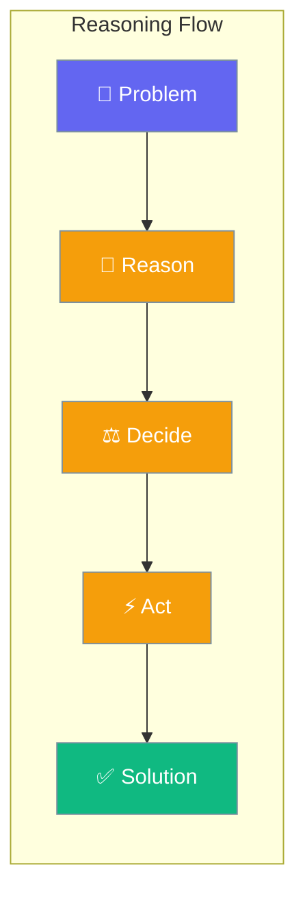
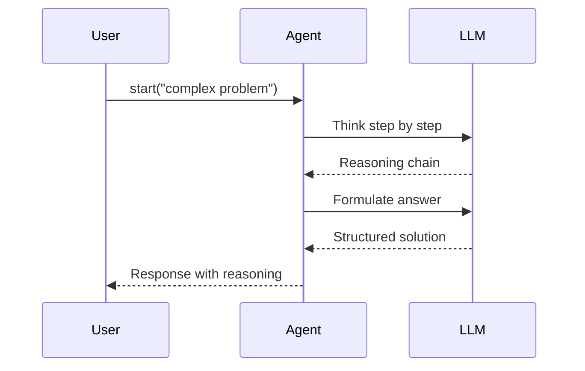

Reasoning agents think step-by-step before acting, breaking complex problems into structured solutions.

```python
from praisonaiagents import Agent

agent = Agent(
    name="Reasoner",
    instructions="You are an expert problem solver. Think step by step.",
)

agent.start("Analyse the pros and cons of electric vehicles")
```



## Quick Start

<Steps>
<Step title="Simple Usage">

```python
from praisonaiagents import Agent

agent = Agent(
    name="Reasoner",
    instructions="You are an expert problem solver. Think step by step.",
)

agent.start("Analyse the pros and cons of electric vehicles")
```

</Step>

<Step title="With Configuration">

Use a reasoning-optimised model for multi-step problems:

```python
from praisonaiagents import Agent

agent = Agent(
    name="DeepReasoner",
    instructions="You solve complex problems with structured analysis.",
    llm="o1-mini",
)

agent.start("What strategy should a startup use to enter a competitive market?")
```

</Step>
</Steps>

---

## How It Works



| Stage | Description |
|-------|-------------|
| **Reason** | Agent breaks the problem into sub-questions |
| **Decide** | Agent evaluates options with evidence |
| **Act** | Agent executes the chosen approach |
| **Output** | Agent returns solution with explanation |

---

## Common Patterns

### Multi-agent reasoning pipeline

```python
from praisonaiagents import Agent, Task, AgentTeam

analyst = Agent(
    name="Analyst",
    instructions="Analyse problems and identify key issues with evidence.",
)

solver = Agent(
    name="Solver",
    instructions="Design comprehensive solutions based on analysis.",
)

team = AgentTeam(
    agents=[analyst, solver],
    tasks=[
        Task(
            description="Analyse market challenges in the electric vehicle industry",
            expected_output="Detailed analysis with key findings",
            agent=analyst,
        ),
        Task(
            description="Develop strategy based on the analysis",
            expected_output="Action plan with prioritised recommendations",
            agent=solver,
        ),
    ],
)

team.start()
```

### Reasoning with tools

```python
from praisonaiagents import Agent
from praisonaiagents.tools import internet_search

agent = Agent(
    name="ResearchReasoner",
    instructions="Research topics deeply and reason about the findings.",
    tools=[internet_search],
)

agent.start("What are the biggest AI safety concerns in 2025?")
```

### Structured output

```python
from praisonaiagents import Agent
from pydantic import BaseModel

class Analysis(BaseModel):
    summary: str
    pros: list[str]
    cons: list[str]
    recommendation: str

agent = Agent(
    name="StructuredReasoner",
    instructions="Analyse topics and provide structured assessments.",
    output_pydantic=Analysis,
)

result = agent.start("Should we migrate our database to PostgreSQL?")
print(result.recommendation)
```

---

## Best Practices

<AccordionGroup>
  <Accordion title="Write clear, specific problem statements">
    Vague inputs produce vague reasoning. State the problem with context: instead of "help with marketing", use "suggest three low-budget marketing strategies for a B2B SaaS startup targeting mid-sized logistics companies."
  </Accordion>
  <Accordion title="Use reasoning-optimised models for complex tasks">
    Models like `o1-mini`, `o3-mini`, or `claude-3-7-sonnet` perform better on multi-step problems. Use standard models for simpler tasks to save cost and latency.
  </Accordion>
  <Accordion title="Break problems into sub-tasks with multi-agent pipelines">
    Complex reasoning benefits from specialisation. Assign analysis to one agent and solution design to another — each agent focuses on its strength without context overload.
  </Accordion>
  <Accordion title="Use structured output for decision-making">
    When reasoning must produce actionable decisions, use `output_pydantic` to get typed results. This ensures reasoning outputs are machine-readable and integration-ready.
  </Accordion>
</AccordionGroup>

---

## Related

<CardGroup cols={2}>
  <Card title="Planning Mode" icon="list-check" href="/docs/features/planning-mode">
    Enable agents to plan before executing multi-step tasks
  </Card>
  <Card title="Reasoning Extract" icon="brain-circuit" href="/docs/features/reasoning-extract">
    Chain a reasoning model with a smaller agent to extract concise answers
  </Card>
</CardGroup>
