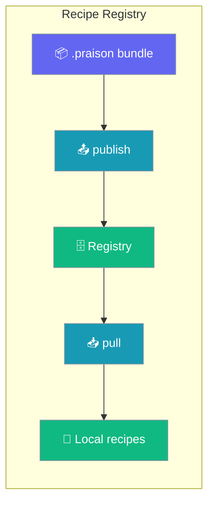
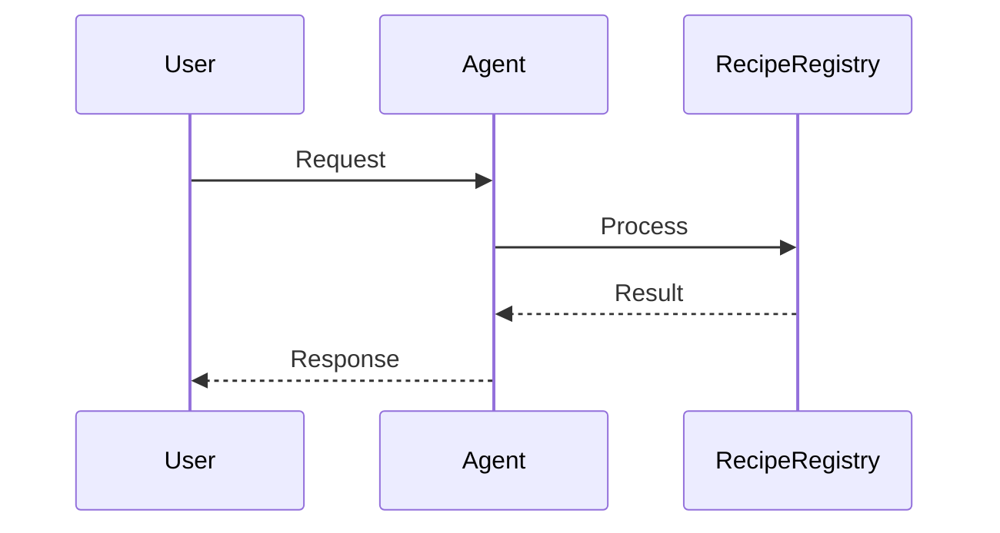
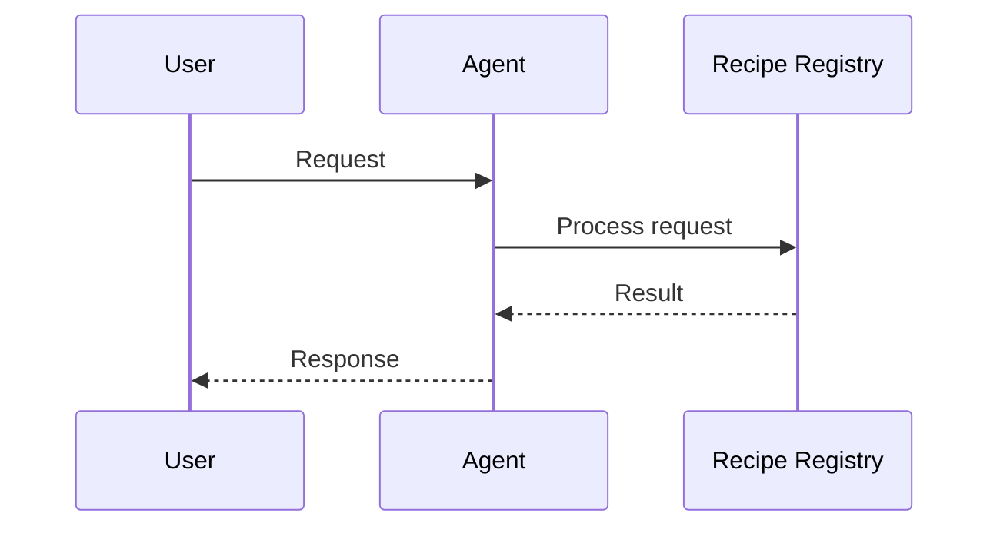

```python
from praisonaiagents import Agent

agent = Agent(name="recipe-agent", instructions="Use recipes from the recipe registry.")
agent.start("Load the customer-support recipe and start handling tickets.")
```

The user pulls a published recipe bundle and the agent runs that workflow for their request.


Publish and share `.praison` recipe bundles from a local folder or remote HTTP registry.

```python
from praisonai.recipe.registry import get_registry

registry = get_registry()
registry.publish("./my-agent-1.0.0.praison")
registry.pull("my-agent", output_dir="./recipes")
```



## How It Works




## Quick Start

<Steps>
<Step title="Simple Usage">

Use the default local registry at `~/.praison/registry`:

```python
from praisonai.recipe.registry import get_registry

registry = get_registry()

result = registry.publish("./my-agent-1.0.0.praison")
print(f"Published: {result['name']}@{result['version']}")

pulled = registry.pull("my-agent", output_dir="./recipes")
print(f"Pulled to: {pulled['path']}")
```

</Step>

<Step title="With Configuration">

Connect to a remote HTTP registry with token authentication:

```python
import os
from praisonai.recipe.registry import get_registry

registry = get_registry(
    "http://localhost:7777",
    token=os.environ.get("PRAISONAI_REGISTRY_TOKEN"),
)

for recipe in registry.search("agent"):
    print(f"{recipe['name']}: {recipe['description']}")
```

</Step>
</Steps>

---

## How It Works




Local registries store bundles on disk with atomic writes and checksum verification. HTTP registries expose the same operations over REST — `get_registry()` picks the right backend from a path or URL.

| Operation | Purpose |
|-----------|---------|
| `publish()` | Upload a `.praison` bundle |
| `pull()` | Download a recipe by name and version |
| `list_recipes()` | List available recipes |
| `search()` | Find recipes by name, description, or tags |

---

## Configuration Options

| Option | Type | Default | Description |
|--------|------|---------|-------------|
| `registry` | `str` | local path | Filesystem path or HTTP(S) URL |
| `token` | `str` | `None` | Auth token for remote registries |
| `force` | `bool` | `False` | Overwrite existing version on publish |
| `verify_checksum` | `bool` | `True` | Verify bundle integrity on pull |
| `timeout` | `int` | `30` | HTTP request timeout (seconds) |

### Environment variables

| Variable | Description |
|----------|-------------|
| `PRAISONAI_REGISTRY_TOKEN` | Default token for HTTP registry authentication |
| `PRAISONAI_REGISTRY_URL` | Default registry URL for scripts |

---

## Common Patterns

### CLI workflow

```bash
# Publish a recipe
praisonai recipe publish ./my-recipe --json

# Pull a recipe
praisonai recipe pull my-recipe@1.0.0 -o ./recipes

# List and search
praisonai recipe list --json
praisonai recipe search "video"

# Remote registry
praisonai recipe list --registry http://localhost:7777 --token "$PRAISONAI_REGISTRY_TOKEN"
```

### Error handling

```python
from praisonai.recipe.registry import (
    get_registry,
    RecipeNotFoundError,
    RegistryAuthError,
)

registry = get_registry()

try:
    registry.pull("nonexistent-recipe")
except RecipeNotFoundError as e:
    print(f"Recipe not found: {e}")
except RegistryAuthError as e:
    print(f"Authentication failed: {e}")
```

---

## Best Practices

<AccordionGroup>
  <Accordion title="Version recipes with semantic versioning">
    Tag each publish with a clear version (`1.0.0`, `1.1.0`). Use `force=True` only when intentionally replacing a broken release.
  </Accordion>
  <Accordion title="Use remote registries for team sharing">
    Point `get_registry()` at a shared HTTP registry so teammates pull the same bundles without copying files manually.
  </Accordion>
  <Accordion title="Load tokens from environment variables">
    Never hardcode registry tokens. Set `PRAISONAI_REGISTRY_TOKEN` in your shell or deployment secrets.
  </Accordion>
  <Accordion title="Verify checksums on pull">
    Keep `verify_checksum=True` (default) in production so corrupted or tampered bundles are rejected before execution.
  </Accordion>
</AccordionGroup>

---

## Related

<CardGroup cols={2}>
  <Card title="Modular Recipes" icon="puzzle-piece" href="/docs/features/modular-recipes">
    Compose recipes from reusable components with the include pattern
  </Card>
  <Card title="Recipe Serve" icon="server" href="/docs/features/recipe-serve-code">
    Run recipes over HTTP for production deployments
  </Card>
</CardGroup>
