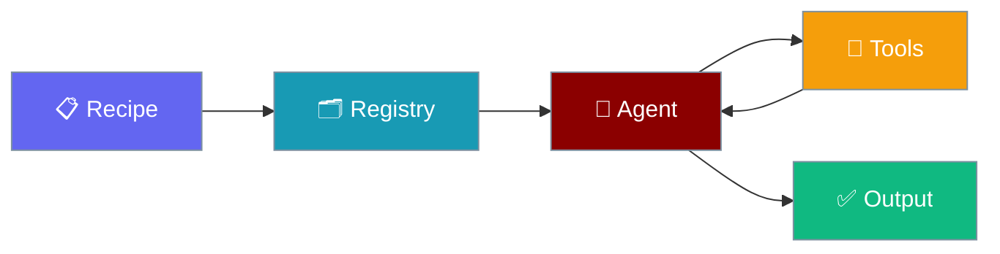

The Recipe Registry provides a centralized location for storing, sharing, and managing recipe bundles. It supports both local filesystem registries and HTTP-based remote registries with token authentication.




## Overview

Recipes are reusable agent configurations packaged as `.praison` bundles. The registry system allows you to:

- **Publish** recipes to share with your team or organization
- **Pull** recipes to use pre-built agent workflows
- **Search** for recipes by name, description, or tags
- **Version** recipes with semantic versioning

## Quick Start

<Steps>
<Step title="Basic Usage">
```python
from praisonai.recipe.registry import get_registry, LocalRegistry, HttpRegistry

# Get default local registry
registry = get_registry()

# Publish a recipe
result = registry.publish("./my-agent-1.0.0.praison")
print(f"Published: {result['name']}@{result['version']}")

# Pull a recipe
result = registry.pull("my-agent", output_dir="./recipes")
print(f"Pulled to: {result['path']}")

# List all recipes
recipes = registry.list_recipes()
for r in recipes["recipes"]:
    print(f"- {r['name']} v{r['version']}")

# Search recipes
results = registry.search("agent")
for r in results:
    print(f"- {r['name']}: {r['description']}")
```
</Step>
</Steps>


## Registry Types

### Local Registry

The default registry stores recipes on the local filesystem at `~/.praisonai/registry`.

```python
from praisonai.recipe.registry import LocalRegistry
from pathlib import Path

# Use default path
registry = LocalRegistry()

# Or specify custom path
registry = LocalRegistry(Path("/shared/team-recipes"))
```

### HTTP Registry

Connect to remote HTTP registries with optional token authentication.

```python
from praisonai.recipe.registry import HttpRegistry
import os

# Connect to HTTP registry
registry = HttpRegistry(
    url="http://localhost:7777",
    token=os.environ.get("PRAISONAI_REGISTRY_TOKEN"),
    timeout=30
)

# Check health
health = registry.health()
print(f"Status: {health['status']}")
print(f"Auth required: {health['auth_required']}")
```

### Auto-Detection with get_registry

The `get_registry()` function automatically returns the appropriate registry type:

```python
from praisonai.recipe.registry import get_registry
import os

# Local registry (default)
local = get_registry()

# Local registry with custom path
local = get_registry("/path/to/registry")

# HTTP registry (auto-detected from URL)
http = get_registry(
    "http://localhost:7777",
    token=os.environ.get("PRAISONAI_REGISTRY_TOKEN")
)

# HTTPS registry
https = get_registry("https://registry.example.com", token="your-token")
```

## Core Operations

### Publish

Publish a recipe bundle to the registry.

```python
result = registry.publish(
    bundle_path="./my-recipe-1.0.0.praison",
    force=False,  # Set True to overwrite existing version
    metadata={"custom_key": "value"}  # Optional metadata
)

print(f"Published: {result['name']}@{result['version']}")
print(f"Checksum: {result['checksum']}")
print(f"Published at: {result['published_at']}")
```

### Pull

Download a recipe from the registry.

```python
result = registry.pull(
    name="my-recipe",
    version="1.0.0",  # Optional, defaults to latest
    output_dir=Path("./pulled"),
    verify_checksum=True
)

print(f"Pulled to: {result['path']}")
print(f"Version: {result['version']}")
print(f"Checksum verified: {result['checksum_verified']}")
```

### List

List all recipes in the registry.

```python
result = registry.list_recipes(
    tags=["agent", "tool"],  # Optional filter by tags
    limit=50,
    offset=0
)

print(f"Total: {result['total']}")
for recipe in result["recipes"]:
    print(f"- {recipe['name']} v{recipe['version']}: {recipe['description']}")
```

### Search

Search recipes by name, description, or tags.

```python
results = registry.search("video processing")

for recipe in results:
    print(f"- {recipe['name']}: {recipe['description']}")
    print(f"  Tags: {', '.join(recipe.get('tags', []))}")
```

### Get Info

Get detailed information about a recipe.

```python
info = registry.get_info("my-recipe")

print(f"Name: {info['name']}")
print(f"Latest version: {info['latest']}")
print(f"Available versions: {list(info['versions'].keys())}")
```

### Delete

Delete a recipe version from the registry.

```python
registry.delete("my-recipe", version="1.0.0")
```

## Error Handling

```python
from praisonai.recipe.registry import (
    RegistryError,
    RecipeNotFoundError,
    RecipeExistsError,
    RegistryAuthError,
    RegistryNetworkError
)

try:
    registry.pull("nonexistent-recipe")
except RecipeNotFoundError as e:
    print(f"Recipe not found: {e}")
except RegistryAuthError as e:
    print(f"Authentication failed: {e}")
except RegistryNetworkError as e:
    print(f"Network error: {e}")
except RegistryError as e:
    print(f"Registry error: {e}")
```

## Environment Variables

| Variable | Description |
|----------|-------------|
| `PRAISONAI_REGISTRY_TOKEN` | Default token for HTTP registry authentication |

## CLI Commands

```bash
# Publish a recipe
praisonai recipe publish ./my-recipe --json

# Pull a recipe
praisonai recipe pull my-recipe@1.0.0 -o ./recipes

# List recipes
praisonai recipe list --json

# Search recipes
praisonai recipe search "video"

# With HTTP registry
praisonai recipe publish ./my-recipe --registry http://localhost:7777 --token $TOKEN
praisonai recipe list --registry http://localhost:7777
```

## Complete Example

```python
import os
from pathlib import Path
from praisonai.recipe.registry import get_registry

def main():
    # Connect to registry (local or remote based on env)
    registry_url = os.environ.get("PRAISONAI_REGISTRY_URL")
    token = os.environ.get("PRAISONAI_REGISTRY_TOKEN")
    
    registry = get_registry(registry_url, token=token)
    
    # Publish a recipe
    result = registry.publish("./my-agent-1.0.0.praison")
    print(f"✓ Published {result['name']}@{result['version']}")
    
    # List all recipes
    recipes = registry.list_recipes()
    print(f"\nAvailable recipes ({recipes['total']}):")
    for r in recipes["recipes"]:
        print(f"  - {r['name']} v{r['version']}")
    
    # Search for agent recipes
    print("\nSearching for 'agent':")
    for r in registry.search("agent"):
        print(f"  - {r['name']}: {r['description']}")
    
    # Pull a recipe
    pulled = registry.pull("my-agent", output_dir=Path("./recipes"))
    print(f"\n✓ Pulled to {pulled['path']}")

if __name__ == "__main__":
    main()
```

## Best Practices

<AccordionGroup>
<Accordion title="Start with defaults">
Use the built-in defaults first. Only add configuration when you hit a specific limitation.
</Accordion>
<Accordion title="Test incrementally">
Add one feature at a time and verify behaviour before combining features.
</Accordion>
<Accordion title="Monitor in production">
Watch token consumption and latency metrics when enabling advanced features in production.
</Accordion>
</AccordionGroup>

## Related

- [Recipe Registry Server](/docs/deploy/recipe-registry-server) - Deploy HTTP registry server
- [Recipe Registry API](/docs/deploy/api/recipe-registry-api) - HTTP API endpoints
- [Recipe CLI](/docs/cli/recipe-registry) - CLI commands reference

## Related

<CardGroup cols={2}>
<Card title="Modular Recipes" icon="puzzle-piece" href="/docs/features/modular-recipes">
  Build modular workflows
</Card>
<Card title="Recipe Server" icon="server" href="/docs/features/recipe-serve-advanced">
  Serve recipes
</Card>
</CardGroup>
