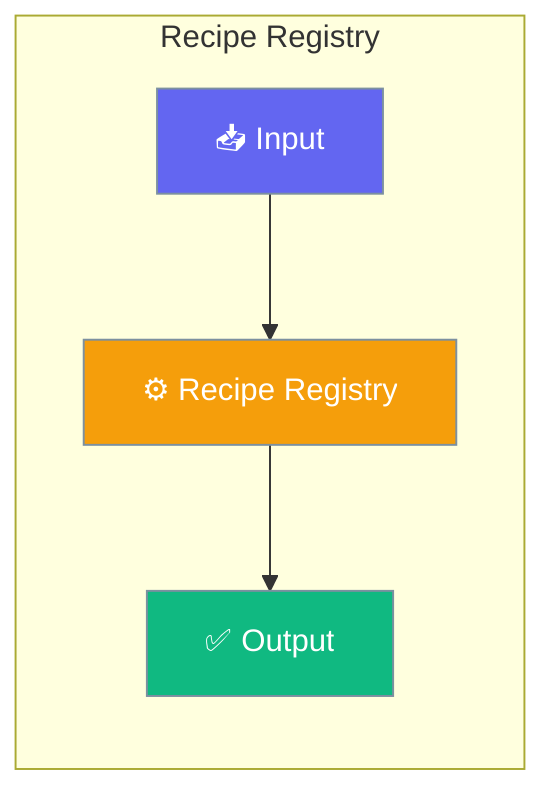

The Recipe Registry provides a centralized location for storing, sharing, and managing recipe bundles. It supports both local filesystem registries and HTTP-based remote registries with token authentication.




## Overview

Recipes are reusable agent configurations packaged as `.praison` bundles. The registry system allows you to:

- **Publish** recipes to share with your team or organization
- **Pull** recipes to use pre-built agent workflows
- **Search** for recipes by name, description, or tags
- **Version** recipes with semantic versioning

## Quick Start


<Steps>
<Step title="Quick Start">
```python
from praisonai.recipe.registry import get_registry, LocalRegistry, HttpRegistry

# Get default local registry
registry = get_registry()

# Publish a recipe
result = registry.publish("./my-agent-1.0.0.praison")
print(f"Published: {result['name']}@{result['version']}")

# Pull a recipe
result = registry.pull("my-agent", output_dir="./recipes")
print(f"Pulled to: {result['path']}")

# List all recipes
recipes = registry.list_recipes()
for r in recipes["recipes"]:
    print(f"- {r['name']} v{r['version']}")

# Search recipes
results = registry.search("agent")
for r in results:
    print(f"- {r['name']}: {r['description']}")
```
</Step>
</Steps>


## Best Practices

<AccordionGroup>
  <Accordion title="Start simple">
    Enable the feature with a single parameter before adding configuration. Verify it works, then layer in options.
  </Accordion>
  <Accordion title="Use environment variables for secrets">
    Never hardcode API keys or tokens. Use `os.getenv("KEY_NAME")` to read from environment variables.
  </Accordion>
  <Accordion title="Test with minimal examples first">
    Copy the Quick Start example, run it, then extend it. This confirms your environment is set up correctly.
  </Accordion>
  <Accordion title="Check the logs">
    Set `verbose=True` on your agent to see detailed execution logs when debugging unexpected behavior.
  </Accordion>
</AccordionGroup>

## Related

<CardGroup cols={2}>
  <Card title="Features Overview" icon="grid-2" href="/docs/features">
    Browse all PraisonAI features
  </Card>
  <Card title="Quick Start" icon="rocket" href="/docs/introduction">
    Get started with PraisonAI agents
  </Card>
</CardGroup>
